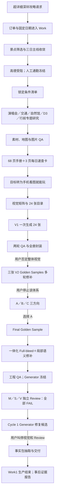

# 深圳旅行攻略 Work1：实际执行工作流重建

> 文件名：`07-work1-as-executed-workflow.md`  
> 重建对象：本次深圳旅行攻略 **Work1**  
> 重建口径：只记录当前会话／Work 中可见的聊天片段、文件、脚本、工具痕迹和实际产物；不把后来的 Work2 成功路径倒灌进 Work1；不设计 Travel Guide Skill。

## 1. 证据范围和可见性限制

### 1.1 当前来源能够直接看到的内容

本次重建使用了以下当前可见证据：

1. **当前可见聊天片段**
   - 消息 181—185：Final Golden Sample 工程修复、Generator 自检与冻结。
   - 消息 186—192：用户要求建立 Generator ≠ Reviewer 的独立 Review；三路首轮 Review 完成并汇总。
   - 消息 193—198：用户叫停视觉和 Review，切换为事实包；随后因旧 Reviewer 身份被复用而要求停止全部子智能体；事实包交付。
   - 消息 199—205：用户停止攻略生产，要求生成 Work1 失败路径证据报告；报告交付。

2. **用户上传或当前工作区保留的原始输入**
   - `upload/0A4BD2B9-34A2-4AB8-B817-0D1DD780461B.jpeg`：两场演唱会订单证据。
   - `upload/EE46818A-11E5-4143-95BC-F5C5C673483F.png`：酒店订单证据。
   - `upload/01-image.png`：高德二维码交互相关聊天截图。
   - 当前工作区中的西安参考图及其联系表。

3. **事实、研究和内容文件**
   - `research/locked_conditions.md`
   - `research/concert.md`
   - `research/commute_cards.md`
   - `research/natural_museum.md`
   - `research/pretrip_tables.md`
   - `research/day3.md`
   - `research/image_qa.md`
   - `deliverables/Shenzhen_Trip_Handbook_2026.md`

4. **实际生产脚本和技术痕迹**
   - 素材和地图：`scripts/download_assets.sh`、`scripts/make_maps.py`、`scripts/make_mobile_source_crops.py`。
   - 手册和速查卡：`scripts/build_handbook.py`、`scripts/build_quick_cards.py`。
   - V1 图册：`scripts/build_visual_atlas.py`、`scripts/package_visual_atlas.py`。
   - V2 与方向探索：`scripts/build_golden_samples_v2.py`、`scripts/build_golden_samples_v3.py`、`scripts/build_visual_direction_exploration.py`。
   - Final 与一体化版本：`scripts/build_final_golden_sample.py`、`scripts/build_integrated_final_golden.py`、`scripts/compose_semantic_art.py` 及相关 QA 脚本。
   - 当前保留的 `generated_images/exec-*.png`、`imagegen_prompt.txt`、地图瓦片、素材、渲染页、联系表、手机缩图、布局报告和哈希文件。

5. **实际中间产物和交付物**
   - 68 页详细手册、3 页每日速查卡。
   - 24 张 V1 视觉速查图册及 PDF、ZIP。
   - 3 张 V2 Golden Samples 及多轮 QA 产物。
   - A／B／C 三种视觉方向。
   - Final Golden Sample、一体化 Final Golden Sample、Semantic-Anchored 候选。
   - 三个独立 Reviewer 的 packet、报告和合并缺陷清单。
   - `deliverables/深圳旅行事实包.md`。
   - `deliverables/02-work1-failure-evidence.md`。

6. **当前来源中的事后证据文件**
   - `01-chat-requirements-and-decisions.md` 保存了若干原始用户表述和需求变化，但它同时涉及 Work1 与后来的 Work2；本文件只采用其中明确属于 Work1 的内容。
   - `02-work1-failure-evidence.md` 是 Work1 的事后证据报告；本重建将其中叙述与实际文件、脚本、哈希和当前消息交叉核对后使用。

### 1.2 本重建明确排除的内容

- `03-work2-success-evidence.md` 与 `04-shenzhen-final-acceptance.md` 描述的是后来的 **Work2／19 张成品链**，不属于 Work1 的实际执行过程，故不写入事件账本。
- 不使用其他会话中的记忆补齐 Work1 没有留下的候选菜单、用户原话、搜索记录或工具动作。
- 不把当前这份工作流重建本身反向算作 Work1 的攻略生产步骤。

### 1.3 当前来源看不到或只能部分看到的内容

1. 最早一条相关用户消息的完整原文和准确时间没有保存在工作区；当前只能看到事后报告保存的直接引语和随后形成的锁定条件。
2. 最早的景点发现、候选推荐、选项编号、逐项比较过程没有完整原始聊天；只能确认最终选中和排除的结果。
3. 研究稿列出了大量官方、馆方、政府、权威媒体和少量次级来源，但没有保存每次 Web 搜索的查询词、结果页顺序、打开动作和完整工具调用日志。
4. 高德交互只有错误记录、聊天截图和事后报告；无法确认调用次数、每次页面状态、二维码是否实际成功展示或是否登录成功。
5. 多专题研究的文件时间非常接近，但不能仅凭时间戳断言由多少个子智能体并行完成。
6. 部分文件被后续覆盖；例如 8 月 14 日早期 Final 主 PNG 的原始像素已不能从当前同名文件直接恢复。
7. 多个 `generated_images/exec-*.png` 没有完整的“提示词—用户反馈—采用／淘汰原因”映射。
8. 文件时间受时区、覆盖写入和脚本后续编辑影响；本文用其判断相对先后，不拼接成精确到分钟的聊天时间线。

### 1.4 证据标记

- **A｜直接证据**：当前用户消息、实际文件、脚本、哈希、最终像素或 QA／Review 报告直接支持。
- **B｜相互印证**：事后报告与文件先后、修改内容和实际产物能够互证，但原始逐轮聊天不完整。
- **U｜无法确定**：当前来源不足，本文只记录缺口，不补写答案。

## 2. 完整事件账本

### 事件 1｜用户提出“超详细、当天可直接执行”的深圳旅行攻略需求

- **顺序／相对时间**：Work1 第一阶段；早于 `research/locked_conditions.md`（工作区时间 2026-08-13 04:32）。准确消息时间不可见。
- **用户输入、目标或问题**：用户要求攻略不只是列出每天去哪，还要包含通勤、地图、景点内部玩法、博物馆预约／购票／重点展品／参观动线、公园游览路线；同时希望有完整文字和生动图片，并要求生成后自检和优化。西安攻略被作为已经满意的视觉参照。
- **AI／Work 实际动作**：先理解为“把出发前研究尽量做完、旅行当天可以照着执行”的三日旅行规划，而不是普通行程表。
- **实际使用的资料／工具**：当前早期原始工具日志不可见；需求原句保存在 `01-chat-requirements-and-decisions.md`。
- **中间／最终产物**：尚未直接产出成品；形成后续事实锁定、专题研究和手册制作的任务边界。
- **候选、推荐或方案**：当前来源没有保存这一条消息后 AI 首次给出的完整候选方案。
- **用户决定**：用户明确要“很详细”“当天轻松照着玩”，并同时要求文字与图片。
- **如何触发下一步**：需要先把已经购买／预订的旅行锚点、白天可用时间和用户取舍收敛为具体行程。
- **直接证据**：`01-chat-requirements-and-decisions.md` 保存两段用户原话：“我就是想要很详细的攻略……”及“我既希望有完整的文字描述，也需要生动形象的图片信息……”。【A】
- **无法确定**：第一条消息是否同时包含全部日期、车次、酒店和景点偏好，当前来源无法还原。【U】

### 事件 2｜演唱会、酒店、铁路和日期等硬输入进入 Work

- **顺序／相对时间**：事件 1 之后、锁定条件文件形成之前。
- **用户输入、目标或问题**：武汉出发；10 月 4 日、10 月 5 日 19:00 两场 G.E.M. 深圳大运中心体育场演唱会；全季深圳大运中心吉祥酒店 10/4 入住、10/6 退房；去返程以 G419、G400 为首选。
- **AI／Work 实际动作**：读取订单截图和用户说明，把活动、住宿、铁路及“待出票／出发前更新”状态整理成可继续规划的硬输入。
- **实际使用的资料／工具**：演唱会订单截图、酒店订单截图；后续对应写入 `research/locked_conditions.md`。
- **中间／最终产物**：形成两晚演唱会、酒店、G419／G400 和三日日期边界。
- **候选、推荐或方案**：当前来源无法确认 G419／G400 是 AI 首次推荐、用户先提出，还是双方比较后确定；只能确认它们最后被用户固定为首选。
- **用户决定**：两晚演唱会、酒店、G419 和 G400 均保留；具体区排座、检票门等继续保留“待官方公布／出发前更新”状态。
- **如何触发下一步**：在固定晚间活动、住宿和铁路之后，需要安排三天白天内容并筛掉不想去的地点。
- **直接证据**：两张订单截图；`research/locked_conditions.md` 第 1—3 节；详细手册第 1 章。【A】
- **无法确定**：最早有哪些列车或酒店备选、比较维度和推荐措辞没有留下完整记录。【U】

### 事件 3｜白天景点候选被筛选，三日主线收敛

- **顺序／相对时间**：锁定条件形成前；与交通核算先后关系无法精确区分。
- **用户输入、目标或问题**：偏好深圳城市地标、博物馆和历史文化；海景不是重点；不午休；演唱会日尽量避免折返。
- **AI／Work 实际动作**：当前来源能确认 AI 与用户进行过行程候选收敛，但不能恢复完整候选菜单。最终组合被整理为：D1 抵深后不强加景点；D2 深圳自然博物馆后直去大运天地和第二场演唱会；D3 莲花山—市民中心—深圳博物馆—深圳北。
- **实际使用的资料／工具**：原始候选聊天不可见；结果写入 `research/locked_conditions.md` 第 5—6 节及详细手册总览。
- **中间／最终产物**：三日白天主线和场景取舍。
- **候选、推荐或方案**：可见的最终排除项为海边、大芬油画村、鹤湖新居、赛格电子市场；完整候选项、选项编号及比较表不可见。
- **用户决定**：确认自然博物馆；确认莲花山、市民中心和深圳博物馆组合；排除上述地点；确认不午休、小行李随身、D2 不回酒店。
- **如何触发下一步**：行程主线确定后，需核实通勤时间、线路方向和硬截止。
- **直接证据**：`research/locked_conditions.md` 第 5—6 节；`deliverables/Shenzhen_Trip_Handbook_2026.md` 总览。【A】
- **无法确定**：不能重建“哪些候选由 AI 发现／推荐、用户如何逐项比较”的原始顺序，也不能把当前来源外的选项编号补进来。【U】

### 事件 4｜尝试使用高德核算，随后改由用户人工冻结七段通勤

- **顺序／相对时间**：三日主线收敛期间；早于 `locked_conditions.md` 定稿。
- **用户输入、目标或问题**：需要核实武汉和深圳的关键通勤，但高德浏览器交互反复出现二维码／验证问题；用户后来明确七段通勤已经人工确认，不允许继续调用高德或由其他地图覆盖。
- **AI／Work 实际动作**：曾尝试打开高德并进行交互；事后报告记录滑块验证失败和错误码 `UBFz9c`。之后停止以高德重新核算，把用户给出的七段时间改为固定输入。
- **实际使用的资料／工具**：高德页面交互；`upload/01-image.png`；`research/locked_conditions.md`；`research/commute_cards.md`。
- **中间／最终产物**：七段人工固定通勤：谷尚居→武汉站、深圳北→酒店、酒店→大运天地、酒店→自然馆、自然馆→大运天地、酒店→少年宫 F1、市民中心 B→深圳北。
- **候选、推荐或方案**：地图工具核算支路被放弃；后续地图只用于站序、方向和空间说明，不再改写七段总时长。
- **用户决定**：明确“禁止再调高德”；固定值不得缩短、重算或覆盖。
- **如何触发下一步**：AI 将人工值和全部已选行程汇总到单独的锁定条件文件，供专题研究读取。
- **直接证据**：聊天截图、高德失败记载、`research/locked_conditions.md` 第 4 节、`02-work1-failure-evidence.md` 事件 1。【A/B】
- **无法确定**：高德调用总次数、每次失败所在回合、是否有一次登录成功均无法确认。【U】

### 事件 5｜建立《已锁定条件清单》

- **顺序／相对时间**：工作区最早的核心研究文件；2026-08-13 04:32。
- **用户输入、目标或问题**：需要保证后续研究不反复改动酒店、演唱会、车次、人工通勤、三日景点组合和个人节奏。
- **AI／Work 实际动作**：将输入整理为住宿、演唱会、铁路、七段通勤、三日选择、个人节奏和状态标签七部分。
- **实际使用的资料／工具**：用户订单、用户人工时间、此前选择结果；文件 `research/locked_conditions.md`。
- **中间／最终产物**：`《已锁定条件清单》`，并区分“已确认”“出发前更新”“尚待官方公布”。
- **候选、推荐或方案**：本事件不再提供新候选，而是固定已经完成的选择。
- **用户决定**：现有证据显示这些条件被后续研究、手册和视觉矩阵采用；没有证据显示用户在此处重新开放候选选择。
- **如何触发下一步**：以锁定条件为共同输入，分别开展演唱会、交通、自然馆、D3、行前准备和图像素材研究。
- **直接证据**：文件本体及其时间；后续研究稿和手册重复引用相同条件。【A】
- **无法确定**：文件形成前是否经历过未保存的草稿版本和用户逐条确认回合。【U】

### 事件 6｜开展演唱会与大运片区专题研究

- **顺序／相对时间**：锁定条件之后；`research/concert.md` 时间为 04:39。
- **用户输入、目标或问题**：两晚演唱会都要有到场、实名、安检、禁带、晚餐衔接、最晚离餐厅、入场和散场预案；具体检票门不得在公告前伪造。
- **AI／Work 实际动作**：核实已确认信息和待公布边界；制定两晚执行时间轴；研究大运天地晚餐原则；整理散场 Plan A／B／C、末班车边界、历史官方组织规律和出发前更新清单。
- **实际使用的搜索／资料／工具**：`research/concert.md` 内列出的票务、场馆、地铁和官方／历史资料；`assets/source_maps/dayun_historic_orientation.jpg` 等。具体 Web 查询词不可见。
- **中间／最终产物**：`research/concert.md`，含手机现场速查文字。
- **候选、推荐或方案**：晚餐不锁定某一家店，提供“立即落座、快出餐”的选择原则；散场主推 Plan A 地铁，保留 Plan B／C；历史 C／D 入口只用于读票，不提前当成 2026 检票门。
- **用户决定**：当前来源没有逐项保存用户对 Plan A／B／C 的即时回复；最终手册采用 Plan A 为正文主线并保留 B／C。
- **如何触发下一步**：演唱会时间轴需与铁路、酒店、自然馆和 D3 全程通勤整合。
- **直接证据**：`research/concert.md`；最终手册第 10 章。【A】
- **无法确定**：每一条规则是首次搜索所得、用户后续补充，还是研究者综合形成，无法逐条追溯。【U】

### 事件 7｜开展铁路、酒店与全程通勤卡片研究

- **顺序／相对时间**：演唱会研究后；`research/commute_cards.md` 时间为 04:55。
- **用户输入、目标或问题**：保留 G419／G400 和七段总时长；需要具体到线路方向、换乘站、出口、末段步行、易错点、雨天和进站缓冲。
- **AI／Work 实际动作**：研究 12306 当前班次和售票动作、酒店入住／早餐／退房；把 D1／D2／D3 拆成逐段通勤卡，并写方向口令和常见错误。
- **实际使用的搜索／资料／工具**：铁路、酒店、深圳地铁和地图资料；`research/commute_cards.md`；CARTO 地图瓦片开始进入工作区。具体搜索日志不可见。
- **中间／最终产物**：全程通勤研究稿；后续手册中的交通汇总和各日通勤卡。
- **候选、推荐或方案**：提供地铁方向、换乘和出口方案；酒店到场馆、散场回酒店等使用固定主路线，同时保留异常情况下的替代处理。
- **用户决定**：七段总时长保持不变；高铁只保留约 30 分钟进站余量；不为了“从容”制造长时间空等。
- **如何触发下一步**：需要把 D2 自然馆内部玩法和 D3 景点内部路线补到同等细度。
- **直接证据**：`research/commute_cards.md`、`research/locked_conditions.md`、详细手册交通章节。【A】
- **无法确定**：研究稿中的 D3 旧版具体由哪条用户反馈触发修改，原始消息不可见。【U】

### 事件 8｜深化深圳自然博物馆：开放、预约、三层八厅和逐厅玩法

- **顺序／相对时间**：通勤稿之后；`research/natural_museum.md` 时间为 05:03。
- **用户输入、目标或问题**：需要知道开放时间、票价、提前放票、实名、安检、寄存／服务、入口、楼层、八厅动线、核心展品、意义和观察点；15:45 必须离馆。
- **AI／Work 实际动作**：核实馆方票务与入馆规则、文祥路 6 号和沙壆 D 口；整理 B2／1F／2F 八厅；逐厅写推荐时长、展项、观察重点和不确定边界；形成 10:15—15:45 主动线和延误压缩规则；收集馆方及权威媒体图片。
- **实际使用的搜索／资料／工具**：深圳自然博物馆官网及接口、深圳政府、文广旅体局、建筑工务署、深圳新闻网、央广、文汇报、香港 01 等；来源 URL 均在研究稿内。具体查询词不可见。
- **中间／最终产物**：`research/natural_museum.md`；八厅图片和素材清单；后续地图 10／11／12／13。
- **候选、推荐或方案**：主路线为先 B2 四厅，再 1F 人类厅，再 2F 三厅；影院、VR、屋顶步道作为可跳过项；提供延误压缩方案。
- **用户决定**：自然馆作为 D2 白天主活动保持不变；15:45 离馆和之后直去大运天地保持不变。
- **如何触发下一步**：需要同样深化 D3 莲花山、市民中心和深圳博物馆，并把购票／预约动作整合进行前清单。
- **直接证据**：`research/natural_museum.md`；相关素材文件；详细手册第 6、8 章。【A】
- **无法确定**：用户是否逐件确认所有展品说明、哪些图片最终由哪次搜索下载，当前来源不能逐项证明。【U】

### 事件 9｜深化 D3 莲花山—市民中心—深圳博物馆，并形成行前表格

- **顺序／相对时间**：自然馆研究后；`pretrip_tables.md` 为 05:06，`day3.md` 为 05:08。
- **用户输入、目标或问题**：D3 要在 G400 16:46 前完成退房、莲花山、市民中心、深圳博物馆和返程；需要入口、登顶／下山路线、拍照顺序、展馆内部路线、重点内容、离馆和进 B 口硬截止。
- **AI／Work 实际动作**：
  - 在 `day3.md` 中建立逐时方案、迟到压缩、少年宫 F1—莲花山—市民中心中轴—深博—市民中心 B—深圳北通勤卡。
  - 核实莲花山开放、公园入口、山顶游览、雨天边界。
  - 核实深圳博物馆现行免预约、开放、楼层、推荐流线和古代／近代／民俗／改革展内容。
  - 在 `pretrip_tables.md` 中形成铁路、自然馆、演唱会等预约购票表、日期化待办、天气和打包清单。
- **实际使用的搜索／资料／工具**：深圳政府、深圳博物馆官网及藏品／展览页面、官方楼层图、深圳地铁等；`research/day3.md`、`research/pretrip_tables.md`。
- **中间／最终产物**：D3 专题稿、行前购票总表和打包清单。
- **候选、推荐或方案**：正常执行 Plan A，同时保留排队过长、暴雨、地铁／铁路管制等 Plan B／C／D；D3 采用 10:55 开始下山、15:35 离馆、15:45 进入 B 口。
- **用户决定**：最终手册采用 `day3.md` 的新版时间和“原路返回市民中心入口”主线。
- **如何触发下一步**：需要下载正式素材、生成地图和手机裁切，并对旧图／旧时间进行专项核对。
- **直接证据**：两份研究稿；最终手册采用的新时间。【A】
- **无法确定**：`commute_cards.md` 旧版与 `day3.md` 新版之间的完整讨论不可见；只能确认至少发生过一次版本替换。【U】

### 事件 10｜下载素材、生成地图、制作手机裁切并做图片专项 QA

- **顺序／相对时间**：专题研究期间至手册构建前；`image_qa.md` 时间为 05:16。
- **用户输入、目标或问题**：详细手册需要真实地图、场馆／展馆图片和手机可用的内部路线图；不得把历史图、官方入口、地铁口或展馆设施混为当前事实。
- **AI／Work 实际动作**：
  - 用 `curl` 下载字体、自然馆／莲花山／深博照片、官方园图、楼层图、小程序码等。
  - 用 `urllib.request.urlopen` 下载 CARTO `light_all` 地图瓦片；用 Matplotlib＋Pillow 绘制地图。
  - 从官方园图和深博楼层／流线图生成手机裁切。
  - 对地图、照片和手机裁切做专项 QA，并修正 D3 旧时间／旧流线、C／D 地铁口与检票门混淆、自然馆长图字号等。
- **实际使用的搜索／资料／工具**：`scripts/download_assets.sh`、`scripts/make_maps.py`、`scripts/make_mobile_source_crops.py`；`assets/tiles/`、`assets/maps/`、`assets/photos/`、`assets/source_maps/`；`research/image_qa.md`。
- **中间／最终产物**：65 张缓存瓦片、14 张正式地图、5 张手机源图裁切、照片和官方源图；图片 QA 报告。
- **候选、推荐或方案**：地图分为总览、逐日、场馆、散场、自然馆和深博内部示意；历史场馆方向图只作参考，不作为 2026 官方方案。
- **用户决定**：当前来源未保存用户对每张地图的逐项选择；最终手册实际嵌入了这些地图和裁切。
- **如何触发下一步**：事实、文字、图片和地图已经齐备，进入手册和每日速查卡制作。
- **直接证据**：脚本、瓦片、14 张地图、素材文件、`research/image_qa.md`。【A】
- **无法确定**：脚本中计划下载的自然馆票务海报当前不存在，不能确认该单项是否曾成功下载；部分后期核验素材的下载工具也未保存。【U】

### 事件 11｜制作并多轮渲染详细旅行手册与每日速查卡

- **顺序／相对时间**：2026-08-13 05:17—05:23 形成主要构建链；后续仍有渲染更新。
- **用户输入、目标或问题**：把锁定条件、专题研究、地图、图片、预约、异常方案和现场速查整合成完整文字手册，并提供每天可快速查看的页面。
- **AI／Work 实际动作**：
  - `build_handbook.py` 以 Markdown 为源，经 Pandoc 转 DOCX，再用 `python-docx` 设置样式、表格、图片替代文本和文档元数据。
  - 经 LibreOffice 导出 PDF，并把 PDF 渲染成逐页 PNG检查。
  - 形成 45 页试版以及多轮 68 页版本；抽取 PDF 文本比较；执行无障碍检查。
  - `build_quick_cards.py` 用 ReportLab＋Pillow 生成 D1／D2／D3 三页每日速查卡，并经历多轮渲染。
- **实际使用的资料／工具**：前述全部研究稿和地图；Pandoc、`python-docx`、LibreOffice、PDF 渲染／文本抽取、a11y 检查、ReportLab、Pillow。
- **中间／最终产物**：
  - `deliverables/Shenzhen_Trip_Handbook_2026.md`
  - `deliverables/深圳三日演唱会旅行手册_2026.docx`
  - `deliverables/深圳三日演唱会旅行手册_2026.pdf`（68 页）
  - `deliverables/深圳旅行_每日速查卡_2026.pdf`（3 页）
  - `qa/handbook_render_v1/v2/v3/final/`、`qa/quick_cards*`。
- **候选、推荐或方案**：手册采用 15 章＋附录；正文、逐日、景点专题、演唱会、交通、异常、速查和行前清单并存。状态标识由早期 emoji 版本改为文字标签。
- **用户决定**：后续用户把这份手册作为事实底稿，但没有当前证据显示用户把 68 页 PDF 的视觉设计本身确认为最终视觉成品。
- **如何触发下一步**：用户实际需要的是旅行当天手机上快速查看；详细手册之后，任务转向把内容压缩为视觉攻略。
- **直接证据**：构建脚本、各轮渲染目录、a11y JSON、四份正式交付物。【A】
- **无法确定**：45 页试版对应的具体用户反馈和每次 68 页重渲染的完整聊天触发点不可见。【U】

### 事件 12｜产品目标从“详细文档配图”转向“手机上看图就能玩”

- **顺序／相对时间**：68 页手册完成之后、V1 视觉矩阵形成之前。
- **用户输入、目标或问题**：看到详细文档和既有图片后，用户明确表示自己不想旅行当天再查长文字，而是希望图片本身承担执行信息；主要在手机上竖向查看。
- **AI／Work 实际动作**：将目标从“完整文字＋图片并重”改成“10 秒回答现在去哪、几点走、坐什么、到后先做什么”的视觉速查图册；手册继续作为后台事实依据。
- **实际使用的资料／工具**：`01-chat-requirements-and-decisions.md` 保存“我其实不需要详细资料，我需要看图就能玩”等原话；68 页手册作为内容源；西安参考图进入工作区。
- **中间／最终产物**：新的视觉产品定位和手机使用场景；不直接修改旅行事实。
- **候选、推荐或方案**：用户要求至少有整趟总览、每日图、主要景点图；复杂博物馆继续拆分重点馆藏和内部动线。图片数量不在当前证据中预先固定为最终值。
- **用户决定**：确认图片为现场主要载体；确认西安只作为完成度和“看图就能玩”参照，不是深圳页数或古风模板。
- **如何触发下一步**：需要把 68 页事实压缩成逐图内容矩阵，并规划视觉图册目录。
- **直接证据**：用户原话保存在 `01-chat-requirements-and-decisions.md`；`02-work1-failure-evidence.md` 事件 3；随后生成的视觉矩阵和目录。【A/B】
- **无法确定**：手机竖版要求是在本 Work 的哪一张具体早期图片之后首次提出，原始逐轮消息不可见。【U】

### 事件 13｜建立视觉事实矩阵和 24 张图册目录；文档中写入“先做 5 张”

- **顺序／相对时间**：2026-08-13 11:47—11:49 起。
- **用户输入、目标或问题**：把手册转为手机视觉攻略，同时保持固定事实、硬截止、路线方向和待公布边界；视觉完成度需参考西安。
- **AI／Work 实际动作**：
  - 生成一张 1024×1536 装饰底图并在 V1 中使用。
  - 建立 `research/visual_fact_matrix.md`，规定每张图必须出现、不得出现和 10 秒文案。
  - 建立 `research/visual_catalog.md`，列出 24 张图的层级、主题、素材和组件。
  - 文档中写明应先制作 01、02、05、07、08 五张代表页，通过后再扩量。
- **实际使用的资料／工具**：68 页手册、锁定条件、西安参考图、`generated_images/exec-ad367e94-*.png`、视觉矩阵和目录文件。
- **中间／最终产物**：24 张内容目录和一个计划中的五张代表页检查点。
- **候选、推荐或方案**：目录覆盖总览、三日、交通、演唱会、自然馆多层、莲花山、市民中心、深博、行前与终极速查。
- **用户决定**：当前来源不能证明用户在实际扩量前看过并批准了指定五张代表页。
- **如何触发下一步**：生产脚本开始实现视觉目录；实际控制流没有停在五张处。
- **直接证据**：`research/visual_fact_matrix.md`、`research/visual_catalog.md`、生成底图及西安联系表。【A】
- **无法确定**：24 张目录是否曾被用户逐张确认、五张 checkpoint 是否在聊天中被口头批准，均无直接证据。【U】

### 事件 14｜V1 实际一次生成全部 24 张，并封装为 PDF／ZIP

- **顺序／相对时间**：2026-08-13 12:16—12:58 形成并重跑；当前 24 张正式 PNG 时间集中在 12:58。
- **用户输入、目标或问题**：需要完整手机视觉图册，而不是只修一个示例页。
- **AI／Work 实际动作**：`build_visual_atlas.py` 的 `main()` 直接执行 `paths = [fn() for fn in ALL_CARDS]`，一次运行 24 个渲染函数；之后才生成全册联系表和 `paths[:8]` 的 `first_batch_contact`。
- **实际使用的资料／工具**：Pillow 确定性排版；视觉矩阵、地图、照片、字体和生成底图；`package_visual_atlas.py` 用 ReportLab 和 `zipfile` 封装并生成 SHA256。
- **中间／最终产物**：
  - `deliverables/深圳三日旅行视觉速查图册/PNG/` 下 24 张 1440×2160 PNG。
  - `deliverables/2026深圳三日旅行视觉速查图册.pdf`（24 页）。
  - `deliverables/2026深圳三日旅行视觉速查图册_手机PNG.zip`。
  - 全册、首批和 390px 手机联系表。
- **候选、推荐或方案**：24 张全部成为可查看成品；`first_batch` 实际是成品生成后的前 8 张联系表，不是等待用户批准的五张候选。
- **用户决定**：用户后来说明整套页面已经生成，随手指出演唱会页只是举例，不代表只修单页。
- **如何触发下一步**：整套图已经存在，因此后续检查和返工直接针对 24 张全册。
- **直接证据**：源码 `ALL_CARDS` 和 `paths[:8]`；24 张文件；PDF、ZIP 及封装脚本。【A】
- **无法确定**：是否存在一个未保存在当前目录的更早五张手工样稿；当前代码和产物不能证明其发生。【U】

### 事件 15｜V1 进行手机模拟、逐张 QA、两轮修复并宣布可交付；用户仍否定整体视觉

- **顺序／相对时间**：V1 生成前后至 2026-08-13 13:03；用户整体否定发生在其后。
- **用户输入、目标或问题**：检查旅行当天能否只靠图执行，并修正事实、排版、遮挡、方向和手机阅读问题。
- **AI／Work 实际动作**：
  - 生成 390px 手机预览和联系表。
  - `mobile_simulation_qa.md` 从 D1／D2／D3 现场执行角度检查。
  - `visual_final_qa.md` 逐张发现 15 项必修，包括事实压缩、路线、地铁口／门号、图片和遮挡问题。
  - 修改脚本并重跑；`visual_final_qa_round2.md` 又发现卡 06／21／22 的 3 项残余，修复后写出“PASS，可以交付”。
  - 重新封装 PDF／ZIP并验证尺寸、模式、解码和编号。
- **实际使用的资料／工具**：三份 QA 报告、Pillow 重绘、390px 缩图、文件解码、ReportLab、ZIP 和 SHA256。
- **中间／最终产物**：经过两轮局部修复的 24 张 V1、正式 PDF 和 ZIP；V1 文件继续保留。
- **候选、推荐或方案**：没有新增行程候选；处理的是既定 24 张内部缺陷。
- **用户决定**：用户仍认为成品“好丑好简陋”，与西安不能比；否定 Dashboard／PPT／UI 卡片感、粗糙真实底图、上下割裂、文案和元素问题。用户要求从整体视觉层重新处理，而不是只修示例页。
- **如何触发下一步**：AI 编写 V2 Golden Samples 审计，不再直接重做全部 24 张，先做三张代表页。
- **直接证据**：`research/mobile_simulation_qa.md`、`visual_final_qa.md`、`visual_final_qa_round2.md`、24 张当前文件及 V2 审计；用户否定由事后报告与后续转向互证。【A/B】
- **无法确定**：15 项和 3 项分别对应哪条用户消息，当前没有完整逐轮映射。【U】

### 事件 16｜制作三张 V2 Golden Samples，并经历多轮 phone／R2／R3／R4 修补

- **顺序／相对时间**：2026-08-13 16:49—19:33。
- **用户输入、目标或问题**：先重做总览、演唱会、自然馆三张代表页，对标西安完成度；增加真实底图、权威实景和更强 Hero，但不要立即扩展整套。
- **AI／Work 实际动作**：
  - 编写 `visual_v2_golden_samples_audit.md`，分析 V1 与西安差距。
  - 收集并核验大运、自然馆、深博等素材，建立 asset audit、manifest 和哈希。
  - 运行 V2／V3 脚本，多轮生成 `mobile`、`phone`、`phone2`、`phone3`、`FINAL`、`FINAL2`、`R2`、`R3`、`FINAL_R2`、`R4`。
  - V3 加入 fail-closed 几何 QA、100% 裁片、390px 预览、西安对比和 layout report。
- **实际使用的资料／工具**：V1 手机截图、西安参考、权威照片、真实底图、Pillow、布局／碰撞 QA、素材哈希；V2／V3 脚本和 QA 目录。
- **中间／最终产物**：
  - `A_深圳三日旅行总攻略_V2.png`
  - `B_两晚演唱会入场攻略_V2.png`
  - `C_深圳自然博物馆总攻略与八厅动线_V2.png`
  - `R4_FINAL_QA_MANIFEST.json` 将三张均标为 PASS。
- **候选、推荐或方案**：三张是内容代表页，不是三种美术方向；共同使用真实地图／照片、Hero 和信息区的 V2 体系。
- **用户决定**：用户正式停止继续修补这一体系，否定深蓝科技发布会、Dashboard、PPT、UI 卡片、白卡／深色信息框堆叠、粗糙真实底图和上下割裂；没有扩展为整套 V2。
- **如何触发下一步**：任务从“在 V2 内继续修”回退为“同一总览事实做 A／B／C 三个真正不同的视觉方向”。
- **直接证据**：V2 三张、各轮 QA 文件、V2/V3 脚本、R4 manifest；用户否定与后续 A/B/C 转向互证。【A/B】
- **无法确定**：每个 `phone2`、`FINAL2`、`R2` 等文件分别由哪条反馈触发，当前不能一一还原；manifest 所称“独立检查”没有单独 Reviewer 报告佐证。【U】

### 事件 17｜生成 A／B／C 三个方向，用户选择 A 为主方向

- **顺序／相对时间**：V2 R4 之后；2026-08-13 20:02—20:54。
- **用户输入、目标或问题**：停止延续 V2 体系；以同一《深圳三日旅行总攻略》和同一三日事实，制作三种完全不同的视觉表达，先选方向，不开始整套新图册。
- **AI／Work 实际动作**：生成三张无字底图，再由 `build_visual_direction_exploration.py` 确定性叠加中文、路线和三日信息；为每张制作手机图、布局报告和对比图。
- **实际使用的资料／工具**：图像生成产物 `exec-f48311ec-*`、`exec-7e8fc37f-*`、`exec-4653582b-*`；Pillow 脚本；西安参考；同一总览事实。
- **中间／最终产物**：
  - A｜现代城市旅行插画版。
  - B｜城市地图与地标绘本版。
  - C｜现代文旅海报与实景拼贴版。
  - 三方向桌面／手机对比和 QA manifest。
- **候选、推荐或方案**：A、B、C 三个明确候选。
- **用户决定**：选择 A 为主方向；吸收 B 的“地图即旅程、地标即节点”和 C 的少量真实照片／拼贴；明确不再更换美术方向。B、C 不再独立延续。
- **如何触发下一步**：围绕 A 制作单张《深圳三日旅行总攻略》Final Golden Sample，继续处理路线和信息融合。
- **直接证据**：三张方向图、方向脚本、QA 文件；用户选择由当前事后报告和后续 A 系列产物互证。【A/B】
- **无法确定**：三个更早但未被方向脚本引用的生成图究竟是候选、废稿或其他用途。【U】

### 事件 18｜围绕 A 制作首个 Final Golden Sample，并反复编辑地图和地标

- **顺序／相对时间**：2026-08-13 21:44—2026-08-14 00:42。
- **用户输入、目标或问题**：保持 A 的现代城市旅行插画气质；完成总览 Golden Sample；路线要直观、时间与地点绑定；视觉要与西安一样整体，但深圳内容和风格保持自身特点。
- **AI／Work 实际动作**：
  - 使用图像生成创建城市插画／地图底图。
  - 裁出地图编辑目标，进行局部图像编辑；移除重复邓小平铜像。
  - `build_final_golden_sample.py` 将生成底图、局部补丁、确定性中文、三条路线、时间和底部“三日执行日志”组合为 1440×2160 PNG。
  - 输出 100% 裁片、390px 预览、layout report、overlay、Xi’an compare 和 SHA256；QA 失败时停止覆盖最终文件。
- **实际使用的资料／工具**：多个 `generated_images/exec-*.png`、`prepare_final_map_edit_target.py`、`build_final_golden_sample.py`、`FinalGoldenSample/QA/imagegen_prompt.txt`、Pillow 和图像生成／编辑。
- **中间／最终产物**：早期 `深圳三日旅行总攻略_Final_Golden_Sample.png` 及 QA；当前同名主 PNG后来被 8 月 22 日版本覆盖，但早期输入、裁片和脚本仍在。
- **候选、推荐或方案**：采用“上部插画地图＋底部单一三日执行日志”的 Final 构图；局部编辑候选中只接收未破坏整体底图的版本。
- **用户决定**：用户继续指出时间错锚、路线第二种读法、路线穿地标／文字、上下割裂等问题；后续把“上图下日志”重新打开，要求一体化。
- **如何触发下一步**：另建 full-bleed 一体化版本，把原底部日志中的信息重新融入整幅插画。
- **直接证据**：生成输入、编辑目标、脚本、保存的 imagegen prompt、QA 目录和早期裁片；用户反馈由后续一体化转向与事后报告互证。【A/B】
- **无法确定**：被覆盖前的早期 Final 主 PNG准确像素、每个生成图对应的完整提示词和用户反馈不可完全恢复。【U】

### 事件 19｜改为一体化 Full-bleed，并做语义锚定与局部事实视觉修补

- **顺序／相对时间**：2026-08-14 01:03 起形成一体化版本；2026-08-22 再继续局部修补和 QA。
- **用户输入、目标或问题**：解决“上半插画、下半日志”割裂；路线、时间、地标和说明应属于同一幅画；同时纠正重复铜像、室外恐龙、福田圆顶／亭子等可能被误认为真实现场的对象。
- **AI／Work 实际动作**：
  - 生成新的 full-bleed 一体化底图，把三条路线和 12 个关键时间压回整幅插画。
  - 对自然馆和福田区域分别做局部对象编辑；部分会改变全图背景的草稿被拒绝。
  - `compose_semantic_art.py` 合并被接收的自然馆、福田和亭子移除补丁，形成 `shenzhen_integrated_semantic_safe_art.png`。
  - `build_integrated_final_golden.py` 注册 12 个 Action Label、`semantic_anchor`、`route_truth`、文字安全区、图层和手机缩图。
- **实际使用的资料／工具**：`exec-e07fc*` 一体化底图、多个局部生成／编辑候选、`compose_semantic_art.py`、`build_integrated_final_golden.py`、`一体化FinalGoldenSample/QA/imagegen_prompt.txt`。
- **中间／最终产物**：
  - `深圳三日旅行总攻略_一体化_Final_Golden_Sample.png`
  - 10 个区域 100% 裁片、6 个大裁片、手机预览、Xi’an compare、layout report。
  - 多个接收和拒绝的局部编辑分支。
- **候选、推荐或方案**：保留 A 的一体化插画；不再回到 B／C；局部图像编辑只处理已识别对象。
- **用户决定**：逐步冻结整体美术和一体化构图，后续只允许语义锚定、路线精修、事实视觉校正和工程级碰撞修复；不再做整体再设计。
- **如何触发下一步**：进入只修 Action Label、路线、文字安全区和渲染质量的工程阶段。
- **直接证据**：一体化主图、合成脚本、保存的接受／拒绝编辑说明、12 个锚点和 QA 产物。【A】
- **无法确定**：未被当前脚本引用的 `exec-*.png` 分别是哪一个被拒草稿；局部编辑是否穷尽了所有可能被误认为真实设施的对象。【U】

### 事件 20｜只做工程修复，Generator 自检后宣布 Final Golden Sample 冻结

- **顺序／相对时间**：当前可见消息 181—185；最终文件时间 2026-08-22 04:03。
- **用户输入、目标或问题**：禁止视觉再设计；移除 Action Label 下划线／leader line；路线不得进入文字安全区；按 10 个区域和 12 个时间标签做 100% 与手机检查；任一压字或贴边都不得冻结。
- **AI／Work 实际动作**：
  - 12 个 Action Label 统一改为橙色节点＋D1／D2／D3 前缀＋动作文字。
  - 删除下划线和 leader line；扩大 Text Safe Area；检查文字—路线、文字—文字和边界。
  - 声称按 10 个区域逐块查看 1440×2160 PNG，并检查 390px 手机缩图。
  - 覆盖 Final 文件并宣布 12 个 Action Label 全量 QA 通过。
- **实际使用的资料／工具**：`build_integrated_final_golden.py`、`FinalGoldenSample/QA/layout_report.json`、`layout_overlay.png`、`PHONE_390w.png`、`regions100/`、`crops100/`、SHA256。
- **中间／最终产物**：`deliverables/深圳三日旅行总攻略_FinalGoldenSample/深圳三日旅行总攻略_Final_Golden_Sample.png`；哈希 `32c514f231bab5ed7b1c02fca3c6e1d54763bbb92e9a23f46cca9e314bea4dc1`；Generator QA 为 `passed:true`、`issues:[]`。
- **候选、推荐或方案**：本轮只输出一个冻结候选，不提供多版。
- **用户决定**：下一条相关请求没有接受 Generator 自己的 FINAL PASS 作为最终放行，而是要求冻结同一 PNG、建立独立 Reviewer 工作流。
- **如何触发下一步**：同一 PNG 被复制为独立 Review 输入，Generator 暂停修改。
- **直接证据**：消息 181—185、Final PNG、QA JSON 和哈希。【A】
- **无法确定**：Generator 所称的肉眼 100% 扫描是否逐区实际完成，只能确认其报告和对应裁片存在；无法从报告本身证明感知结果正确。【U】

### 事件 21｜冻结同一 PNG，建立 M／S／V 三个独立 Reviewer 并合并首轮缺陷

- **顺序／相对时间**：消息 186—192；2026-08-22 04:16—04:31。
- **用户输入、目标或问题**：Generator ≠ Reviewer；M 只看机械排版，S 只看路线／事实，V 只看整体视觉／现场使用并对标西安；Reviewer 只能报告缺陷、不得修改；最多三轮，三者全 PASS 才放行。
- **AI／Work 实际动作**：
  - 冻结当前 PNG 和 390px 版本；Review 输入与 Final PNG 哈希相同。
  - 创建 `packet_M.md`、`packet_S.md`、`packet_V.md`；按角色给最小资料。
  - 三位 Reviewer 分别打开对应输入并产出报告；主 Agent 合并去重。
- **实际使用的资料／工具**：
  - M：Final PNG＋390px。
  - S：Final PNG＋68 页手册＋锁定条件／事实矩阵。
  - V：Final PNG＋390px＋西安总览参考。
  - `work/independent_review/cycle1/` 下全部 packet、reviewer 和 merged 文件。
- **中间／最终产物**：M＝FAIL、S＝FAIL、V＝FAIL；去重后 P0＝2、P1＝7。问题涉及武汉／深圳北共用站体、写实建筑事实边界、手机微字、Footer、路线细弱／悬空／第二读法、D1／D3 链和地理尺度暗示。
- **候选、推荐或方案**：Reviewer 只给缺陷和 Required Fix；合并清单成为 Generator Cycle 1 的修复输入。
- **用户决定**：在三份报告全部返回前不修改；三份均 FAIL 后允许进入 Cycle 1 修复。
- **如何触发下一步**：Generator 根据合并后的 2 个 P0、7 个 P1 生成新候选。
- **直接证据**：消息 186—192；三份 packet、三份 reviewer report、`merged_issues.md`；输入哈希一致。【A】
- **无法确定**：子智能体的完整启动参数和不可见内部工具日志不在工作区；不能证明三位 Reviewer 在平台层面完全无共享上下文，只能确认给它们的显式 packet 不同。【U】

### 事件 22｜Cycle 1 生成语义修复候选，但全页回归尚未执行即被叫停

- **顺序／相对时间**：首轮合并后；2026-08-22 04:42—04:46；随后消息 193 叫停。
- **用户输入、目标或问题**：按合并清单修 P0／P1，再让三位 Reviewer 从整张新 PNG 重新 Review；最多三轮。
- **AI／Work 实际动作**：修改集成脚本，增加独立“武汉出发”节点、“概念拼贴｜不按比例”“各点不可步行互达｜建筑与入口以现场为准”、路线摘要、酒店“节点示意”，并放大文字和路线。
- **实际使用的资料／工具**：`merged_issues.md`、修改后的 `build_integrated_final_golden.py`、新 PNG、layout report、overlay、phone 和 SHA。
- **中间／最终产物**：`深圳三日旅行总攻略_Semantic-Anchored_Final_Golden_Sample.png`，哈希 `ac2d798aec79ca76a96a2f6d5d6205c2727c3f631948ae1fbe8aec53170661f3`；随后一次 QA 顶层为 `passed:false`，列出 4 个 route／text collision，但同一报告静态 checklist 又写相关项目 PASS。
- **候选、推荐或方案**：这是一个新候选，不是已冻结 Final；没有 Cycle 2／3 产物。
- **用户决定**：在三位 Reviewer 对新 PNG 做全页 Regression Review 前，用户明确停止所有视觉设计、图片修改和 Review，改为只提取事实包。
- **如何触发下一步**：独立 Review 主线中止；任务阶段被替换为纯事实抽取。
- **直接证据**：新 PNG、哈希、失败 QA、工作区只有 `cycle1`、消息 193。【A】
- **无法确定**：4 个碰撞是否全部由本次修复新引入；若继续三轮是否会收敛；新候选是否曾被用户实际打开查看。【U】

### 事件 23｜停止视觉和 Review，分段提取《深圳旅行事实包.md》；旧 Reviewer 身份被停止

- **顺序／相对时间**：消息 193—198；2026-08-22 04:57—05:08。
- **用户输入、目标或问题**：停止所有视觉设计、图片修改和 Review；只以 68 页手册及本 Work 后续明确确认／修改为来源，完整提取纯 Markdown 事实；不搜索、不重算、不规划、不加入视觉／QA／工作流内容。
- **AI／Work 实际动作**：
  - 从 68 页手册抽出 layout text 和 plain text。
  - 把事实分为 `part_01_05.md`、`part_06_10.md`、`part_11_appendix_later.md` 三段。
  - 旧名为 Reviewer 的子任务被复用于事实分段；用户看到后质问为什么仍有 Reviewer。
  - 助手承认角色名和阶段处理错误，停止所有子智能体；只保留事实包合并和交付。
- **实际使用的资料／工具**：手册 PDF 文本抽取；`tmp/pdfs/fact_pack/`；三段 Markdown；当前消息 193—198。
- **中间／最终产物**：`deliverables/深圳旅行事实包.md`，58,971 bytes，纯 Markdown；此后没有新的视觉图、Cycle 2 或 Cycle 3 文件。
- **候选、推荐或方案**：没有旅行候选、视觉方案或 Review 方案；唯一交付是事实包。
- **用户决定**：否定继续沿用 Reviewer 身份；要求立即停止全部子智能体；接受最终只交付事实包的回合结束方式。
- **如何触发下一步**：Work1 的攻略生产、修改和 Review 到此停止；之后进入事后证据整理，而不是继续制作攻略。
- **直接证据**：消息 193—198、三段事实文件、最终事实包、没有后续 cycle 目录。【A】
- **无法确定**：三个分段任务的完整内部运行过程、事实包是否由用户逐页终验，当前来源不完整。【U】

### 事件 24｜生产停止后制作 Work1 失败路径证据报告

- **顺序／相对时间**：事实包交付之后；消息 199—205；文件当前时间为 2026-08-25。
- **用户输入、目标或问题**：明确停止制作、修改或重新规划旅行攻略；只基于 Work1 实际历史生成《深圳旅行攻略：失败路径证据报告》，不重新设计方案、不编写 Skill。
- **AI／Work 实际动作**：检查研究、手册、V1、V2、方向探索、Final、一体化版本、QA、独立 Reviewer 和事实包文件；按 11 个重要事件整理证据并区分直接证据和推测。
- **实际使用的资料／工具**：当前工作区实际文件、脚本、QA／Review 报告和消息；`deliverables/02-work1-failure-evidence.md`。
- **中间／最终产物**：`02-work1-failure-evidence.md`。
- **候选、推荐或方案**：本事件不提供新攻略或视觉方案；只提供事后证据报告。
- **用户决定**：用户随后要求进一步从“评价失败”转为“发现并重建实际执行过的完整工作流”，即当前这份文件的任务。
- **如何触发下一步**：形成当前 Work1 实际执行工作流重建请求。
- **直接证据**：消息 199—205、报告文件及其证据索引。【A】
- **无法确定**：本事件不补齐此前缺失的原始聊天；报告本身仍是事后记录，不能取代早期原始消息。【U】

## 3. 实际执行流程图

### 3.1 事件级流程

### 3.2 各真实阶段的输入—动作—输出—用户决定—进入下一阶段原因

| 阶段 | 输入 | 实际动作 | 输出 | 用户决定 | 进入下一阶段的实际原因 |
|---|---|---|---|---|---|
| 旅行意图建立 | 三日深圳旅行、两晚演唱会、详细攻略和图片需求 | 理解为当天可直接执行的深度规划 | 初始任务边界 | 要详细、要图、要自检 | 先收敛硬事实和可用时间 |
| 硬锚点进入 | 演唱会／酒店订单、G419／G400、日期 | 整理活动、住宿、铁路和状态 | 固定活动框架 | 保留两场、酒店、首选车次 | 需要安排白天景点 |
| 候选筛选 | 城市地标／历史文化偏好、不午休、演唱会硬截止 | 收敛三日主线；排除部分地点 | D1／D2／D3 组合 | D2 自然馆；D3 莲花山—市民中心—深博；排除海边等 | 需要核实交通 |
| 交通核算与冻结 | 关键通勤需求、高德交互问题、用户人工时间 | 停止重算，固化七段时间 | 锁定通勤 | 禁止再调高德、不得覆盖 | 建立共同事实输入 |
| 专题研究 | 锁定条件 | 分主题核实演唱会、交通、自然馆、D3、预约和打包 | 六类研究稿 | 采用主线、保留待公告项 | 需要整合成手册 |
| 素材与地图 | 研究中的位置、入口、楼层和识别需求 | 下载字体／照片／官方图；生成 14 张地图和手机裁切；图片 QA | 本地素材库和地图 | 未见逐图选择；手册实际采用 | 内容和图片齐备 |
| 手册制作 | 全部研究、地图、照片 | Markdown→DOCX→PDF，多轮渲染、文本和 a11y 检查；制作每日卡 | 68 页手册＋3 页速查卡 | 手册保留为事实底稿 | 用户现场主要想看手机图 |
| 视觉产品重定义 | 68 页手册、西安参考、手机使用场景 | 把内容压成 10 秒视觉信息 | 视觉事实矩阵、24 张目录 | 要“看图就能玩” | 进入图册生产 |
| V1 生产 | 矩阵、目录、地图、照片 | 一次渲染 24 张；再做手机、事实、布局 QA和封装 | 24 PNG＋24 页 PDF＋ZIP | 否定整体视觉 | 改做三张 V2 样稿 |
| V2 样稿 | V1 问题、西安参考、真实底图和实景 | 总览／演唱会／自然馆多轮 phone/R2/R3/R4 | 3 张 V2 Golden Samples | 正式停止该 Dashboard／UI 体系 | 回退到视觉方向选择 |
| A／B／C 方向 | 同一总览事实 | 生成三套不同媒介并做手机对比 | A、B、C 三张 | 选 A；吸收 B 路线叙事和 C 少量拼贴 | 以 A 做 Final |
| Final 收敛 | A 方向、三日路线和 12 个时间 | 图像生成／局部编辑＋确定性文字路线；再改 full-bleed | Final 与一体化两条产物线 | 冻结美术和构图，只许语义／工程修复 | 清理碰撞、错锚和视觉对象 |
| Generator 工程放行 | 一体化图、Action Label、文字安全区 | 去下划线、扩大安全区、100% 和手机自检 | 哈希固定的 Final PNG | 不接受 Generator 单独放行 | 明确建立独立 Review |
| 独立 Review | 同一冻结 PNG；M/S/V 各自最小 packet | 三路审查并合并 | P0=2、P1=7 | 允许 Cycle 1 修复 | 生成修复候选并准备全页回归 |
| Cycle 1 中止 | 合并缺陷 | 增加武汉节点、路线摘要和边界说明；新 QA | Semantic-Anchored 候选；顶层 QA FAIL | 停止全部视觉和 Review | 任务改为事实包 |
| 事实包与结束 | 68 页手册＋后续确认 | PDF 文本抽取、三段事实整理、停止旧 Reviewer 身份 | `深圳旅行事实包.md` | 本轮立即结束，不继续图片／Review | Work1 生产终止，转事后取证 |

## 4. 分支、循环、回退和被放弃路径

### 4.1 实际并行或分支后合流的路径

1. **专题研究分支**
   - `concert.md`、`commute_cards.md`、`natural_museum.md`、`pretrip_tables.md`、`day3.md` 和 `image_qa.md` 分别处理不同主题。
   - 它们在详细手册处合流。
   - 文件时间接近，但当前证据不能确认具体有多少 Agent 并行。

2. **手册与每日速查卡双产物**
   - 同一批研究同时生成 68 页详细手册和 3 页每日速查卡。
   - 两者并存；每日速查卡不是失败后的回滚版本。

3. **A／B／C 三方向分支**
   - 三张使用同一总览事实，只改变视觉表达。
   - 用户选 A 为主；B、C 不再作为独立方向继续，但 B 的路线叙事和 C 的少量拼贴被吸收。

4. **独立 M／S／V Review 分支**
   - 三个 Reviewer 接收不同最小 packet，分别检查机械、语义／事实、整体／现场使用。
   - 三份报告在 `merged_issues.md` 合流为 2 个 P0、7 个 P1。

5. **事实包三段抽取分支**
   - 手册被拆为章节 01—05、06—10、11—附录＋后续确认三段。
   - 三段合并为单一事实包。
   - 旧 Reviewer 身份被复用后，用户要求立即停止所有子智能体；分段文件仍作为合并中间产物保留。

### 4.2 实际发生的循环

1. **D3 事实版本循环**
   - `commute_cards.md` 保留 `08:00→09:10`、`15:55→16:15` 和穿越到南门的旧路线。
   - `day3.md` 改为 `08:40→09:50`、`15:45→16:05` 和 10:55 后原路返回市民中心入口。
   - 最终手册采用新版，但旧研究稿没有删除。

2. **V1 QA 循环**
   - 24 张初版 → 首轮 15 项必修 → 修改／重跑 → 第二轮 3 项残余 → 再修改 → Round 2 PASS → 用户从整体视觉层重新否定。

3. **V2 多波修补循环**
   - 三张 Golden Samples → `phone`／`phone2`／`phone3`／`FINAL`／`FINAL2`／`R2`／`R3`／`FINAL_R2`／`R4` → R4 自动 QA PASS → 用户停止继续修补该体系。
   - 当前能确认文件先后，但不能把每一波与某一条具体用户反馈一一配对。

4. **Final 局部图像编辑循环**
   - A 插画底图 → 地图编辑目标 → 去重复铜像 → 一体化底图 → 自然馆／福田／亭子局部修补。
   - 一些改变整张背景的草稿被拒绝，未进入合成图。

5. **Generator 工程自检循环**
   - Action Label 改造 → 删除下划线／leader line → 扩大安全区 → 自动碰撞检查 → 10 区 100% 扫描 → 手机扫描 → Generator FINAL PASS。
   - 同一 PNG 随后进入独立 Review，三位 Reviewer 均判 FAIL。

6. **独立 Review 循环（未闭合）**
   - 冻结输入 → M／S／V 首轮 → 合并问题 → Generator 修复 → 新 PNG／新 QA。
   - 循环在三位 Reviewer 对新 PNG 做全页回归之前被用户叫停；Cycle 2、Cycle 3 未开始。

### 4.3 明确发生的回退或阶段切换

1. 高德核算受阻后，回退到用户人工确认的七段时间。
2. V1 局部 QA PASS 后，回退到整体视觉审计，改做 V2 三张样稿。
3. V2 R4 PASS 后，停止在既有体系内修补，回退到 A／B／C 方向选择。
4. 首个 Final 的“上部插画＋底部日志”被重新打开，改为 full-bleed 一体化。
5. Generator 宣布 Final 后，用户重新打开同一 PNG，只作为独立 Review 冻结基线。
6. 独立 Review Cycle 1 修复进行中，用户将任务整体切换为事实包。
7. 事实包阶段旧 Reviewer 身份被复用，用户要求停止全部子智能体，回退为只交付事实包。
8. 事实包之后不再生产攻略，而转入失败路径证据整理。

### 4.4 已执行后被放弃或替代的路径

- 高德继续核算通勤。
- D3 旧时间／旧园内线路版本。
- V1 的 24 张 Dashboard／UI 卡片视觉体系。
- V2 三张真实地图／照片／Hero 信息区体系；没有扩成整套 V2。
- B、C 两个独立主方向。
- 底部独立“三日执行日志”构图。
- 会改变整幅背景的局部图像编辑草稿。
- Generator 自己的 Final PASS 作为唯一放行依据。
- Independent Review Cycle 1 的全页回归，以及原定 Cycle 2、3。
- 继续用旧 Reviewer 身份进行事实分段。

### 4.5 文档中存在、但实际没有执行的路径

1. **“先做指定 5 张，通过后再扩量”**
   - `visual_catalog.md` 中存在。
   - 实际代码一次执行全部 24 张；之后才截取前 8 张生成名为 `first_batch` 的联系表。

2. **“最多完成 3 个独立 Review Cycle”**
   - 用户确实提出。
   - 实际只启动 Cycle 1；首轮 Review 和一次 Generator Fix 完成，但修复后的三 Reviewer 全页回归没有发生。

3. **“Semantic-Anchored 候选已 Final PASS”**
   - 当前没有此证据。
   - 最新对应 QA 顶层明确为 `passed:false`。

4. **“事实包阶段仍在继续 M／S／V Review”**
   - 当前没有证据支持。
   - 可确认的是旧名 Reviewer 的执行槽被改用于事实分段，并因用户反对而停止。

### 4.6 冻结与重新打开的实际状态

| 对象 | 当时冻结含义 | 后续实际状态 |
|---|---|---|
| 七段人工通勤、G419／G400 | 用户事实输入冻结 | 后续总体保留；未见新工具正式覆盖 |
| V1 Round 2 PASS | 既定 QA 范围内“可以交付” | 用户从整体视觉层重新打开并转 V2 |
| V2 R4 PASS | 三张样稿的自动几何／素材／手机 QA | 用户正式放弃该视觉体系 |
| A 现代城市旅行插画 | 用户选定美术方向 | 后续 Final 和一体化版本继续沿用；未回到 B／C |
| 底部三日执行日志 | 一度作为 Final 构图组成部分 | 后来为解决上下割裂被替换为 full-bleed |
| 一体化构图 | 后期只允许语义和工程修复 | 用户在消息 186 显式重新打开，以便按独立 Reviewer 的 P0／P1 修改 |
| 消息 185 的 Final PNG | Generator 宣布冻结 | 下一步被复制为独立 Review 基线；原哈希保持不变 |
| Review 输入 | 冻结为共同基线 | 修复另写为新候选，没有覆盖输入 |
| Semantic-Anchored 新候选 | 从未被用户冻结为最终版 | 最新 QA 顶层 FAIL，且无三 Reviewer 回归 |
| 全部视觉和 Review | 消息 193 明确叫停 | 此后无 Cycle 2；事实包交付后 Work1 生产结束 |

## 5. 当前来源无法回答的问题

1. 第一条相关用户请求的完整原文、准确时间，以及它是否一次性包含全部日期、订单和偏好。
2. 最早的景点发现过程：AI 到底推荐过哪些景点、完整候选菜单是什么、选项编号是什么、用户逐项比较和选择的原话是什么。
3. G419、G400 和酒店最终是用户先定、AI 首推，还是经过哪些备选比较后确定。
4. 高德具体调用多少次、每次失败发生在哪一回合、二维码是否成功显示、是否曾登录成功。
5. 所有 Web 研究的查询词、结果页排名、打开顺序和使用的具体搜索工具；当前只能看到研究稿引用的来源页面。
6. 多专题研究是否由多个子智能体并行完成，以及每个研究稿的具体作者／Agent。
7. `research/commute_cards.md` 的 D3 旧版为何改成 `day3.md` 新版，中间完整用户反馈是什么。
8. 45 页手册试版对应哪一轮用户反馈，为什么扩为 68 页，以及 v2／v3／final 每次具体修改了什么。
9. 用户是否逐页确认过 68 页手册；当前只能确认后续把它作为事实底稿，不能把其视觉设计写成用户最终认可。
10. 文档中计划的 5 张代表页是否曾在聊天里以其他形式出现或获口头批准；当前实际代码没有等待检查点。
11. V1 24 张目录是否由用户逐张确认，首轮 15 项和第二轮 3 项分别对应哪些用户消息。
12. V2 每个 `phone`、`FINAL`、`R2`、`R3`、`R4` 文件分别由哪条反馈触发；哪些只是自动重跑。
13. `R4_FINAL_QA_MANIFEST.json` 所称“独立空间／路线检查”是否由真正独立 Reviewer 执行；当前没有对应独立报告。
14. 三方向之前存在但未被当前方向脚本引用的若干生成图，究竟是候选、废稿还是其他用途。
15. 每个 `generated_images/exec-*.png` 的完整提示词、图像生成模型、种子、用户是否看过以及采用／淘汰原因。
16. 8 月 14 日早期 Final 同名 PNG 被覆盖前的完整像素状态。
17. 哪些局部 ImageGen 草稿因改变全图而被拒绝；当前只知道有 rejected drafts，不能为所有执行 ID 命名。
18. 用户何时、以何种原话重新打开底部日志和一体化构图；当前只能由后续文件和事后报告确认发生过切换。
19. Generator 声称完成的 100% 肉眼扫描在不可见内部究竟怎样执行；当前只有报告、裁片和最终结论。
20. 三个独立 Reviewer 在平台层面的完整上下文隔离程度和内部工具日志。
21. Cycle 1 新候选的 4 个碰撞是否全部由本轮修复新引入。
22. 如果用户没有叫停，原定三轮独立 Review 是否会收敛。
23. 用户转向事实包是否由某一个具体 Reviewer 问题直接触发；当前只能确认先后，不能确认单一因果。
24. 事实包三段抽取的每一段由哪个实际执行体完成，以及事实包是否经过用户逐页终验。
25. 当前来源中没有用户对 Work1 最终 PNG 作出无条件、全范围的最终验收；不能把 Generator 的 Final、自动 QA 的 PASS 或未完成的 Reviewer Cycle 改写成用户签收。
26. Work2 的 19 张成品、用户整体满意和后续最终验收属于另一个 Work；当前来源不能把它们反推为 Work1 的后续阶段。

---

本文件到消息 199—205 所对应的 Work1 事后证据报告为止。其后 Work2 的生产和验收不属于本执行账本。
