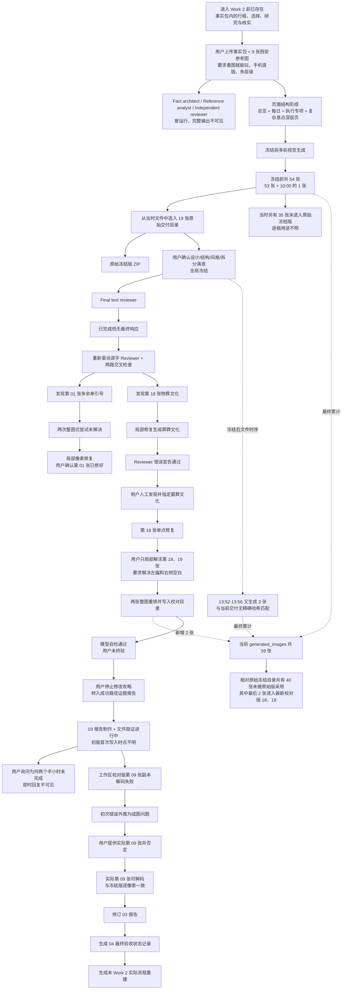

# 深圳旅行攻略：Work 2 实际执行工作流重建

> 文件名：`08-work2-as-executed-workflow.md`  
> 记录对象：当前来源中可见的深圳旅行视觉攻略 Work 2。  
> 记录目的：按实际发生顺序重建工作流，不评价其是否应成为未来流程。  
> 截止点：本文件生成时当前来源中最后一个相关用户决定与产物。  
> 本文件不修改旅行攻略、不重新验收图片、不设计 Travel Guide Skill，也不补写当前来源没有发生过的活动。

---

## 1. 证据范围和可见性限制

### 1.1 当前来源可以直接看到的证据

1. **当前会话中的用户消息与截图**
   - Work 2 的首条视觉攻略制作请求；
   - “直接给我最终版，而不是让我自己去找”；
   - 19 张整体方案满意并冻结的声明；
   - 最终逐字校对要求；
   - 子 Agent 均已完成、`Final text reviewer` 无最终响应的两张截图；
   - 第 18 张 `葬葬文化` 的人工纠错；
   - 第 18、19 张左偏及右侧大面积空白的返工要求；
   - 停止攻略修改并转入证据报告的决定；
   - “09 图片没有问题啊”及用户重新提供的实际第 09 张；
   - `04-shenzhen-final-acceptance.md` 和本文件的制作要求。

2. **Work 2 的原始输入文件**
   - `upload/01-md`：完整的《深圳旅行事实包》；
   - `upload/02-...png` 至 `upload/10-...png`：9 张西安旅行攻略参考图；
   - `upload/01-image.png`：用户后来重新提供的实际第 09 张图片。

3. **生成与交付产物**
   - `generated_images/`：59 张 `exec-*.png`；
   - `deliverables/深圳旅行视觉攻略_最终版/`：原始冻结版 19 张；
   - `deliverables/深圳旅行视觉攻略_最终版_19张.zip`：原始冻结版压缩包；
   - `deliverables/深圳旅行视觉攻略_最终校对版/`：当前工作区校对版聚合目录；
   - `deliverables/深圳旅行视觉攻略_最终校对版_19张.zip`：当前工作区校对版 ZIP 副本。

4. **当前 Work 的复盘与验收文件**
   - `03-work2-success-evidence.md`；
   - `04-shenzhen-final-acceptance.md`。

5. **当前可复核的工具结果**
   - PNG 数量统计、完整解码检查；
   - SHA-256 字节匹配；
   - ImageMagick 逐像素比较；
   - ZIP `unzip -t` 完整性检查；
   - 文件修改时间、尺寸和目录差异检查。

6. **当前可见的 Agent 记录**
   - 初期：`Fact architect`、`Reference analyst`、`Independent reviewer`；
   - 冻结后：`Final text reviewer`、`proofread_19_images` 及两个交叉检查 Agent；
   - 验收记录阶段：针对证据、文件完整性和报告文本的只读审计 Agent；
   - 本文件制作阶段：事件账本、产物时序和 Work 2 边界三个只读审计分支。

### 1.2 01、02、03、04 四份既有报告的使用边界

- `01-chat-requirements-and-decisions.md` 是需求与决策的回顾性报告。它可以说明哪些要求在 Work 2 入口处已经形成，但不能把其中更早的聊天事件自动改写成 Work 2 内重新发生的事件。
- `02-work1-failure-evidence.md` 记录的是 Work 1。它不用于重建 Work 2 的内部执行顺序，仅用于确认两个 Work 不应混写。
- `03-work2-success-evidence.md` 是当前 Work 2 的回顾性证据报告，可用于定位阶段、文件数量、修改记录和已知证据缺口。
- `04-shenzhen-final-acceptance.md` 固定了不同版本载体、用户确认、模型自检和文件完整性之间的边界。
- 当回顾性报告与当前实际文件或用户后续纠正不一致时，本账本采用后出现的用户确认和当前实际文件检查结果。例如，第 09 张以用户提供的实际图片及逐像素检查为准。

### 1.3 Work 2 的入口边界

Work 2 开始时，《深圳旅行事实包》已经是一个完整上传文件。它已经包含：

- 深圳三日旅行目的与两场演唱会；
- 已订酒店、首选高铁、三日主线；
- 七段固定通勤时间；
- 已排除的景点与个人取舍；
- 自然馆、莲花山、市民中心、深圳博物馆和演唱会专项事实；
- 开放时间、预约、购票、内部路线、重点展品、Plan A／B／C；
- `[已确认]`、`[出发前更新]`、`[待官方公布]` 三种状态；
- “不再调用高德、不重新计算固定通勤”的限制。

因此，当前来源只能确认 Work 2 **读取、组织并视觉转译**这些内容，不能把以下活动重新记成 Work 2 内发生：

- 发现深圳这个目的地；
- 推荐或比较酒店；
- 推荐或比较 G419、G400；
- 发现自然馆、莲花山、市民中心、深博、大运天地；
- 比较海边、大芬、鹤湖、赛格等候选并由用户筛选；
- 重新搜索交通、开放时间、预约或购票规则；
- 从零研究自然馆八厅、深博重点物证或演唱会散场方案；
- 制作事实包引用的《深圳三日演唱会旅行手册》。

这些内容是 Work 2 的**既有输入**，其形成过程在当前来源中没有相应聊天轮次、搜索日志或工具记录。

#### 旅行工作流活动在 Work 2 内的实际状态

| 活动 | Work 2 内可确认状态 | 在本账本中的位置 |
|---|---|---|
| 旅行意图理解 | 发生的是对“图片作为现场使用载体”的理解；三日深圳旅行本身已确定 | 事件 01 |
| 目的地发现 | 未发现 Work 2 内执行证据；深圳已锁定 | 本节入口边界 |
| 景点／活动／住宿／交通推荐 | 未发现 Work 2 内重新推荐证据；均已在事实包中锁定或列为既有事实 | 本节入口边界 |
| 候选项比较 | 未发现 Work 2 内对城市、酒店、车次或景点进行候选比较的证据 | 本节入口边界 |
| 用户筛选、排除和确认 | 海边、大芬、鹤湖、赛格等取舍作为既有输入进入；其实际筛选轮次不可见 | 本节入口边界 |
| 行程组合与调整 | Work 2 没有重新组合三日行程；执行的是页面编排 | 事件 04 |
| 专题研究 | 专题事实已写入事实包；Work 2 内没有可见的新搜索／研究日志 | 本节入口边界 |
| 交通、开放时间、预约、购票核实 | 作为事实包内容被采用；没有 Work 2 内重新核实证据 | 本节入口边界 |
| 景点内部玩法、路线和重点内容深化 | 研究内容已存在；Work 2 将其拆分、压缩并视觉化 | 事件 04—06 |
| 文字攻略或手册制作 | 未发现 Work 2 制作长篇文字手册的证据；手册和事实包均为入口前产物 | 本节入口边界 |
| 视觉攻略规划和生成 | 明确发生 | 事件 04—06 |
| Review、返工、冻结和交付 | 明确发生，并有多轮回退与局部解冻 | 事件 07—21 |

### 1.4 当前来源不能完整看到的内容

- Work 2 开始前的旅行发现、候选推荐、用户筛选和事实核实过程；
- 《深圳三日演唱会旅行手册》本体；
- 初期三个 Agent 的完整提示词、完整回复和逐项采用记录；
- 59 张生成图各自的完整生成提示词；
- 59 张图的“页面—版本—反馈—淘汰原因”映射；
- 初始生成阶段是否严格对每一批图片执行了用户要求的独立 Review 循环；
- AI 在“直接给我最终版”之前的即时回复；
- 第 01、18 张各次局部修复的完整工具命令和中间文件；
- 用户侧实际持有的最新 19 张目录或 ZIP 字节；
- 用户是否最终接受最新第 18、19 张重排版；
- 用户是否接受 `04-shenzhen-final-acceptance.md` 的结论。

---

## 2. 完整事件账本

### 事件 01｜用户提交 Work 2 的视觉攻略制作任务

- **顺序／时间定位**：当前来源中的第一条相关用户请求；上传文件的工作区时间早于所有生成图。
- **用户输入、目标或问题**：上传《深圳旅行事实包》和 9 张西安参考图，要求直接制作一套完整深圳旅行视觉攻略。核心目标是“看图就能玩”；要求总览、每日、每个景点、复杂景点深层内容；手机竖版优先；事实包是事实边界；西安图只作视觉质量和使用体验参考；每批成品应由未参与生成的独立 Reviewer 查看实际图片并循环修正。
- **AI／Work 实际动作**：接收 `upload/01-md` 和 9 张参考图，将本轮任务定位为视觉攻略制作，而不是重新规划深圳行程。
- **实际资料、搜索或工具**：可见资料是事实包与参考 PNG；当前来源没有本轮网页搜索或地图查询日志。
- **产物**：形成 Work 2 的输入边界和视觉交付目标；此时尚无可见最终图片。
- **候选、推荐或方案**：用户把图片数量、每个景点需要几张、构图和图文组合交给 Work 自主判断；没有要求先向用户提交长篇方案。
- **用户决定**：固定事实不得改变；未知信息不得写成确定事实；西安结构不得机械复制。
- **怎样触发下一步**：需要先读取事实内容和参考图，再组织页面并生成图片。
- **直接证据**：当前首条用户消息；`upload/01-md`；9 张上传参考图。
- **记录不足**：无法恢复 Work 对事实包逐条解析的内部过程。

### 事件 02｜用户强化“直接交付成品”

- **顺序／时间定位**：首条任务之后、完整 19 张冻结之前。
- **用户输入、目标或问题**：用户明确说“直接给我最终版，而不是让我自己去找”。
- **AI／Work 实际动作**：后续执行继续指向实际 PNG 套装和 ZIP，而不是只输出资料目录、设计说明或让用户自行查找内容。
- **实际资料、搜索或工具**：当前来源只保留该用户消息，前一条 AI 回复不可见。
- **产物**：后续实际形成 `deliverables` 下的成套图片与压缩包。
- **候选、推荐或方案**：没有可见候选列表；用户要求的是最终成品入口。
- **用户决定**：拒绝“用户自己去找”式交付。
- **怎样触发下一步**：Work 继续直接生成与组装视觉成品。
- **直接证据**：当前用户消息；后续实际 19 张目录和 ZIP。
- **记录不足**：不能确定该消息具体纠正了哪一种先前交付方式，也不能证明 ZIP 的创建只由这一条消息触发。

### 事件 03｜早期事实、参考图与独立检查角色运行

- **顺序／时间定位**：视觉生产早期；与页面规划和首轮生成的精确先后关系不可完全恢复。
- **用户输入、目标或问题**：事实包、9 张参考图、独立 Review 要求。
- **AI／Work 实际动作**：创建并运行 `Fact architect`、`Reference analyst`、`Independent reviewer`。用户后来的界面截图显示三者均为“已完成”。
- **实际资料、搜索或工具**：可确认这些角色存在；没有其完整可读输出，也没有可见外部搜索日志。
- **产物**：当前来源没有保存三份可独立读取的最终回复。
- **候选、推荐或方案**：无法确定 Fact architect 是否提出事实矩阵、Reference analyst 是否提出视觉方向、Independent reviewer 是否提交逐批缺陷清单。
- **用户决定**：用户后续关注到 Agent 均已完成、没有活跃 Agent；但没有可见的初期三份结果选择过程。
- **怎样触发下一步**：实际视觉页面仍需规划和生成。
- **直接证据**：用户截图；`03-work2-success-evidence.md` 对这些角色的记录。
- **记录不足**：无法证明初轮“生成→独立 Review→修改→再 Review”对每一批都完整执行，也无法证明三者对最终 19 张的增量作用。

### 事件 04｜页面层级在视觉规划与生成过程中形成

- **顺序／时间定位**：首轮生成前或生成过程中；当前记录无法进一步细分。
- **用户输入、目标或问题**：必须同时有整趟汇总、每日、景点和复杂景点深层内容，不能按西安“一天一张”封顶。
- **AI／Work 实际动作**：把既有事实内容组织为多层页面体系。
- **实际资料、搜索或工具**：事实包的 15 个正文部分及附录；9 张参考图；没有可见的新事实搜索。
- **产物**：最终落成的页面结构为：
  - 01：三日总览；
  - 02—04：D1—D3 每日攻略；
  - 05—09：行前、交通、演前用餐、入场、散场；
  - 10—14：自然馆八厅总览及 4 张内部主题页；
  - 15—16：莲花山、市民中心；
  - 17—19：深圳博物馆总览及 2 张深层页。
- **候选、推荐或方案**：当前来源没有保存其他页面目录候选，也没有证据表明用户曾逐项选择页面目录。
- **用户决定**：用户后来整体确认内容结构和图片拆分满意。
- **怎样触发下一步**：每个页面进入实际视觉生成。
- **直接证据**：原始冻结目录中的 19 个文件名；用户冻结声明。
- **记录不足**：无法确定 19 张结构是在生成前一次确定，还是在多轮生成中逐步收敛；无法确定每项拆分由哪个角色提出。

### 事件 05｜冻结前的视觉生成形成 54 张 PNG

- **顺序／时间定位**：工作区 mtime（当前文件系统显示为 `+09:00`；只用于文件相对顺序，不等同于聊天时间）显示，原始冻结目录形成前有两个生成簇：
  1. 2026-08-22 06:19:38—07:56:29，共 53 张；
  2. 10:00:02，共 1 张。  
  此时合计 54 张。冻结后的 3 张和 2 张分别记录在事件 10、15；到当前工作区才累计为 59 张。
- **用户输入、目标或问题**：手机竖版、“看图就能玩”、现代深圳自有表达、事实不能改动。
- **AI／Work 实际动作**：在原始冻结版组装前执行多轮图像生成，形成 54 张 `exec-*.png`；这些文件均可完整解码。
- **实际资料、搜索或工具**：图像生成执行产物；当前来源没有每次调用的完整提示词或调用日志。
- **产物**：冻结前 54 张生成 PNG。后来入选的 19 张使用深圳天际线、蓝绿城市色彩、现代交通、演唱会夜景和博物馆器物插画，没有照搬西安古风。
- **候选、推荐或方案**：冻结前工作区已有 54 张生成文件，但不能确认 54 张是否都被当作候选审阅；也不能确认当时向用户展示了哪些文件或是否存在正式 A／B／C 选择界面。
- **用户决定**：没有可见逐稿选择记录；只确认后续整套 19 张获得认可。
- **怎样触发下一步**：需要从生成结果中组装一套命名明确的 19 张交付版。
- **直接证据**：`generated_images/` 的文件、解码结果和 mtime；原始冻结目录的 mtime；`03` 的数量核验。
- **记录不足**：不能把冻结前 54 张等同于 54 次有效迭代；也不能把当时未入选的 35 张统一称为失败稿。

### 事件 06｜从生成结果中组装原始 19 张与 ZIP

- **顺序／时间定位**：原始冻结目录文件 mtime 集中于 2026-08-22 12:19:18，ZIP 为 12:19:19；19 张全部来自第一生成簇。
- **用户输入、目标或问题**：需要可直接使用的完整成套攻略。
- **AI／Work 实际动作**：将 19 张已生成图片汇集到 `deliverables/深圳旅行视觉攻略_最终版/`，并创建 `深圳旅行视觉攻略_最终版_19张.zip`；19 张都能精确映射到冻结前已有文件。
- **实际资料、搜索或工具**：文件选择、复制／汇集、压缩；SHA-256 检查证明 19 张分别与 19 个 `generated_images/exec-*.png` 字节完全一致。
- **产物**：原始冻结版 19 张和有效 ZIP。ZIP 含目录项与 19 张 PNG，`unzip -t` 通过。
- **候选、推荐或方案**：目录形成时工作区已有 54 张生成图，其中 19 张进入此目录、35 张未进入；无法确认全部 54 张是否都参与过同一轮选择，也没有逐稿淘汰说明。冻结后又生成 5 张，因此当前 `generated_images/` 相对原始冻结版共有 40 张未被原始冻结目录采用。
- **用户决定**：随后的冻结声明接受整套 19 张的整体设计、结构、风格和拆分。
- **怎样触发下一步**：方案层通过后转入最终文字校对。
- **直接证据**：原始冻结目录、ZIP、哈希映射、完整性检查、用户冻结声明。
- **记录不足**：无法确定最终挑选由模型自动完成、由某 Agent 推荐，还是用户逐张参与；无法恢复逐页选择理由。

#### 原始冻结版 19 张的生成来源

| 图号 | 原始冻结版文件 | 字节完全相同的生成文件 |
|---:|---|---|
| 01 | `01_深圳3日旅行总览.png` | `exec-685735f6-b894-44b7-b417-94a2eb3db0ba.png` |
| 02 | `02_D1武汉到深圳第一场.png` | `exec-616fb28d-1771-435d-b8ce-a67936e674f8.png` |
| 03 | `03_D2自然博物馆与收官场.png` | `exec-a5db52c4-d55c-4ac6-9244-8baa226e422d.png` |
| 04 | `04_D3莲花山深博返汉.png` | `exec-f20f84d5-3bab-4bde-bdb4-4e112c76d3f8.png` |
| 05 | `05_出发前必办时间表.png` | `exec-fccfe1b1-99d0-476f-b302-cc6b99d3780b.png` |
| 06 | `06_深圳地铁交通速查.png` | `exec-97bcdbcd-11b3-4b90-841f-4a8617b443c1.png` |
| 07 | `07_大运天地演前用餐.png` | `exec-e1a12d14-8166-4961-9579-bf16963d1482.png` |
| 08 | `08_双场演唱会入场.png` | `exec-e71067a0-2ac0-4209-82f4-cc3360714902.png` |
| 09 | `09_演唱会散场ABC.png` | `exec-c3994189-ca4d-4736-b54b-340311c5910d.png` |
| 10 | `10_自然博物馆八厅总览.png` | `exec-82adfcc2-ed41-4671-a74d-4c180e51e8aa.png` |
| 11 | `11_自然馆宇宙厅与地球厅.png` | `exec-c1e40676-fe56-4c8b-82a7-6771baa78829.png` |
| 12 | `12_自然馆演化厅.png` | `exec-ed707f77-866d-427b-b7cc-d98e63fd715b.png` |
| 13 | `13_自然馆恐龙厅.png` | `exec-eb5bede3-49ec-45fb-91b2-4201242200a2.png` |
| 14 | `14_自然馆人类生物生态家园.png` | `exec-5b217796-20e0-4b7d-9f82-e6d5ad4d959b.png` |
| 15 | `15_莲花山最短登顶线.png` | `exec-dfc76a22-cfa5-43e1-a529-dd0891d72ea3.png` |
| 16 | `16_市民中心中轴.png` | `exec-914d032b-1c39-4eb7-8a99-264f1b0ab173.png` |
| 17 | `17_深圳博物馆总览.png` | `exec-1a9c99af-dda2-4fe6-a621-938ac5e754d4.png` |
| 18 | `18_古代深圳重点物证.png` | `exec-315fcae7-3b81-4be2-97e6-59b473e7e064.png` |
| 19 | `19_近代民俗改革开放.png` | `exec-29a20cc2-556a-4720-9377-071512a22eb8.png` |

### 事件 07｜用户确认整套方案并全局冻结

- **顺序／时间定位**：原始 19 张形成之后。
- **用户输入、目标或问题**：用户明确表示“当前 19 张视觉攻略的整体设计、内容结构、视觉风格和图片拆分已经确认满意，全部冻结”。随后要求只做最终成图逐字校对。
- **AI／Work 实际动作**：停止重新设计、调整版式、改变内容组织、增加信息或重规划；将任务改成确定性文字瑕疵检查。
- **实际资料、搜索或工具**：原始冻结版 19 张；用户列出的文字检查范围。
- **产物**：全局冻结边界和逐字校对任务。
- **候选、推荐或方案**：用户已知第 01 张 `坪山自然馆'` 应为 `坪山自然馆`；同时要求不能只查这一处。
- **用户决定**：整体方案层通过；只允许对明确文字错误作最小修正。
- **怎样触发下一步**：需要委派未参与生成的独立 Reviewer 检查 19 张实际可见文字。
- **直接证据**：当前用户冻结消息；`03`、`04` 对该边界的记录。
- **记录不足**：没有可见的 19 张 OCR 文本基线或逐页人工抄录清单。

### 事件 08｜首个 `Final text reviewer` 完成但没有返回结果

- **顺序／时间定位**：全局冻结后的第一轮逐字校对。
- **用户输入、目标或问题**：独立逐字检查 19 张，发现后最小修复，再复核。
- **AI／Work 实际动作**：委派 `Final text reviewer`。
- **实际资料、搜索或工具**：Agent 界面显示状态“已完成”，最终回复区域显示“暂无最终响应”。
- **产物**：没有可执行的问题清单。
- **候选、推荐或方案**：无。
- **用户决定**：用户先指出“没有活跃的子智能体”，再问“是不是你给的指令有问题”。
- **怎样触发下一步**：首次委派未产生可用输出，需要重新委派独立校对。
- **直接证据**：用户提供的两张 Agent 状态截图；`03` 对无响应事件的记录。
- **记录不足**：无法确定无响应是提示词、上下文、运行故障还是其他原因；也看不到 AI 当时的完整解释。

### 事件 09｜重新委派逐字 Reviewer 与两路交叉检查

- **顺序／时间定位**：首个 Reviewer 无结果之后。
- **用户输入、目标或问题**：仍然只检查确定存在的文字问题，不重新设计。
- **AI／Work 实际动作**：重新委派 `proofread_19_images` Reviewer，并由两个交叉检查 Agent 分别覆盖 01—10、11—19。
- **实际资料、搜索或工具**：Agent 直接查看图片的结果摘要；完整提示词、截图和逐页输出当前不可见。
- **产物**：确认两处问题：
  1. 第 01 张 `坪山自然馆'` → `坪山自然馆`；
  2. 第 18 张 `物葬文化` → `墓葬文化`。
- **候选、推荐或方案**：只提出这两处确定修正，没有可见的新设计建议。
- **用户决定**：后续接受第 01 张修复；第 18 张进入修复与复核。
- **怎样触发下一步**：Generator 对两处文字执行最小修改。
- **直接证据**：`03` 第 3D、8.4、16 节的事件记录；当前后续用户反馈。
- **记录不足**：不能恢复 Reviewer 对其他文字的逐行结论，也不能确认是否有问题被讨论后排除。

### 事件 10｜第 01 张修复先走整图尝试，后转为局部像素修复

- **顺序／时间定位**：逐字问题清单之后；校对目录主体于 2026-08-22 14:02 左右汇集。
- **用户输入、目标或问题**：删除 `坪山自然馆` 后的多余单引号，不改其他内容。
- **AI／Work 实际动作**：记录显示先进行了两次整图式生成，但多余单引号仍存在；随后采用极小局部像素修复。
- **实际资料、搜索或工具**：三个 13:52—13:56 的生成文件存在，但它们与当前交付 PNG 均无精确哈希匹配；最终校对目录第 01 张与冻结版不同，且不与任何 `generated_images` 文件字节完全一致。具体局部编辑工具不可见。
- **产物**：校对版第 01 张显示 `坪山自然馆`，尺寸仍为 864×1821。
- **候选、推荐或方案**：整图式尝试没有成为最终交付文件；局部修复结果进入校对目录。
- **用户决定**：用户后来明确确认“已修复，无需处理”。
- **怎样触发下一步**：第 18 张仍需完成文字修复和复核。
- **直接证据**：`03` 的修复记录；第 01 张文件差异；用户明确确认。
- **记录不足**：不能把 13:52—13:56 的三个生成文件逐一对应到两次失败尝试；具体工具、提示词和裁剪区域不明。

### 事件 11｜第 18 张从原错误修成新的重复字

- **顺序／时间定位**：第 18 张文字修复阶段。
- **用户输入、目标或问题**：把 Reviewer 发现的 `物葬文化` 改为 `墓葬文化`。
- **AI／Work 实际动作**：执行局部文字／像素修正；记录称局部取字或覆盖位置发生错误。
- **实际资料、搜索或工具**：具体编辑命令和中间文件没有保留在当前来源中。
- **产物**：中间结果成为 `葬葬文化`。
- **候选、推荐或方案**：目标只有 `墓葬文化`，没有其他候选文案。
- **用户决定**：当时尚未确认；错误在下一轮 Reviewer 中被放过。
- **怎样触发下一步**：按用户要求对修正后的 19 张再次逐字复核。
- **直接证据**：用户后续人工指出当前文字为 `葬葬文化`；`03`、`04` 对修复链的记录。
- **记录不足**：无法定位该错误对应的单独临时文件或具体执行 ID。

### 事件 12｜Reviewer 对含 `葬葬文化` 的版本错误宣告通过

- **顺序／时间定位**：第 18 张错误中间版本形成后。
- **用户输入、目标或问题**：对修正后的 19 张重新逐字复核，只报告实际存在的问题。
- **AI／Work 实际动作**：独立 Reviewer 复核并报告全量通过；记录中特别声称第 18 张句子完整、没有重复。
- **实际资料、搜索或工具**：Reviewer 文字结论可由 `03` 恢复；原始完整输出当前不可见。
- **产物**：一个“通过”的 Review 结论，但图片中仍保留 `葬葬文化`。
- **候选、推荐或方案**：Reviewer 没有提出继续修改。
- **用户决定**：用户随后查看实际图片并推翻该结论。
- **怎样触发下一步**：用户发出只修第 18 张一个词的明确指令。
- **直接证据**：当前用户纠错消息；`03` 第 7.4、8.4 节；`04` 第 3 节。
- **记录不足**：无法确定 Reviewer 漏检来自视觉识别、裁片、提示或执行问题。

### 事件 13｜用户人工终检并限定第 18 张单点修复

- **顺序／时间定位**：错误 PASS 之后。
- **用户输入、目标或问题**：用户明确：第 01 张已修复，无需处理；第 18 张当前 `葬葬文化`，必须改为 `墓葬文化`；只执行这一处，不改版式、不重新生成整张、不改其他文案。
- **AI／Work 实际动作**：仅对第 18 张该词做局部修复。
- **实际资料、搜索或工具**：局部修复方法的完整命令不可见；`03` 记录修正结果。
- **产物**：显示 `墓葬文化` 的文字修正版第 18 张。
- **候选、推荐或方案**：没有其他候选；正确目标由用户直接给定。
- **用户决定**：确认目标文字；没有对这张局部修正版另发整图“通过”确认。
- **怎样触发下一步**：用户随后发现第 18、19 张还有与文字无关的共同布局问题。
- **直接证据**：当前用户单点修复消息；`03`、`04`。
- **记录不足**：当前交付结构中没有一个可独立识别、与后续重排严格分离的完整 19 张“文字修正版”目录或 ZIP。

### 事件 14｜用户只对第 18、19 张重新开放布局修改

- **顺序／时间定位**：全局冻结和文字修复之后。
- **用户输入、目标或问题**：仅处理第 18、19 张；两张有效内容明显集中在左侧，右侧大面积无效空白；允许根据各自内容重新布局，不要求沿用错误版式，也不能机械拉伸；其他 17 张不处理；第 18 张必须保持 `墓葬文化`。
- **AI／Work 实际动作**：保留其他 17 张冻结状态，把第 18、19 张改为整图重新排版任务。
- **实际资料、搜索或工具**：旧版第 18、19 张、事实包和用户给定的布局验收目标。
- **产物**：局部解冻边界与两张重排任务。
- **候选、推荐或方案**：用户没有指定具体新构图，把实现交给 Work 自主判断。
- **用户决定**：授权两张重排；没有授权继续优化其他页面。
- **怎样触发下一步**：重新生成／重组第 18、19 张。
- **直接证据**：当前用户布局修改消息；`03` 第 3E、9 节；`04` 第 1.3 节。
- **记录不足**：旧版 18、19 的所有历史候选与用户看到的具体版本之间没有完整映射。

### 事件 15｜第 18、19 张生成最新重排版并写入校对目录

- **顺序／时间定位**：工作区 mtime 显示两张新图于 2026-08-22 19:36:13、19:37:28 生成，19:38 左右写入校对目录。
- **用户输入、目标或问题**：解决左偏和右侧大面积空白，保持正确事实与 `墓葬文化`。
- **AI／Work 实际动作**：整图重新生成／重新排版两张页面，并查看最终实际成图。
- **实际资料、搜索或工具**：
  - 最新第 18 张与 `exec-cf78db56-52e0-4f09-a3a2-f2b42ddc5a0e.png` 字节一致；
  - 最新第 19 张与 `exec-f73056d1-02cc-4118-a74e-5b46dc9d3cc9.png` 字节一致；
  - 两张均可完整解码。
- **产物**：`最终校对版/18_古代深圳重点物证.png` 和 `19_近代民俗改革开放.png` 的最新重排版。
- **候选、推荐或方案**：模型自检认为两张已充分利用竖版画布、左右均衡，第 18 张显示 `墓葬文化`，且没有新增明显文字或事实错误。
- **用户决定**：当前来源中没有用户对这两张最新图明确回复“满意”或“通过”。
- **怎样触发下一步**：用户停止继续修改攻略，转而要求记录项目过程和最终状态。
- **直接证据**：最新文件、哈希匹配、解码检查；`03`、`04`。
- **记录不足**：布局和文字正确性只有模型自检，不是用户终验；完整图像生成提示词不可见。

### 事件 16｜用户停止图片工作并启动成功路径证据取证

- **顺序／时间定位**：最新第 18、19 张生成后。
- **用户输入、目标或问题**：停止继续修改深圳攻略；只基于当前 Work 实际过程和最终产物生成《深圳旅行攻略：成功路径证据报告》；区分直接证据、部分证据、推测、深圳特例和通用候选；不事后合理化，不写 Skill。
- **AI／Work 实际动作**：读取输入与产物，统计最终累计的 59 张生成 PNG，核对原始冻结版 19 张及其生成来源，比较冻结版与校对版，执行 PNG 解码和 ZIP 完整性检查，整理 Review 与修正记录。检查时观察到：
  - 校对目录主体文件的 mtime 横跨 2026-08-22 14:02、19:38 和 2026-08-25 12:24，不是一次单独汇集动作；
  - 当前目录有 19 个 PNG 文件名；第 02—08、10—17 共 15 张与冻结版字节一致，第 01、09、18、19 张不同；
  - 当前工作区第 09 张副本无法完整解码；
  - 当前工作区校对 ZIP 缺少中央目录，`unzip -t` 失败。
- **实际资料、搜索或工具**：本地文件读取、数量统计、哈希／字节比较、图像解码、ZIP 检查；没有重新搜索旅行事实。
- **产物**：形成 `03-work2-success-evidence.md` 的取证材料、文件检查结果和报告草稿；当前来源无法确定初版文件是在下一条状态询问之前还是之后首次写入完成。
- **候选、推荐或方案**：报告对哪些做法被保留、哪些未证明价值、哪些结论不能事后采用进行了证据标记；它不是攻略方案。
- **用户决定**：先停止图片修改，授权只做证据报告。
- **怎样触发下一步**：报告制作与取证仍在进行，用户随后单独询问运行状态。
- **直接证据**：当前用户请求、当前目录与文件检查、`03` 文件和修订说明。
- **记录不足**：mtime 只能证明文件写入的相对顺序，不能证明由谁、因何写入；第 09 张工作区副本和 ZIP 副本何时、为何与其他版本分叉仍未知。

### 事件 17｜用户在报告运行中询问进度

- **顺序／时间定位**：成功路径报告制作过程中、用户提供实际第 09 张之前。
- **用户输入、目标或问题**：用户询问“现在进行到哪一步了？为什么两个半小时还没有跑完？”
- **AI／Work 实际动作**：当前来源没有保留该问题之后的完整即时回复，也不能恢复询问是否改变了正在进行的文件检查或报告编写。
- **实际资料、搜索或工具**：只有该用户消息；没有对应的分项耗时日志。
- **产物**：没有可单独确认的新文件产物；取证和报告编写继续进行。
- **候选、推荐或方案**：不可见。
- **用户决定**：用户要求获知当前进度和耗时原因，没有在该条消息中重新开放图片修改。
- **怎样触发下一步**：取证过程随后把工作区第 09 张副本异常错误外推到实际成图，用户因此提供实际图片纠偏。
- **直接证据**：当前用户状态询问消息。
- **记录不足**：无法把两个半小时分配给某个 Agent、图像检查或文件操作，也无法确定 AI 当时给出的解释。

### 事件 18｜用户用实际第 09 张推翻本地副本外推结论

- **顺序／时间定位**：取证过程对第 09 张作出错误外推之后；用户实际第 09 张文件 mtime 为 2026-08-25 15:00 左右。初版 `03` 的首次写入与上一条状态询问的精确先后无法确定。
- **用户输入、目标或问题**：用户提供图片并说“09 图片没有问题啊”。
- **AI／Work 实际动作**：检查 `upload/01-image.png`：可完整解码，尺寸 941×1672；与原始冻结版第 09 张执行 ImageMagick `compare -metric AE`，结果为 0，即画面逐像素一致；同时保留“工作区校对目录第 09 张副本无法完整解码”的单独结论。
- **实际资料、搜索或工具**：ImageMagick 解码与逐像素比较、SHA-256 文件哈希、原始冻结版第 09 张、工作区校对副本。
- **产物**：撤回“第 09 张实际成图损坏”的判断；修订 `03-work2-success-evidence.md`，把事件改记为“取证副本与实际成品不一致”。
- **候选、推荐或方案**：没有图片修改；只修正证据报告的对象归属。
- **用户决定**：明确确认其实际看到的第 09 张没有问题。
- **怎样触发下一步**：需要把“整体方案确认”“局部修改”“文件副本状态”和“用户侧实际交付”拆开记录。
- **直接证据**：用户消息与上传图；逐像素比较；`03` 修订说明；`04` 第 4 节。
- **记录不足**：工作区异常副本的来源仍未知；用户侧是否存在完整有效的最新校对 ZIP 仍未知。

### 事件 19｜生成独立的最终验收状态记录

- **顺序／时间定位**：`03` 修订后。
- **用户输入、目标或问题**：要求生成 `04-shenzhen-final-acceptance.md`；禁止修改图片；必须区分原始冻结版、文字修正版、最新 18／19、当前校对目录、原始 ZIP、当前校对 ZIP，并使用五种状态记录用户确认、文件检查、模型自检、已发现问题和无法确定。
- **AI／Work 实际动作**：
  - 读取修订后的 `03`；
  - 独立委派验收证据审计、产物完整性审计和报告文本审阅；
  - 检查两个目录的 PNG 数量和完整解码；
  - 检查两个 ZIP；
  - 比较用户实际第 09 张与原始冻结版；
  - 用最小文本修订拆开混合证据状态；
  - 保存 Markdown 成品。
- **实际资料、搜索或工具**：`rg`、`find`、ImageMagick `convert`／`compare`、`sha256sum`、`unzip -t`、文件补丁写入、持久文件保存；没有修改任何攻略图片或 ZIP。
- **产物**：`04-shenzhen-final-acceptance.md`。
- **候选、推荐或方案**：记录将项目状态写为“部分终验完成”，并分别列出视觉方案层、内容结构层、最新局部修改和文件交付层。
- **用户决定**：当前来源中没有用户对 `04` 内容作进一步确认、否定或修订。
- **怎样触发下一步**：用户要求进一步重建 Work 2 实际执行过的完整工作流，即本文件。
- **直接证据**：当前用户请求；本会话可见的工具输出与 Agent 返回；`04` 实际文件。
- **记录不足**：用户是否阅读并接受 `04` 无法确定。

### 事件 20｜当前任务转为“发现并记录实际工作流”

- **顺序／时间定位**：当前来源最后一个相关用户请求。
- **用户输入、目标或问题**：禁止设计 Skill、禁止提炼通用原则、禁止只总结成功或失败；要求从第一条相关请求到最后产物，按顺序记录输入、动作、工具、产物、候选、用户决定、触发关系、直接证据和未知项，并输出 `08-work2-as-executed-workflow.md`。
- **AI／Work 实际动作**：
  - 只读检查当前工作区文件；
  - 读取事实包、`03`、`04`；
  - 识别并读取用户点名的 01、02 报告，仅用于划清 Work 2 与上游／Work 1 的边界；
  - 并行委派事件账本、产物时序、Work 2 范围三个只读审计分支；
  - 核对 59 张生成图、19 张哈希映射、四个生成时间簇、目录差异和 ZIP 状态；
  - 生成本 Markdown 文件。
- **实际资料、搜索或工具**：本地文件搜索与读取、持久文件检索、`find`、`sha256sum`、文件元数据检查、只读 Agent 审计、补丁写入；没有网页搜索，没有图片修改。
- **产物**：`08-work2-as-executed-workflow.md`。
- **候选、推荐或方案**：没有提出未来流程或 Skill 方案；只组织当前证据支持的事件顺序。
- **用户决定**：本事件由当前请求授权；文件生成后用户尚未反馈。
- **怎样触发下一步**：当前来源在本文件交付处结束。
- **直接证据**：当前用户请求、本轮工具输出和本文件。
- **记录不足**：用户是否接受本次重建需要后续反馈，当前无法预写。

---

## 3. 实际执行流程图

### 3.1 按实际事件整理的主流程与分支

### 3.2 各真实阶段的输入—动作—输出—用户决定—转场原因

| 实际阶段 | 输入 | 实际动作 | 输出 | 用户决定 | 进入下一阶段的实际原因 |
|---|---|---|---|---|---|
| Work 2 入口 | 已完成事实包、9 张西安图、视觉攻略要求 | 接收输入，运行早期分析角色 | 事实／视觉边界；完整 Agent 输出不可见 | 事实包负责事实，西安只作质量参考 | 需要形成页面和实际图片 |
| 内容视觉编排 | 多层级要求、事实包章节 | 将既有内容拆为总览、每日、现场专项和景点深层页 | 19 张页面结构 | 后来整体确认拆分满意 | 页面需逐张生成 |
| 冻结前多轮生成 | 页面目标、事实、参考风格 | 先生成 53 张，后又生成 1 张 | 冻结前 2 个时间簇、共 54 个文件 | 无可见逐稿选择 | 需要组装可交付套装 |
| 原始交付组装 | 当时工作区已有 54 张；其中 19 张有精确来源映射，是否审阅全部 54 张未知 | 汇集 19 张、命名、建目录、打 ZIP | 原始冻结版目录与有效 ZIP | 19 张设计／结构／风格／拆分满意并冻结 | 只剩最终文字校对 |
| 第一次文字 Review | 冻结版 19 张、已知第 01 张问题 | 委派 `Final text reviewer` | Agent 完成但无回复 | 用户质疑没有活跃 Agent／指令是否有问题 | 需要重新委派 |
| 第二次文字 Review | 同一 19 张与限定范围 | 新 Reviewer + 两路交叉检查 | 第 01、18 张问题清单 | 只修确定错误 | 进入局部修复 |
| 文字修复循环 | 01、18 两处问题 | 01 先整图尝试再局部修；18 局部修；文件时序显示冻结后另有 3 张生成图，但不能精确映射用途 | 01 正确；18 中间成为 `葬葬文化` | Reviewer 误判通过，用户人工推翻 | 重新修第 18 张 |
| 第 18 张单点修复 | 用户给定 `墓葬文化` | 局部修正 | 文字修正版第 18 张 | 未作整图终验 | 用户发现 18、19 的布局问题 |
| 第 18、19 张局部解冻 | 两张旧图、画布空白问题 | 新生成 2 张并整图重排、替换；到此 `generated_images` 最终累计 59 张 | 最新第 18、19 张 | 只有模型自检，用户未终验 | 用户停止图片工作 |
| 成功路径取证 | 当前文件、用户要求 | 统计、哈希、解码、ZIP 检查、整理报告 | 03 的取证材料与报告草稿；初版首次写入时点不明 | 用户在过程中询问进度，随后指出实际 09 没问题 | 重新核对实际文件 |
| 报告运行中状态询问 | 报告已运行一段时间 | 用户询问进度和两个半小时耗时；AI 即时回复不可见 | 无可单独确认的新产物 | 未重新开放图片修改 | 报告继续，随后进入第 09 张纠偏 |
| 第 09 张纠偏 | 用户实际第 09 张、冻结版、异常本地副本 | 解码和逐像素比较 | 实际图正常；本地副本异常；03 修订 | 用户明确实际 09 无问题 | 需要独立固定最终验收状态 |
| 最终状态记录 | 修订 03、文件检查、用户确认 | 分开记录六类版本／载体与五种状态 | 04 验收状态记录 | 尚无后续确认 | 用户进一步要求重建实际工作流 |
| 当前流程重建 | 当前会话、文件、工具结果、03／04 | 只读取证并按时间重建 | 本文件 | 尚待用户反馈 | 当前来源到此结束 |

---

## 4. 分支、循环、回退和被放弃路径

### 4.1 上游旅行研究与 Work 2 视觉生产分支

- 目的地、演唱会、酒店、车次、景点选择、排除项、通勤、开放时间、预约、购票、内部玩法和专题研究，在 Work 2 入口时已经存在于事实包。
- Work 2 没有可见证据表明重新执行了这些发现、推荐、候选比较或核实。
- Work 2 实际进入的是“把既有事实转成视觉页面”的分支。

### 4.2 最终累计 59 张生成结果的时序与选择分支

- `generated_images/` 有 59 张、分为 4 个 mtime 簇。
- 原始冻结目录在前两个生成簇之后形成；当时已有 54 张，而不是最终累计的 59 张。
- 原始冻结版 19 张全部来自第一簇的 19 个文件。
- 冻结时另有 35 张没有进入原始冻结版；冻结后又生成 3 张和 2 张，因此当前相对原始冻结目录共有 40 张未被原始版采用。
- 当前来源没有逐稿说明，因而无法把 40 张继续细分为失败稿、探索稿、修正版或备用稿。
- 10:00 的 1 张和 13:52—13:56 的 3 张都未与当前交付 PNG 形成精确字节匹配；仅凭文件不能判断其用途。
- 最后 2 张发生在原始冻结之后，并明确成为最新校对版第 18、19 张。

### 4.3 早期 Agent 分支没有留下可追踪闭环

- `Fact architect`、`Reference analyst`、`Independent reviewer` 显示已完成。
- 当前来源没有它们的完整输出，也没有“结论—页面—返工”的映射。
- 因此只能把它们记录为实际运行过的并行分支，不能写成已经完成的逐批质量门禁。

### 4.4 首次文字 Reviewer 死路与重新委派

- 第一条路径：`Final text reviewer` → 状态完成 → 无最终回复 → 没有可执行清单。
- 用户通过界面状态发现该路径没有继续活动，并质疑指令。
- 第二条路径：新 `proofread_19_images` Reviewer + 两个交叉检查 Agent → 返回第 01、18 张问题。

### 4.5 第 01 张修复循环

1. 确认多余单引号；
2. 两次整图式生成仍保留问题；
3. 放弃这两次结果作为最终修复；
4. 转为极小局部像素修复；
5. 用户确认该处已修好。

具体两次整图生成文件无法从当前哈希记录中逐一定位。

### 4.6 第 18 张修复—误判—人工纠错循环

1. Reviewer 报告 `物葬文化`；
2. 局部修复产生 `葬葬文化`；
3. Reviewer 宣告全量通过；
4. 用户查看实际图片后推翻 PASS；
5. 用户指定唯一正确文本 `墓葬文化`；
6. Work 执行单点修复；
7. 随后该文字修正版又被整图重排版覆盖。

这个循环没有保留下一个可独立验收的完整 19 张“纯文字修正版”包。

### 4.7 全局冻结与局部解冻

- 全局冻结对象：19 张的设计、内容结构、视觉风格和图片拆分。
- 第一次冻结后开放范围：确定性文字错误。
- 第二次局部开放范围：仅第 18、19 张的布局。
- 其他 17 张没有重新开放视觉优化。
- 最新第 18、19 张生成后只有模型自检，没有用户最终通过消息。

### 4.8 原始冻结版、文字修正版与最新重排版的版本分叉

- 原始冻结版：独立 19 张目录及有效 ZIP；19 张均可解码。
- 文字修正版：存在第 01、18 张修复过程，但没有可独立识别的完整目录／ZIP。
- 当前校对目录：混合 15 张冻结版字节、修改后的第 01、最新第 18、19，以及一个异常的本地第 09 张副本。
- 用户实际第 09 张：正常，并与冻结版第 09 张逐像素一致。
- 当前校对 ZIP 工作区副本：无有效中央目录；用户侧实际校对 ZIP 字节不可见。

### 4.9 第 09 张“实际成图”与“取证副本”分叉

- 初次报告路径：读取工作区校对目录第 09 张失败 → 错误外推为最终成图问题。
- 用户纠偏路径：用户提供实际第 09 张 → 完整解码成功 → 与冻结版逐像素一致。
- 报告回退：撤回初次结论，修改 `03`，把异常限定为工作区副本。
- 没有执行图片修复，也没有用用户上传图覆盖工作区异常副本。

### 4.10 报告产物分支

- `01`：需求与决策证据报告，包含 Work 2 入口前已形成的要求；不是 Work 2 图像生产日志。
- `02`：Work 1 失败证据，不并入本 Work 2 账本。
- `03`：Work 2 成功路径证据；因第 09 张判断被用户纠正而发生一次修订。
- `04`：独立记录最终验收状态，不把整体方案满意等同于最新局部修改或文件包完整。
- `08`：本文件，只重建实际执行顺序。

### 4.11 明确没有继续的路径

- 未入选的 40 张生成结果没有进入原始冻结交付。
- 首个 `Final text reviewer` 没有返回可用结果，没有继续沿用其输出。
- 第 01 张两次整图式修复没有成为最终修复文件。
- 第 18 张 `葬葬文化` 中间版本被用户推翻。
- 整套视觉设计在冻结后没有重新全面开放；只处理第 18、19 张。
- 用户要求停止攻略修改后，没有再重新生成、重新设计或重新验收整套攻略。
- 工作区异常第 09 张和 ZIP 在证据报告阶段没有被修复。
- 最新第 18、19 张没有获得用户终验闭环。

---

## 5. 当前来源无法回答的问题

### 5.1 Work 2 入口前的旅行规划过程

1. 事实包由谁、在哪个 Work、使用哪些搜索或资料制作。
2. 《深圳三日演唱会旅行手册》的完整内容和制作过程。
3. 深圳目的地、双场演唱会旅行、酒店、G419／G400如何被发现、比较和确定。
4. 自然馆、莲花山、市民中心、深博、大运天地等景点如何进入候选。
5. 海边、大芬、鹤湖、赛格等排除项经过了怎样的候选比较和用户筛选。
6. 七段固定通勤的人工查询过程和原始地图证据。
7. 开放时间、预约、购票、自然馆八厅、深博展品及演唱会 Plan A／B／C 的原始专题研究过程。
8. 事实包内部“当前 Work 后续明确确认”所指的具体聊天阶段；由于该文件在本 Work 首条消息中已完整存在，不能定位成 Work 2 内的具体轮次。

### 5.2 初始视觉规划与生成

9. `Fact architect`、`Reference analyst`、早期 `Independent reviewer` 的完整提示词和最终回复。
10. 三个早期 Agent 与页面结构、具体图片或返工之间的映射。
11. 初始阶段是否确实对“每一批”图片执行独立 Review。
12. 19 张页面目录是生成前确定还是生成中逐步收敛。
13. 59 张图各自对应哪个页面、哪个版本、哪条反馈和哪次修正。
14. 每次图像生成的完整提示词、工具调用参数和返回顺序。
15. 是否向用户展示过正式的视觉方向候选、页面候选或逐页推荐。
16. 40 张未入选结果的淘汰原因及中间价值。
17. 最终 19 张由谁逐张选择、采用了什么判断、是否经过用户逐张确认。

### 5.3 冻结后校对与修复

18. `Final text reviewer` 无最终响应的具体原因。
19. 新 Reviewer 和两个交叉检查 Agent 的完整逐页原始输出。
20. 第 01 张两次整图式修复对应哪些具体生成文件。
21. 第 01 张最终局部像素修复使用的工具、区域和操作细节。
22. 第 18 张 `物葬文化` → `葬葬文化` 对应哪个中间文件及具体编辑动作。
23. Reviewer 为什么会把 `葬葬文化` 判断为无重复并宣告通过。
24. 第 18 张单点修复后是否曾形成一个完整、有效的 19 张文字修正版包。
25. 最新第 18、19 张是否完全没有新增文字、事实或成图错误；当前只有模型自检。
26. 用户是否接受最新第 18、19 张。

### 5.4 文件与交付

27. 当前工作区第 09 张校对副本何时、为何变成无法完整解码的文件。
28. 当前工作区校对 ZIP 为何缺少中央目录。
29. `03` 的回顾性文字写有“校对 ZIP 此前曾通过检查”，但当前来源没有那次检查的原始工具输出或当时 ZIP 字节；因此无法判断它是否与当前失败副本为同一文件版本。
30. 用户侧是否存在一份完整有效、包含最新第 01、18、19 张的 19 张目录或 ZIP。
31. 用户实际接收过哪些下载链接、目录或压缩包；“直接给最终版”之前的 AI 回复不可见。

### 5.5 后续记录

32. 用户是否接受 `04-shenzhen-final-acceptance.md` 中“部分终验完成”的记录。
33. 用户是否认为本文件已完整覆盖 Work 2 的实际事件。
34. 当前来源没有的问题，不在本文件中作推断或补全。
