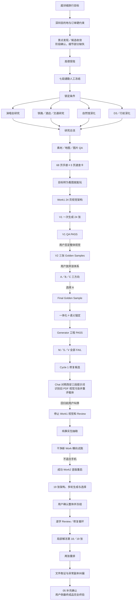

# 深圳旅行攻略：跨来源实际工作流合并图

> 文件名：`09-cross-source-as-executed-workflow-map.md`  
> 合并对象：原始 Chat、Work1、Work2 及最终验收补充记录  
> 目的：只重建并合并历史中**实际发生过的工作流**，不设计未来 Travel Guide Skill，不提出理想流程，不补造缺失步骤。

## 1. 证据范围与来源优先级

### 1.1 三份主要工作流证据的职责

| 来源 | 主要职责 | 本文件中的使用方式 | 不承担的职责 |
|---|---|---|---|
| `06-chat-as-executed-workflow.md` | 原始 Chat 中实际发生的事件；用户需求如何变化；旧 Work、事实包、横向试跑、新 Work 与最终成品之间的衔接；Chat 对 Work 的提示和方向控制 | 用于确定跨工作区转场、用户反馈先后、产品目标变化、载体选择、停止旧 Work 和启动新 Work的原因 | 不替代 Work1／Work2 内部脚本、文件、工具和产物时序 |
| `07-work1-as-executed-workflow.md` | Work1 内部实际执行；硬约束和候选范围收敛；专题研究；交通、开放时间、预约购票核实；自然馆和 D3 深化；手册、地图、视觉生产、返工、Review 和失败路径 | 用于重建 Work1 从订单与锁定条件到事实包交付的内部顺序，并确认哪些门禁只写在文档中、哪些动作真正执行 | 不把 Work2 的 19 张成功成品倒灌为 Work1 的后续阶段 |
| `08-work2-as-executed-workflow.md` | Work2 的入口边界；既有事实如何被组织为视觉页面；视觉生成、选择、冻结；逐字校对、局部解冻、最终重排、交付和取证 | 用于重建成功 Work2 内部的生成与冻结链，并明确 Work2 没有重新执行上游旅行研究 | 不重新解释 Work1 如何形成事实包，也不把 Work2 入口前的候选筛选记成 Work2 行为 |

### 1.2 辅助证据的职责

| 来源 | 辅助用途 | 使用限制 |
|---|---|---|
| `01-chat-requirements-and-decisions.md` | 确认用户要求、偏好和决策变化；区分最初要求、看到产物后新增的要求、最终保留与放弃的要求 | 不替代 06—08 的事件顺序；不把回顾性归纳改写成当时已执行步骤 |
| `02-work1-failure-evidence.md` | 确认 Work1 失败根因、未执行门禁、PASS 范围错配、版本与职责漂移 | 不把根因分析本身写成 Work1 当时执行的动作 |
| `03-work2-success-evidence.md` | 确认 Work2 的成功结果、59 张生成结果、19 张冻结版、校对过程和文件风险 | Work2 内缺少第 18、19 张最终用户回复的记录仍保持原样 |
| `04-shenzhen-final-acceptance.md` | 区分原始冻结版、文字修正版、最新第 18／19 张、工作区校对副本和 ZIP 的验收状态 | 其“部分终验完成”是当时证据状态，不再作为项目最终用户验收结论 |
| `05-shenzhen-final-acceptance-addendum.md` | 更新项目层面的最终用户验收：第 18、19 张最新重排版和用户侧最新交付包均获用户确认，项目为完全终验完成 | 不重写 Work2 内缺少显式回复的历史；不删除第 09 张异常副本、ZIP 异常或 Reviewer 漏检事实 |

### 1.3 重叠事件的处理规则

1. 同一事件由多个来源覆盖时，优先用负责该执行空间的主来源确定顺序：Chat 转场以 06 为主，Work1 内部以 07 为主，Work2 内部以 08 为主。
2. 重复事件只保留一次，但在该阶段中分别标明：哪个来源直接确认、哪个只能部分确认、哪个未覆盖。
3. 结果文件存在，只能证明结果存在；除非有执行记录、脚本、工具痕迹或用户消息支持，否则不反推完整中间流程。
4. Chat 中曾提出的方案只有在 Work 截图、文件、脚本或后续产物能证明实际执行时，才进入实际时间线。
5. Work1 的研究、核实、行程组合和事实包形成，不写成 Work2 内重新执行；Work2 只读取、组织和视觉转译既有事实。
6. 05 只更新“最终用户是否接受”这一项目层状态，不改写 Work2 会话内的历史缺口与工作区异常。

### 1.4 证据完整度口径

- **完整可确认**：阶段输入、实际动作、主要工具或资料、输出、用户决定和转场均有直接证据或强交叉印证。
- **部分可确认**：阶段发生和主要结果可确认，但候选、具体顺序、完整工具参数、逐项采用原因或部分中间动作缺失。
- **仅结果可确认**：主要只能看到输出或后续反馈，无法恢复实际生成、选择或修改过程。
- **当前无法恢复**：现有来源不足以确认该具体过程；本文件保留缺口，不作补造。

---

## 2. 跨来源统一时间线

### 阶段 01｜提出“超详细、当天可直接执行”的旅行规划目标

- **主要证据来源**：06；07；辅助 01。
- **来源覆盖**：06 直接确认用户原始目标；07 部分确认该目标如何进入 Work1；08 未覆盖。
- **用户输入或当时问题**：希望攻略包含通勤、地图、细分景点玩法、博物馆预约／购票／重点馆藏／馆内动线、公园路线，同时要完整文字、生动图片和自检优化。
- **AI／Work 实际动作**：Chat 开始组织面向 Work 的详细规划提示方向；Work1 将任务理解为把出发前研究尽量提前完成的深度旅行规划。
- **实际使用的资料或工具**：此时未见具体工具；主要是用户原始文字需求。
- **实际输出**：形成“超详细、可现场执行”的任务边界。
- **用户作出的决定**：继续把通用旅行规划收敛到深圳项目。
- **进入下一阶段的实际原因**：目的地尚需明确，才能进入具体行程规划。
- **证据完整度**：部分可确认；最初完整助手提示词未保存。

### 阶段 02｜目的地确定为深圳

- **主要证据来源**：06；辅助 01。
- **来源覆盖**：06 直接确认；07 以深圳项目既成边界部分确认；08 未覆盖。
- **用户输入或当时问题**：用户明确说明“是深圳这趟旅游”。
- **AI／Work 实际动作**：后续提示和规划转为深圳三日旅行。
- **实际使用的资料或工具**：无可见外部工具。
- **实际输出**：深圳项目边界确定。
- **用户作出的决定**：深圳成为唯一目的地。
- **进入下一阶段的实际原因**：需要把已购活动、住宿、铁路和日期作为硬约束输入。
- **证据完整度**：完整可确认。

### 阶段 03｜演唱会、酒店、车次和日期等硬约束进入

- **主要证据来源**：07；06；辅助 01。
- **来源覆盖**：07 直接确认 Work1 读取订单和形成硬输入；06 部分确认最终手册与行程锚点；08 不覆盖形成过程，只把这些视为既有输入。
- **用户输入或当时问题**：武汉出发；2026 年 10 月 4 日、5 日 19:00 两场 G.E.M. 深圳大运中心体育场演唱会；全季深圳大运中心吉祥酒店；去返程首选 G419、G400。
- **AI／Work 实际动作**：读取演唱会和酒店订单截图，把活动、住宿、铁路及“待出票／待官方公布”状态整理为规划锚点。
- **实际使用的资料或工具**：演唱会订单截图、酒店订单截图、后续 `research/locked_conditions.md`。
- **实际输出**：两晚活动、酒店、三日日期和首选铁路框架。
- **用户作出的决定**：保留两场演唱会、酒店、G419／G400；检票门等未公布信息不得伪造。
- **进入下一阶段的实际原因**：需要在固定晚间活动和返程时间之间安排白天景点。
- **证据完整度**：部分可确认；最初的酒店和车次备选比较无法恢复。

### 阶段 04｜景点发现／候选收敛

- **主要证据来源**：07；06；辅助 01。
- **来源覆盖**：07 直接确认候选范围确实收敛及最终选排结果；06 直接确认用户偏好、最终组合和缺失边界；08 未覆盖该过程，只接收结果。
- **用户输入或当时问题**：用户偏好城市地标、博物馆和历史文化；海景不是重点；不午休；演唱会日尽量避免空间折返。
- **AI／Work 实际动作**：AI 与用户实际进行过景点范围收敛，并把白天活动组合成 D1、D2、D3 主线；现有证据无法还原完整候选生成和逐项比较过程。
- **实际使用的资料或工具**：原始候选聊天不可见；最终结果写入 `research/locked_conditions.md` 和详细手册总览。
- **实际输出**：最终保留深圳自然博物馆、莲花山、市民中心、深圳博物馆及两场演唱会相关活动；最终排除海边、大芬油画村、鹤湖新居和赛格电子市场；形成 D1 抵深后不强加景点、D2 自然馆后直去大运天地、D3 莲花山—市民中心—深博—深圳北的主线。
- **用户作出的决定**：确认上述保留与排除项；确认不午休、D2 不回酒店、小行李随身等执行条件。
- **进入下一阶段的实际原因**：景点范围和日程骨架确定后，需要核实通勤、方向和硬截止。
- **证据完整度**：部分可确认。

> **固定记录**：景点发现／候选收敛阶段已确认发生，具体候选生成与逐项比较细节部分缺失。

### 阶段 05｜高德核算受阻，改为用户人工冻结七段通勤

- **主要证据来源**：07；06；辅助 02。
- **来源覆盖**：07 直接确认 Work1 的高德尝试、错误和七段冻结；06 部分确认 Chat 中的工具失败与用户方向控制；08 未覆盖形成过程，只把固定时间作为输入。
- **用户输入或当时问题**：需要核实武汉和深圳关键通勤；高德交互反复出现二维码、滑块验证和错误码问题。
- **AI／Work 实际动作**：曾尝试使用高德核算；失败后停止该路径，改用用户人工查询并确认的七段总时长。
- **实际使用的资料或工具**：高德网页交互、聊天截图、错误码 `UBFz9c`、`locked_conditions.md`、`commute_cards.md`。
- **实际输出**：七段人工固定通勤被写入项目事实；后续地图只说明站序、方向和空间关系，不得重算总时长。
- **用户作出的决定**：禁止再调用高德；固定通勤不得缩短、重算或被其他地图覆盖。
- **进入下一阶段的实际原因**：需要把所有硬约束和选择形成共同事实基线。
- **证据完整度**：部分可确认；高德总调用次数和每轮页面状态无法恢复。

### 阶段 06｜建立《已锁定条件清单》

- **主要证据来源**：07；辅助 02。
- **来源覆盖**：07 直接确认文件、时间和内容；06 部分确认这些条件后来持续被 Chat 和 Work 使用；08 不覆盖形成过程。
- **用户输入或当时问题**：酒店、演唱会、车次、七段通勤、景点组合、个人节奏和信息状态需要停止漂移。
- **AI／Work 实际动作**：整理 `research/locked_conditions.md`，将事实分为住宿、演唱会、铁路、通勤、三日选择、个人节奏和状态标签。
- **实际使用的资料或工具**：订单、用户人工时间、此前筛选结果、Markdown 文件。
- **实际输出**：统一锁定条件，并区分已确认、出发前更新和待官方公布。
- **用户作出的决定**：后续研究不得擅自重新开放已锁定条件。
- **进入下一阶段的实际原因**：以该文件为共同输入，开始多专题研究。
- **证据完整度**：完整可确认。

### 阶段 07｜演唱会与大运片区专题研究

- **主要证据来源**：07；辅助 02。
- **来源覆盖**：07 直接确认研究稿、内容和后续手册采用；06 只部分看到研究子任务名称和结果；08 不覆盖新研究。
- **用户输入或当时问题**：两晚演唱会需覆盖实名、安检、禁带、演前用餐、最晚离餐厅、入场和散场方案，且不得提前伪造具体检票门。
- **AI／Work 实际动作**：核实已确认与待公布边界，制定两晚执行时间轴，整理大运天地用餐原则和散场 Plan A／B／C。
- **实际使用的资料或工具**：票务、场馆、地铁、官方或历史资料；`research/concert.md`；历史方向图。
- **实际输出**：演唱会专题稿和手机现场速查文字。
- **用户作出的决定**：正文采用地铁 Plan A，同时保留 Plan B／C；未公布门号继续保持待更新状态。
- **进入下一阶段的实际原因**：演唱会时间轴需要与铁路、酒店、自然馆和 D3 交通整合。
- **证据完整度**：部分可确认；完整搜索查询和逐条来源选择不可恢复。

### 阶段 08｜铁路、酒店与全程交通专题研究

- **主要证据来源**：07；辅助 02。
- **来源覆盖**：07 直接确认；06 只看到 Transport research 等结果性痕迹；08 仅采用事实包中的结果。
- **用户输入或当时问题**：保持 G419／G400 和七段总时长，同时需要线路方向、换乘、出口、步行、易错点、雨天和进站缓冲。
- **AI／Work 实际动作**：研究 12306 当前班次和售票动作、酒店入住／早餐／退房；把 D1—D3 拆成逐段通勤卡。
- **实际使用的资料或工具**：铁路、酒店、深圳地铁与地图资料；`research/commute_cards.md`；CARTO 地图瓦片。
- **实际输出**：全程通勤稿和后续手册交通卡。
- **用户作出的决定**：固定时长不变；高铁仅保留约 30 分钟进站余量，不人为制造长时间空等。
- **进入下一阶段的实际原因**：自然馆和 D3 的内部玩法需达到同等细度。
- **证据完整度**：部分可确认；具体搜索日志缺失，D3 旧版变更原因只部分可见。

### 阶段 09｜深圳自然博物馆深化

- **主要证据来源**：07；06；辅助 02。
- **来源覆盖**：07 直接确认开放、预约、三层八厅、逐厅玩法与研究资料；06 部分确认最终手册和后续视觉内容；08 只视觉化既有研究。
- **用户输入或当时问题**：需要开放时间、票价、预约、实名、安检、入口、楼层、八厅动线、核心展品、意义、观察点和 15:45 离馆硬截止。
- **AI／Work 实际动作**：核实馆方规则和地址，整理 B2／1F／2F 八厅，逐厅写推荐时长、重点展项和观察点，形成 10:15—15:45 主动线与延误压缩规则。
- **实际使用的资料或工具**：自然馆官网及接口、政府和权威媒体资料、`research/natural_museum.md`、馆方与媒体图片。
- **实际输出**：自然馆专题稿、八厅路线与素材清单。
- **用户作出的决定**：自然馆保持为 D2 主活动；15:45 离馆后直去大运天地。
- **进入下一阶段的实际原因**：D3 莲花山—市民中心—深博需要同等深化，并需整合行前操作表。
- **证据完整度**：部分可确认；逐件展品是否由用户逐项确认不可恢复。

### 阶段 10｜D3 景点深化与行前操作表形成

- **主要证据来源**：07；06；辅助 02。
- **来源覆盖**：07 直接确认 D3 和行前研究；06 部分确认最终行程；08 只使用结果。
- **用户输入或当时问题**：必须在 G400 16:46 前完成退房、莲花山、市民中心、深圳博物馆和返程；需要入口、登顶／下山、拍摄顺序、馆内路线、重点内容和离馆硬截止。
- **AI／Work 实际动作**：建立 D3 逐时方案、迟到压缩和通勤卡；核实莲花山开放、深圳博物馆开放／免预约／楼层／展览；建立铁路、自然馆、演唱会等预约购票和打包表。
- **实际使用的资料或工具**：深圳政府、深圳博物馆官网及楼层图、深圳地铁；`research/day3.md`、`research/pretrip_tables.md`。
- **实际输出**：D3 新版主线、Plan B／C／D、行前日期化清单和打包表。
- **用户作出的决定**：最终采用 10:55 开始下山、15:35 离馆、15:45 进入市民中心 B 口等新版时间与原路返回主线。
- **进入下一阶段的实际原因**：研究事实已较完整，需要收集可用素材、地图和手机裁切。
- **证据完整度**：部分可确认；旧版到新版的完整用户反馈缺失。

### 阶段 11｜下载素材、生成地图和手机裁切，并做图片专项 QA

- **主要证据来源**：07；辅助 02。
- **来源覆盖**：07 直接确认脚本、素材、地图和 QA；06 只部分看到 PDF 中实际使用的图；08 未覆盖。
- **用户输入或当时问题**：手册需要真实地图、场馆／展馆图片和手机可读内部路线图，同时避免把历史入口、地铁口或设施当成当前确定事实。
- **AI／Work 实际动作**：下载字体、照片、官方园图和楼层图；下载 CARTO 瓦片；用 Matplotlib＋Pillow 绘制地图；制作手机裁切；对图片、地图、旧时间和入口含义做专项 QA。
- **实际使用的资料或工具**：`curl`、`urllib.request`、CARTO `light_all`、Matplotlib、Pillow、`download_assets.sh`、`make_maps.py`、`make_mobile_source_crops.py`、`image_qa.md`。
- **实际输出**：65 张缓存瓦片、14 张正式地图、5 张手机裁切、照片与官方源图及图片 QA 报告。
- **用户作出的决定**：未见逐图选择记录；这些素材实际进入手册。
- **进入下一阶段的实际原因**：事实、文字、地图和图片齐备，可以制作详细手册和速查卡。
- **证据完整度**：完整可确认；个别未成功下载素材仍无法确定。

### 阶段 12｜制作 68 页详细手册与 3 页每日速查卡

- **主要证据来源**：07；06；辅助 02。
- **来源覆盖**：07 直接确认构建链和正式产物；06 直接确认 68 页 PDF 已形成并被用户称为“很详细”；08 明确把手册和事实包视为入口前产物。
- **用户输入或当时问题**：需要把锁定条件、专题研究、地图、图片、预约、异常方案和现场速查整合为完整文字手册。
- **AI／Work 实际动作**：用 Markdown→Pandoc→DOCX→LibreOffice PDF 的链路生成手册，多轮渲染、抽取文本和做无障碍检查；用 ReportLab＋Pillow 生成三页每日速查卡。
- **实际使用的资料或工具**：`build_handbook.py`、Pandoc、`python-docx`、LibreOffice、PDF 渲染与文本抽取、a11y 检查、`build_quick_cards.py`、ReportLab、Pillow。
- **实际输出**：68 页 PDF、DOCX、Markdown 和 3 页每日速查卡；此前还出现过 45 页试版和多轮 68 页版本。
- **用户作出的决定**：认可手册“很详细”，并将其保留为后续事实底稿；但继续要求更接近西安体验的视觉攻略。
- **进入下一阶段的实际原因**：长篇手册不适合作为旅行当天主要入口，产品目标转向手机视觉使用。
- **证据完整度**：部分可确认；45 页到 68 页每轮用户反馈无法完整恢复。

### 阶段 13｜视觉产品目标从“文档配图”转为“看图就能玩”

- **主要证据来源**：06；07；辅助 01。
- **来源覆盖**：06 直接确认用户用西安图定义目标和产品定位变化；07 部分确认 Work1 将目标改为 10 秒现场视觉速查；08 入口时已继承该目标。
- **用户输入或当时问题**：用户希望旅行当天主要看图；深圳可以比西安更细，但必须生动、整体、直观、简单易用；后来明确不需要再查详细文字资料。
- **AI／Work 实际动作**：把 68 页手册降为后台事实依据，开始设计手机视觉攻略；西安图用于视觉完成度和使用体验参照。
- **实际使用的资料或工具**：68 页手册、西安参考图、用户在 Chat 中粘贴的西安实际三段提示词。
- **实际输出**：新的产品目标：图片本身承担执行信息；复杂景点可继续拆分。
- **用户作出的决定**：西安只作质量基准，不作深圳页数、古风或“一天一张”结构模板。
- **进入下一阶段的实际原因**：需要把手册事实压缩为逐页内容矩阵和视觉目录。
- **证据完整度**：完整可确认；“手机竖版”在此后才进一步显式化。

### 阶段 14｜建立视觉事实矩阵、24 张目录，并写入代表页门禁

- **主要证据来源**：07；辅助 02。
- **来源覆盖**：07 直接确认文件和脚本；06 部分确认旧 Work 开始整套视觉生产；08 未覆盖。
- **用户输入或当时问题**：视觉页需保持固定事实、硬截止、路线方向和待公布边界，并达到西安式完成度。
- **AI／Work 实际动作**：建立 `visual_fact_matrix.md` 和 `visual_catalog.md`，列出 24 张页面、每页必须出现／不得出现／10 秒文案；文档要求先做 01、02、05、07、08 五张代表页再扩量。
- **实际使用的资料或工具**：68 页手册、锁定条件、西安参考图、装饰底图、Markdown 视觉矩阵和目录。
- **实际输出**：24 张视觉内容架构和一个书面代表页检查点。
- **用户作出的决定**：当前证据不能证明用户在实际扩量前批准过五张代表页。
- **进入下一阶段的实际原因**：生产脚本直接执行全量渲染，没有在代表页门禁处暂停。
- **证据完整度**：部分可确认；架构和文档完整，用户批准状态不可恢复。

### 阶段 15｜V1 实际一次生成 24 张并封装 PDF／ZIP

- **主要证据来源**：07；辅助 02。
- **来源覆盖**：07 直接确认源码、24 张文件和封装；06 直接确认旧 Work 已完成整套图册并交付；08 未覆盖。
- **用户输入或当时问题**：需要完整手机视觉图册，而非单页示例。
- **AI／Work 实际动作**：`build_visual_atlas.py` 的 `main()` 一次执行全部 24 个渲染函数；完成后才截取前 8 张生成 `first_batch_contact`；随后制作 24 页 PDF、PNG ZIP 和哈希。
- **实际使用的资料或工具**：Pillow、`build_visual_atlas.py`、`package_visual_atlas.py`、ReportLab、`zipfile`、地图、照片、字体和装饰底图。
- **实际输出**：24 张 1440×2160 PNG、24 页 PDF、手机 PNG ZIP、全册和 390px 联系表。
- **用户作出的决定**：没有在扩量前作代表页批准；看到整套后不接受视觉质量。
- **进入下一阶段的实际原因**：需要对全册做事实、布局和手机 QA，并处理用户指出的整体视觉问题。
- **证据完整度**：完整可确认；这同时确认“先做五张”没有进入真实控制流。

### 阶段 16｜V1 两轮 QA 与封装通过，但用户否定整体视觉

- **主要证据来源**：07；06；辅助 02。
- **来源覆盖**：07 直接确认 15 项＋3 项 QA 和 Round 2 PASS；06 直接确认用户对实际页面的连续否定；08 未覆盖。
- **用户输入或当时问题**：检查事实压缩、方向、遮挡、手机阅读和文件完整性；同时用户指出成图丑、简陋、像 Dashboard／PPT／UI 卡片。
- **AI／Work 实际动作**：生成 390px 预览，做现场模拟、逐张 QA、两轮修改和重新封装；关闭已识别的 15 项及 3 项局部缺陷。
- **实际使用的资料或工具**：`mobile_simulation_qa.md`、`visual_final_qa.md`、`visual_final_qa_round2.md`、Pillow、ReportLab、ZIP、SHA256。
- **实际输出**：局部事实和布局修正后的 V1 24 张、PDF、ZIP；QA 写出“PASS，可以交付”。
- **用户作出的决定**：否定整套视觉完成度，不接受把局部 QA PASS 当作整体可交付；要求从整体视觉层重新处理。
- **进入下一阶段的实际原因**：转为三张 V2 Golden Samples，不立即扩展整套。
- **证据完整度**：完整可确认。

### 阶段 17｜三张 V2 Golden Samples 多轮修补后仍被放弃

- **主要证据来源**：07；06；辅助 02。
- **来源覆盖**：07 直接确认 V2 文件、脚本和 R4 QA；06 直接确认用户对总览、演唱会、自然馆三页反复反馈；08 未覆盖。
- **用户输入或当时问题**：先重做总览、演唱会、自然馆三张代表页，对标西安完成度，并使用更强主视觉、真实底图和实景。
- **AI／Work 实际动作**：进行素材审计，生成 `phone`、`phone2`、`phone3`、`FINAL`、`R2`、`R3`、`R4` 等多轮版本；加入 fail-closed 几何 QA、裁片、手机预览和西安对比。
- **实际使用的资料或工具**：真实地图／照片、Pillow、`build_golden_samples_v2.py`、`build_golden_samples_v3.py`、素材哈希和 `R4_FINAL_QA_MANIFEST.json`。
- **实际输出**：总览、双场演唱会、自然馆三张 R4 样稿及自动 PASS 报告。
- **用户作出的决定**：正式停止在该体系内修补，否定深蓝科技发布会、Dashboard、PPT、UI 卡片、白卡堆叠、粗糙真实底图和上下割裂。
- **进入下一阶段的实际原因**：回退到同一事实下的 A／B／C 三种真正不同的视觉方向。
- **证据完整度**：部分可确认；各版本与每条反馈的完整映射缺失。

### 阶段 18｜A／B／C 视觉方向探索，用户选择 A

- **主要证据来源**：07；06；辅助 02。
- **来源覆盖**：07 直接确认三方向产物与脚本；06 直接确认用户选择 A；08 未覆盖。
- **用户输入或当时问题**：停止沿用 V2，从空白画布用同一总览事实探索三种完全不同表达。
- **AI／Work 实际动作**：生成 A 现代城市旅行插画、B 城市地图与地标绘本、C 现代文旅海报与实景拼贴，并由同一脚本叠加确定性中文和路线。
- **实际使用的资料或工具**：图像生成、`build_visual_direction_exploration.py`、Pillow、西安参考和同一总览事实。
- **实际输出**：A／B／C 三张候选、手机对比和 QA。
- **用户作出的决定**：选择 A 为主方向；吸收 B 的路线叙事和 C 的少量拼贴；不再独立延续 B、C。
- **进入下一阶段的实际原因**：围绕 A 制作总览 Final Golden Sample。
- **证据完整度**：完整可确认；选择的是美术方向，不等于信息架构同时获批。

### 阶段 19｜A 方向 Final Golden Sample 连续迭代

- **主要证据来源**：07；06；辅助 02。
- **来源覆盖**：07 直接确认图像生成、编辑脚本和 QA；06 直接确认多轮用户 Review、路线和标签反馈；08 未覆盖。
- **用户输入或当时问题**：保持 A 的城市旅行插画气质，路线和时间要直观且与地点绑定，整体完成度要接近西安。
- **AI／Work 实际动作**：生成城市插画底图，局部编辑地图和地标，移除重复铜像；用脚本叠加中文、三条路线、时间和底部三日执行日志；输出裁片、手机预览、布局报告和哈希。
- **实际使用的资料或工具**：图像生成／编辑、`prepare_final_map_edit_target.py`、`build_final_golden_sample.py`、Pillow、QA 目录和 `imagegen_prompt.txt`。
- **实际输出**：多版 Final Golden Sample。
- **用户作出的决定**：继续指出时间错锚、路线第二读法、穿地标／文字和上下割裂，未冻结该构图。
- **进入下一阶段的实际原因**：需要放弃“上部插画＋底部日志”二段式，改为一体化 full-bleed。
- **证据完整度**：部分可确认；早期同名主 PNG 被覆盖，逐版映射不完整。

### 阶段 20｜一体化 Full-bleed、语义锚定与局部事实视觉修补

- **主要证据来源**：07；06；辅助 02。
- **来源覆盖**：07 直接确认一体化图、合成脚本、语义锚点和局部编辑；06 直接确认上下割裂、错锚、路线和视觉真实性反馈；08 未覆盖。
- **用户输入或当时问题**：标题、路线、时间、地标和说明应属于同一画面；时间必须与正确地点绑定；路线只能有一种读法；不得用不真实设施误导现场识别。
- **AI／Work 实际动作**：生成 full-bleed 底图；对自然馆、福田、亭子等局部对象做编辑；合成被接受补丁；注册 12 个 Action Label、`semantic_anchor`、`route_truth`、文字安全区和手机缩图。
- **实际使用的资料或工具**：图像生成／编辑、`compose_semantic_art.py`、`build_integrated_final_golden.py`、Pillow、100% 裁片和布局报告。
- **实际输出**：一体化 Final Golden Sample、语义安全底图和多轮局部修补候选。
- **用户作出的决定**：逐步冻结美术和一体化构图，后续只允许语义、路线、事实视觉和工程碰撞修复。
- **进入下一阶段的实际原因**：进入 Action Label、路线和文字安全区的工程清理。
- **证据完整度**：部分可确认；无法证明所有写实对象都完成事实核验。

### 阶段 21｜工程级 QA 后 Generator 宣布 Final 冻结

- **主要证据来源**：07；06；辅助 02。
- **来源覆盖**：07 直接确认消息、Final PNG、QA 和哈希；06 直接确认用户随后不接受 Generator 自审作为最终放行；08 未覆盖。
- **用户输入或当时问题**：禁止再设计；移除下划线／leader line；路线不得进入文字安全区；按 10 个区域和 12 个时间标签检查 100% 原图和手机图。
- **AI／Work 实际动作**：统一 Action Label 样式，删除线条，扩大安全区，执行碰撞、边界、100% 区域和 390px 手机检查；覆盖 Final 文件并宣告通过。
- **实际使用的资料或工具**：`build_integrated_final_golden.py`、`layout_report.json`、overlay、390px 预览、区域裁片和 SHA256。
- **实际输出**：哈希为 `32c514...` 的 Final PNG；Generator QA 为 `passed:true`、`issues:[]`。
- **用户作出的决定**：不把 Generator 自己的 PASS 当作最终放行，要求 Generator ≠ Reviewer。
- **进入下一阶段的实际原因**：冻结同一 PNG，建立独立 M／S／V Reviewer。
- **证据完整度**：完整可确认；报告存在不等于感知结果正确。

### 阶段 22｜M／S／V 独立 Review 与 Cycle 1 修复候选

- **主要证据来源**：07；06；辅助 02。
- **来源覆盖**：07 直接确认 packets、三份 Reviewer 报告、合并缺陷、新候选和未闭合回归；06 直接确认用户提出并多次修订 Reviewer 方案、旧 Work 实际启动及随后叫停；08 未覆盖。
- **用户输入或当时问题**：分别检查机械排版、路线／事实、整体视觉／现场使用；三者全 PASS 才放行，最多三轮。
- **AI／Work 实际动作**：为 M／S／V 构造最小 Review Packet；三位 Reviewer 均判 FAIL；合并为 P0=2、P1=7；Generator 根据清单加入武汉节点、边界声明、路线摘要并生成 Semantic-Anchored 候选。
- **实际使用的资料或工具**：冻结 PNG、390px 图、68 页手册、事实矩阵、西安参考、`work/independent_review/cycle1/`、`merged_issues.md`、修改后的集成脚本和 QA。
- **实际输出**：三份 FAIL 报告、合并问题清单和哈希为 `ac2d...` 的 Cycle 1 新候选；新 QA 顶层 `passed:false`，且内部状态存在矛盾。
- **用户作出的决定**：三份报告均为 FAIL 后，允许 Generator 进入 Cycle 1 修复；此时三位 Reviewer 尚未对新候选完成全页回归。
- **进入下一阶段的实际原因**：在 Cycle 1 候选形成和回归尚未完成期间，用户开始重新审视西安的简单成功路径、旧 PDF 的视觉影响和整条旧 Work 路线。
- **证据完整度**：完整可确认；原定三轮没有完成，不能写成已闭环流程。

### 阶段 23｜Chat 重新评估旧 Work：西安三段提示词、PDF 视觉污染与载体选择

- **主要证据来源**：06；辅助 01、02。
- **来源覆盖**：06 直接确认用户粘贴西安三段真实提示、检查 68 页 PDF、讨论 Work／Chat／Codex／双 Work／单 Work；07 部分确认这些决定触发 Work1 停止和事实包；08 未覆盖。
- **用户输入或当时问题**：用户用西安仅三段简单提示词的经历对照当前复杂流程，并怀疑 68 页 PDF 中丑陋地图、表格和时间轴形成负面视觉锚点；不喜欢两个 Work 来回搬运。
- **AI／Work 实际动作**：Chat 检查 PDF 页面，讨论多种执行载体和 Reviewer 组织方式；没有实际执行普通 Chat、Codex 或双 Work 方案。
- **实际使用的资料或工具**：西安三段用户原话、68 页 PDF 页面、现有 Work 截图。
- **实际输出**：把 PDF 定位为事实来源而非新视觉参考；决定使用一个干净新 Work，并在其中保留独立 Reviewer。
- **用户作出的决定**：旧 Work 不再作为视觉生产主线；重启前先抽离纯事实包。
- **进入下一阶段的实际原因**：用户据此主动叫停仍在进行的旧 Review／Cycle 1 路径，并切换到事实包抽取。
- **证据完整度**：完整可确认；多个讨论方案中只有“单一新 Work”后来执行。

### 阶段 24｜停止旧 Work，抽取并交付纯事实包

- **主要证据来源**：07；06；辅助 02。
- **来源覆盖**：07 直接确认 Work1 的停止、PDF 文本抽取、三段事实文件、角色复用冲突和最终事实包；06 直接确认提示词先过细后被用户纠正以及 Chat 转场；08 把事实包视为既有入口文件。
- **用户输入或当时问题**：停止视觉、图片修改和 Review；只从 68 页手册与后续明确确认中提取事实，不搜索、不重算、不设计、不加入视觉索引或 QA 流程。
- **AI／Work 实际动作**：抽取 PDF 文本，分为 `part_01_05.md`、`part_06_10.md`、`part_11_appendix_later.md`，再合并为 `深圳旅行事实包.md`；旧名 Reviewer 的执行槽一度被用于事实分段，用户发现后要求停止全部子智能体。
- **实际使用的资料或工具**：68 页 PDF、PDF 文本抽取、Markdown 文件、文件系统操作。
- **实际输出**：纯 Markdown《深圳旅行事实包》，包含已确认、出发前更新、待官方公布等事实状态；Work1 视觉生产和 Review 到此结束。
- **用户作出的决定**：接受事实包作为新视觉工作的内容输入；明确最终用户不需要再查详细资料，而要“看图就能玩”。
- **进入下一阶段的实际原因**：需要在干净环境中只用事实包和西安质量参考重新生成视觉产品。
- **证据完整度**：完整可确认；事实包是否逐页人工终验不可恢复。

### 阶段 25｜第一次干净新 Work 横向试跑，被手机场景否定

- **主要证据来源**：06；辅助 01。
- **来源覆盖**：06 直接确认用户看到横向成图并否定；07 未覆盖；08 的成功 Work2 入口已经包含竖版要求，因此不覆盖该横向试跑。
- **用户输入或当时问题**：使用事实包、西安参考和高层视觉目标启动新 Work，但提示中尚未显式锁定手机竖向使用。
- **AI／Work 实际动作**：新 Work 生成一批以横向构图为主的视觉攻略。
- **实际使用的资料或工具**：计划使用事实包、西安参考和图像生成；具体上传清单、图片数量和生成日志不可见。
- **实际输出**：更适合电脑查看的横向图片。
- **用户作出的决定**：否定横向结果，明确真实使用场景是手机相册或聊天窗口中的竖向浏览。
- **进入下一阶段的实际原因**：重新开干净 Work，并在入口提示中显式加入手机竖版要求。
- **证据完整度**：仅结果可确认。

### 阶段 26｜成功 Work2 入口边界建立

- **主要证据来源**：08；06；辅助 03。
- **来源覆盖**：08 直接确认 Work2 首条任务、事实包和 9 张西安参考图；06 直接确认手机竖版启动提示和跨 Work 转场；07 不覆盖。
- **用户输入或当时问题**：上传完整事实包和 9 张西安图，要求直接交付完整成品；看图就能玩；总览、每日、主要景点和复杂景点深层内容；手机竖版；事实包负责事实，西安只负责质量和体验；独立 Reviewer 查看实际图片并自动迭代。
- **AI／Work 实际动作**：接收输入并把任务定位为视觉攻略制作，而不是重新规划深圳行程或重新研究事实。
- **实际使用的资料或工具**：`upload/01-md`、9 张参考 PNG；无 Work2 内网页搜索或地图查询证据。
- **实际输出**：Work2 的事实边界、视觉目标和直接交付目标。
- **用户作出的决定**：拒绝“让我自己去找”；页面数量和拆分由内容决定，不机械复制西安结构。
- **进入下一阶段的实际原因**：需要读取事实包和参考图，形成视觉内容架构。
- **证据完整度**：完整可确认。

### 阶段 27｜Work2 早期角色运行与 19 张内容架构形成

- **主要证据来源**：08；辅助 03。
- **来源覆盖**：08 直接确认 `Fact architect`、`Reference analyst`、`Independent reviewer` 曾运行及最终 19 张结构；06 只部分确认成品层级；07 不覆盖。
- **用户输入或当时问题**：既有事实需要被组织为总览、每日、现场执行和复杂景点深层页面，同时保持现代深圳表达。
- **AI／Work 实际动作**：运行早期事实、参考图和独立检查角色；在规划与生成过程中形成 19 张页面体系。
- **实际使用的资料或工具**：事实包、9 张西安参考图、早期 Agent；完整 Agent 提示词和输出不可见。
- **实际输出**：1 张总览、3 张每日、5 张行前／交通／演唱会、5 张自然馆、2 张城市地标、3 张深圳博物馆的内容架构。
- **用户作出的决定**：没有可见的逐项目录选择过程；后来整体确认内容结构和图片拆分满意。
- **进入下一阶段的实际原因**：页面进入多轮视觉生成、选择和组装。
- **证据完整度**：部分可确认；架构何时定稿、由哪个角色提出无法恢复。

### 阶段 28｜Work2 多轮生成、选择并组装原始 19 张

- **主要证据来源**：08；辅助 03。
- **来源覆盖**：08 直接确认 59 张总量、冻结前 54 张、原始 19 张哈希映射、目录和 ZIP；06 只确认最终收到 19 张；07 不覆盖。
- **用户输入或当时问题**：需要完整可直接使用的手机竖版视觉攻略，而不是设计说明或资料目录。
- **AI／Work 实际动作**：冻结前生成 54 张 PNG；从其中组装 19 张原始交付版并打 ZIP；冻结后又生成 5 张用于文字和布局修正，当前工作区累计 59 张。
- **实际使用的资料或工具**：图像生成、文件选择与复制、SHA-256、ZIP；每次生成的完整提示词和逐稿淘汰原因未保存。
- **实际输出**：`deliverables/深圳旅行视觉攻略_最终版/` 的 19 张 PNG和有效原始 ZIP；19 张均可精确映射到生成文件。
- **用户作出的决定**：随后确认整套设计、结构、风格和拆分满意。
- **进入下一阶段的实际原因**：整体方案通过后，转入冻结后逐字校对。
- **证据完整度**：部分可确认；生成和选择阶段发生可确认，具体候选评价与选择顺序缺失。

### 阶段 29｜用户确认 19 张整体方案并全局冻结

- **主要证据来源**：08；辅助 03、04。
- **来源覆盖**：08 直接确认用户冻结声明；06 直接确认用户总体满意并进入校对；07 不覆盖。
- **用户输入或当时问题**：用户明确表示 19 张的整体设计、内容结构、视觉风格和图片拆分已经满意，要求只做最终成图逐字校对。
- **AI／Work 实际动作**：停止重新设计、版式调整、内容重组和新增信息，将任务收窄为确定性文字检查。
- **实际使用的资料或工具**：原始冻结版 19 张 PNG。
- **实际输出**：全局冻结边界和最终文字校对任务。
- **用户作出的决定**：整体方案层通过；默认其他范围不再开放。
- **进入下一阶段的实际原因**：需要由未参与生成的 Reviewer 检查实际可见文字。
- **证据完整度**：完整可确认。

### 阶段 30｜逐字 Reviewer 无响应后重新委派

- **主要证据来源**：08；辅助 03。
- **来源覆盖**：08 直接确认首个 `Final text reviewer` 完成但无最终响应，以及后续重新委派；06 只概括最终逐字校对；07 不覆盖。
- **用户输入或当时问题**：独立逐字检查 19 张，只修确定错误，不重新设计。
- **AI／Work 实际动作**：首次委派的 Reviewer 未返回可用结果；随后重新委派 `proofread_19_images` 和两路交叉检查 Agent。
- **实际使用的资料或工具**：Agent 界面、19 张实际图片；完整提示词和逐页原始输出不可见。
- **实际输出**：确认第 01 张多余单引号和第 18 张“物葬文化”两处问题。
- **用户作出的决定**：允许只修这两处确定问题。
- **进入下一阶段的实际原因**：Generator 需要执行最小文字修复并复核实际像素。
- **证据完整度**：部分可确认；首次无响应原因和完整 Reviewer 输入输出缺失。

### 阶段 31｜第 01／18 张文字修复、Reviewer 漏检与用户人工纠错

- **主要证据来源**：08；06；辅助 03、04。
- **来源覆盖**：08 直接确认第 01 张整图尝试→局部修复、第 18 张错误修复链和 Reviewer false PASS；06 直接确认用户查看实际图片并纠正；07 不覆盖。
- **用户输入或当时问题**：第 01 张需删除 `坪山自然馆'` 的单引号；第 18 张需把错误词改为 `墓葬文化`。
- **AI／Work 实际动作**：第 01 张先两次整图式生成仍未解决，后用局部像素修复；第 18 张局部修复产生 `葬葬文化`；Reviewer 错误报告全量通过；用户人工查看后限定只修第 18 张该词。
- **实际使用的资料或工具**：图像生成、局部像素编辑、独立 Reviewer、实际 PNG；完整局部工具命令不可见。
- **实际输出**：第 01 张正确显示 `坪山自然馆`；第 18 张最终改为 `墓葬文化`；同时留下 Reviewer 漏检证据。
- **用户作出的决定**：明确第 01 张已修复；推翻 Reviewer PASS；指定第 18 张唯一正确词。
- **进入下一阶段的实际原因**：用户随后发现第 18、19 张还存在整体左偏和右侧大面积空白。
- **证据完整度**：部分可确认；中间文件与执行 ID 映射不完整。

### 阶段 32｜只局部解冻第 18、19 张并重新排版

- **主要证据来源**：08；06；辅助 03、04、05。
- **来源覆盖**：08 直接确认用户局部解冻、两张新文件和哈希；06 直接确认 Chat 将提示收敛为高层结果诉求；04 记录当时用户未在 Work2 内终验；05 后续直接确认两张最终通过。
- **用户输入或当时问题**：仅第 18、19 张有效内容集中左侧、右侧大面积无效空白；允许重新组织，不机械拉伸；其他 17 张不处理；第 18 张必须保留 `墓葬文化`。
- **AI／Work 实际动作**：整图重新生成／重排两张页面，替换进校对目录；Chat 不再规定具体构图，只描述问题、边界和验收结果。
- **实际使用的资料或工具**：旧版两张图、事实包、图像生成；最新 18、19 与对应 `exec-*.png` 哈希一致。
- **实际输出**：新版第 18、19 张，画布利用更均衡，第 18 张保留正确文字。
- **用户作出的决定**：Work2 会话内没有保存最终回复；后续 05 明确确认接受两张最新重排版并视为最终采用版本。
- **进入下一阶段的实际原因**：图片生产停止，项目转入成功路径取证和验收状态记录。
- **证据完整度**：完整可确认；必须区分“Work2 内无显式回复”与“项目层后来明确通过”。

### 阶段 33｜事后取证、工作区异常副本纠偏与 04 验收记录

- **主要证据来源**：08；辅助 03、04。
- **来源覆盖**：08 直接确认文件统计、哈希、解码、ZIP 检查和用户提供实际第 09 张纠偏；06 只覆盖开始做需求证据报告；07 不覆盖。
- **用户输入或当时问题**：停止图片工作，生成成功路径证据；随后用户质疑耗时，并在取证误把工作区第 09 张异常副本外推为实际成品问题时提供正常的实际第 09 张。
- **AI／Work 实际动作**：统计 59 张生成图，比较冻结版和校对版，检查 PNG 和 ZIP；发现工作区某第 09 张副本无法完整解码、某校对 ZIP 副本无效；用 ImageMagick 证明用户实际第 09 张可解码且与原始冻结版逐像素一致；修订 03，并生成 04。
- **实际使用的资料或工具**：`find`、`rg`、ImageMagick `convert`／`compare`、`sha256sum`、`unzip -t`、文件差异检查。
- **实际输出**：`03-work2-success-evidence.md` 修订版和 `04-shenzhen-final-acceptance.md`；04 当时将项目记录为“部分终验完成”。
- **用户作出的决定**：明确“09 图片没有问题”；没有在 Work2 原会话中留下对 04 的后续签收。
- **进入下一阶段的实际原因**：后续项目中用户补充确认第 18、19 张及最新交付包。
- **证据完整度**：完整可确认；异常副本和用户实际文件必须保持为不同对象。

### 阶段 34｜项目层补充最终验收，更新为完全终验完成

- **主要证据来源**：辅助 05；04 提供被更新的原状态。
- **来源覆盖**：06、07、08 均未覆盖这条后续项目消息；05 直接确认最终用户验收；04 只部分确认此前尚未闭环的项目。
- **用户输入或当时问题**：在后续 `travel-guide-skill 迭代` 项目中补充 Work2 会话结束后未显式记录的最终接受状态。
- **AI／Work 实际动作**：把用户补充确认记录为验收附录，不改写 Work2 执行历史。
- **实际使用的资料或工具**：用户直接说明；无重新图片修改或技术复验。
- **实际输出**：第 18 张、19 张最新重排版和用户侧最新交付包均为用户明确确认通过；项目用户验收总体状态为“完全终验完成”。
- **用户作出的决定**：接受最终两张和用户侧最新交付包，视为最终采用版本。
- **进入下一阶段的实际原因**：攻略项目的用户验收闭环完成，随后才进入跨来源复盘与未来 Skill 讨论准备。
- **证据完整度**：完整可确认。

> **验收边界**：05 更新 04 中“第 18、19 张是否通过”和“用户侧最新交付包是否获认可”的状态；但 Work2 内缺少显式回复、工作区异常第 09 张副本、异常 ZIP 副本和 Reviewer 漏检“葬葬文化”仍保留为真实历史证据。

---

## 3. 输入—动作—输出—转场矩阵

| 阶段 | 输入 | 实际动作 | 输出 | 用户决定 | 转场条件 | 来源 |
|---|---|---|---|---|---|---|
| 01 初始深度旅行目标 | 通勤、地图、景点内部玩法、预约购票、文字和图片需求 | Chat 组织详细规划方向；Work1 按深度规划理解任务 | “当天可直接执行”的任务边界 | 继续收敛到具体城市 | 目的地需确定 | 06 直接；07 部分；01 辅助 |
| 02 目的地确定 | “是深圳这趟旅游” | 将后续规划限定为深圳 | 深圳项目边界 | 确认深圳 | 输入硬约束 | 06 直接 |
| 03 硬约束进入 | 演唱会、酒店、日期、G419／G400 | 读取订单并整理活动、住宿、铁路和状态 | 三日硬锚点 | 保留两场、酒店、首选车次 | 安排白天内容 | 07 直接；06 部分 |
| 04 景点发现／候选收敛 | 城市地标、博物馆、历史文化偏好；不午休；演唱会硬时间 | 实际筛选和组合景点，但完整候选与顺序缺失 | 自然馆；莲花山—市民中心—深博；排除海边等 | 确认保留／排除和执行节奏 | 核实交通 | 07、06 直接确认阶段与结果；细节缺失 |
| 05 高德失败与人工冻结 | 关键通勤核算需求；高德验证失败 | 停止高德重算，采用用户人工七段时间 | 七段固定通勤 | 禁止重算和覆盖 | 建共同事实基线 | 07 直接；06 部分；02 辅助 |
| 06 锁定条件清单 | 订单、通勤、景点组合、节奏和状态 | 写入 `locked_conditions.md` | 已确认／待更新／待公布的统一条件 | 后续不得擅自重新开放 | 多专题研究 | 07 直接 |
| 07 演唱会专题 | 两晚活动、场馆与未公布边界 | 核实入场、用餐、散场和 Plan A／B／C | `concert.md` | 主线采用 Plan A，保留 B／C | 与全程交通整合 | 07 直接 |
| 08 铁路／酒店／交通专题 | G419／G400、酒店、七段时间 | 研究班次、入住退房、方向换乘和易错点 | `commute_cards.md` | 保留固定时长和约 30 分钟进站余量 | 深化景点内部 | 07 直接 |
| 09 自然馆深化 | 开放、预约、八厅、15:45 离馆 | 核实规则，建立三层八厅路线和逐厅内容 | `natural_museum.md`、素材清单 | D2 主活动不变 | 深化 D3 | 07 直接；06 部分 |
| 10 D3 与行前深化 | G400 截止、莲花山／市民中心／深博、预约购票 | 建逐时路线、Plan B／C／D和行前表 | `day3.md`、`pretrip_tables.md` | 采用新版 D3 时间和原路返回 | 做地图素材 | 07 直接 |
| 11 素材、地图和图片 QA | 位置、入口、楼层和识别需求 | 下载照片／官方图／瓦片，绘图、裁切、QA | 14 张地图、5 张裁切、素材库 | 手册实际采用 | 制作手册 | 07 直接 |
| 12 手册与速查卡 | 全部研究、地图、图片和异常方案 | Markdown→DOCX→PDF，多轮渲染；制作每日卡 | 68 页手册＋3 页速查卡 | 认可详细，仍要视觉攻略 | 产品转为手机视觉 | 07、06 直接 |
| 13 视觉目标变化 | 68 页手册、西安参考、现场使用反馈 | 将手册降为后台事实，定义“看图就能玩” | 视觉主产品目标 | 西安只作质量参考 | 建视觉架构 | 06 直接；07 部分 |
| 14 视觉矩阵与 24 页目录 | 手册、锁定事实、西安图 | 建事实矩阵和 24 页目录；文档写入五张代表页门禁 | 页面架构和书面 checkpoint | 未见扩量前批准 | 脚本直接批量生成 | 07 直接 |
| 15 V1 批量生成 | 24 页目录、地图、照片和字体 | 一次渲染全部 24 张，再做联系表、PDF、ZIP | 24 PNG＋PDF＋ZIP | 不接受视觉质量 | 做 QA 和返工 | 07、06 直接 |
| 16 V1 QA 与整体否定 | 24 张图和现场使用检查 | 两轮关闭 15＋3 个局部问题并封包 | Round 2 PASS 的 V1 | 否定 Dashboard／PPT／UI 感 | 改做 V2 三样张 | 07、06 直接 |
| 17 V2 Golden Samples | V1 问题、西安参考、真实地图和照片 | 多轮 phone／R2／R3／R4 和几何 QA | 三张 R4 样稿 | 放弃该视觉体系 | 重新探索方向 | 07、06 直接 |
| 18 A／B／C 探索 | 同一总览事实、空白画布 | 生成三种视觉方向并对比 | A、B、C | 选 A；吸收 B/C 部分特征 | 做 A 的 Final | 07、06 直接 |
| 19 Final Golden Sample | A 方向、三日路线和时间 | 图像生成／局部编辑＋确定性叠加 | 多版 Final | 未冻结，继续指出错锚和割裂 | 改 full-bleed | 07、06 直接；逐版部分缺失 |
| 20 一体化与语义锚定 | 上下割裂、错锚、路线和事实视觉问题 | Full-bleed、局部对象编辑、12 个锚点和 route truth | 一体化候选与 QA | 冻结美术／构图，只许语义工程修复 | 工程 QA | 07、06 直接 |
| 21 Generator 工程放行 | Action Label、路线安全区、手机检查 | 去线、扩安全区、自动检查并宣布 Final | 哈希固定 Final PNG | 不接受自审为最终放行 | 独立 Review | 07、06 直接 |
| 22 M／S／V Review 与 Cycle 1 | 同一冻结 PNG、手册、事实和西安参考 | 三路 FAIL，合并 P0/P1，生成语义修复候选 | 新候选和顶层 FAIL QA | 允许 Cycle 1 修复；尚未完成回归 | Chat 重新评估旧路线 | 07、06 直接 |
| 23 Chat 重新评估旧 Work | 西安三段真实提示、68 页 PDF、操作成本 | 检查 PDF 视觉，讨论 Work／Chat／Codex／双 Work | PDF 只作事实源；单一新 Work 方向 | 旧 Work 不再主导视觉 | 抽离事实包 | 06 直接；07 部分 |
| 24 停止 Work1 与事实包抽取 | 68 页手册、后续确认、停止命令 | PDF 文本抽取、三段合并；停止复用 Reviewer 身份 | `深圳旅行事实包.md` | 接受事实包；最终只看图 | 干净新 Work | 07、06 直接 |
| 25 横向新 Work 试跑 | 事实包、西安图、高层视觉目标 | 生成横向视觉页 | 横向图片 | 认为适合电脑，不适合手机 | 再开竖版 Work | 06 直接；仅结果可确认 |
| 26 Work2 入口 | 事实包、9 张西安图、手机竖版、多层级和独立 Review要求 | 接收边界，定位为视觉转译而非重新研究 | Work2 输入和交付目标 | 要直接最终成品 | 形成页面架构 | 08、06 直接 |
| 27 Work2 架构 | 既有事实和参考图 | 早期角色运行，形成 19 张多层结构 | 1+3+5+5+2+3 页面体系 | 后来确认结构满意 | 多轮生成选择 | 08 直接；过程部分缺失 |
| 28 Work2 生成与组装 | 19 张页面目标 | 冻结前生成 54 张，选择 19 张组装并打 ZIP；最终累计 59 张 | 原始 19 张及有效 ZIP | 整体认可 | 全局冻结 | 08 直接；选择理由缺失 |
| 29 全局冻结 | 原始 19 张 | 停止设计，只做逐字校对 | 冻结边界 | 设计／结构／风格／拆分通过 | 独立校对 | 08 直接；03/04 辅助 |
| 30 Reviewer 无响应与重委派 | 19 张实际图片和校对范围 | 首个 Reviewer 无结果；新 Reviewer＋两路交叉检查 | 发现 01、18 两处问题 | 只修确定错误 | 局部修改 | 08 直接 |
| 31 错字修复循环 | 单引号、`物葬文化` | 01 整图尝试后局部修；18 误修成 `葬葬文化`；Reviewer 漏检；用户纠正 | 01 正确；18 为 `墓葬文化` | 推翻 false PASS | 发现布局问题 | 08、06 直接 |
| 32 18／19 局部解冻 | 左偏和右侧空白；其他 17 张冻结 | 两张整图重排，保持正确事实 | 最新第 18、19 张 | 05 后续确认两张通过 | 转入取证和交付 | 08、06 直接；05 更新验收 |
| 33 文件取证与 04 | 59 张、冻结／校对目录、ZIP、用户实际 09 | 哈希、解码、逐像素比较、ZIP 检查；修订 03，生成 04 | 工作区异常副本证据；04“部分终验” | 确认实际 09 正常 | 等待后续验收补充 | 08 直接；03/04 辅助 |
| 34 最终验收补充 | 后续用户明确说明 | 记录补充，不重写 Work2 历史 | 18／19 和用户侧最新包通过；完全终验 | 最终接受成品 | 项目验收闭环 | 05 直接 |

---

## 4. 来源覆盖矩阵

说明：`直接` 表示该来源能直接确认该阶段的实际动作或用户决定；`部分` 表示只能确认结果、局部过程或跨阶段衔接；`未覆盖` 表示该来源不承担该阶段。证据完整度是跨来源合并后的判断。

| 阶段／活动 | 原始 Chat（06） | Work1（07） | Work2（08） | 证据完整度 | 合并说明 |
|---|---|---|---|---|---|
| 初始旅行需求 | 直接 | 部分 | 未覆盖 | 部分可确认 | 用户原话可见；最初完整助手提示缺失 |
| 目的地确定 | 直接 | 部分 | 未覆盖 | 完整可确认 | 深圳在 Work1 中已是既定边界 |
| 活动、酒店和车次硬约束 | 部分 | 直接 | 未覆盖 | 部分可确认 | 订单和最终锚点可确认；最早备选比较缺失 |
| 景点发现和候选收敛 | 直接确认结果与缺口 | 直接确认阶段与结果 | 未覆盖 | 部分可确认 | 阶段发生；完整候选菜单、推荐理由、逐项顺序缺失 |
| 用户排除和确认 | 直接 | 直接 | 仅作为入口事实 | 完整可确认（结果） | 保留自然馆等，排除海边／大芬／鹤湖／赛格 |
| 演唱会硬时间与空间折返约束 | 直接 | 直接 | 入口事实 | 完整可确认 | 两晚 19:00、不午休、D2 不回酒店等进入行程 |
| 高德失败与人工冻结 | 部分 | 直接 | 入口事实 | 部分可确认 | 失败和七段冻结明确；完整交互次数缺失 |
| 交通核实 | 部分 | 直接 | 未重新执行 | 部分可确认 | Work1 研究路线；Work2 只采用事实包 |
| 专题研究 | 部分看到结果 | 直接 | 未重新执行 | 部分可确认 | 查询词、结果顺序和逐条来源选择缺失 |
| 行程组合 | 直接确认最终组合 | 直接 | 未重新组合 | 部分可确认 | 最终 D1／D2／D3 明确，候选比较过程缺失 |
| 景点内部深化 | 部分 | 直接 | 只视觉转译 | 部分可确认 | 自然馆、莲花山、深博深化有研究稿和成品 |
| 开放时间、预约、购票核实 | 部分 | 直接 | 只采用结果 | 部分可确认 | 研究资料可见；完整 Web 日志缺失 |
| 素材、地图和图片 QA | 部分看到 PDF／截图 | 直接 | 未覆盖 | 完整可确认 | Work1 脚本、瓦片、地图和 QA 文件可见 |
| 详细手册 | 直接确认 68 页成品 | 直接 | 入口前产物 | 完整可确认（成品与构建链） | 逐轮用户反馈仅部分缺失 |
| 每日速查卡 | 部分 | 直接 | 未覆盖 | 完整可确认 | 3 页产物与构建脚本可见 |
| 视觉产品目标变化 | 直接 | 直接落实 | 入口时继承 | 完整可确认 | 从文字＋图片转为图片主要使用载体 |
| 西安参考的角色变化 | 直接 | 部分落实 | 直接作为入口参考 | 完整可确认 | 质量／体验参照，不是结构模板 |
| 视觉内容架构（Work1 24 张） | 部分 | 直接 | 未覆盖 | 完整可确认 | 视觉矩阵和目录可见 |
| 代表页门禁 | 部分 | 直接确认“写了但未执行” | 未覆盖 | 完整可确认 | 五张门禁没有进入实际控制流 |
| V1 批量生成 | 直接确认整套结果 | 直接 | 未覆盖 | 完整可确认 | 24 张一次生成、PDF／ZIP 封装 |
| V1 Review／QA | 直接确认用户否定 | 直接 | 未覆盖 | 完整可确认 | 局部 PASS 不等于整体通过 |
| V2 Golden Samples | 直接确认反馈循环 | 直接 | 未覆盖 | 部分可确认 | 多轮文件可见，逐版反馈映射缺失 |
| A／B／C 视觉探索 | 直接确认用户选择 | 直接 | 未覆盖 | 完整可确认 | A 被选；B/C 未独立延续 |
| Final／一体化 Golden Sample | 直接确认反馈 | 直接 | 未覆盖 | 部分可确认 | 多版与脚本可见，部分早期像素被覆盖 |
| Generator 自检 | 直接确认用户质疑 | 直接 | 未覆盖 | 完整可确认 | 同一 PNG 自检 PASS 后被独立 Review 全部否决 |
| M／S／V 独立 Review | 直接确认方案与叫停 | 直接 | 未覆盖 | 完整可确认（首轮） | Cycle 1 回归未闭合 |
| 旧 Work 停止 | 直接 | 直接 | 未覆盖 | 完整可确认 | 用户主动终止视觉和 Review |
| 事实包抽离 | 直接 | 直接 | 作为入口文件 | 完整可确认 | 角色复用冲突仍保留为过程证据 |
| 新 Work 横向试跑 | 直接 | 未覆盖 | 未覆盖 | 仅结果可确认 | 数量、文件和内部日志缺失 |
| Work2 入口边界 | 直接转场 | 未覆盖 | 直接 | 完整可确认 | 手机竖版和多层级在入口已明确 |
| Work2 视觉内容架构 | 部分确认最终层级 | 未覆盖 | 直接确认结果，过程部分缺失 | 部分可确认 | 19 张结构形成时间和角色贡献缺失 |
| Work2 批量生成与选择 | 部分确认 19 张 | 未覆盖 | 直接 | 部分可确认 | 59 张、19 张哈希明确；逐稿选择理由缺失 |
| Work2 Review | 部分 | 未覆盖 | 直接 | 部分可确认 | 早期独立 Review 是否逐批完整执行不可恢复 |
| 全局冻结 | 直接 | 未覆盖 | 直接 | 完整可确认 | 设计、结构、风格、拆分获用户确认 |
| 冻结后逐字校对 | 直接 | 未覆盖 | 直接 | 部分可确认 | Reviewer 原始完整输入输出缺失 |
| Reviewer false PASS | 直接 | 未覆盖 | 直接 | 完整可确认 | `葬葬文化` 由用户肉眼推翻 |
| 局部解冻第 18／19 张 | 直接 | 未覆盖 | 直接 | 完整可确认 | 其他 17 张保持冻结 |
| 最终重排 | 直接看到结果 | 未覆盖 | 直接确认生成和文件 | 完整可确认 | Work2 内无回复，05 后续确认通过 |
| 最终交付 | 部分 | 未覆盖 | 直接确认原始目录／ZIP和工作区副本 | 部分可确认 | 用户侧最新包字节未被当前项目重新技术复验 |
| 文件异常与实际对象纠偏 | 部分 | 未覆盖 | 直接 | 完整可确认 | 异常工作区副本不能外推为用户实际第 09 张 |
| 最终用户验收 | 06／08 当时缺少最终两张回复 | 未覆盖 | 只记录当时缺口 | 完整可确认（由 05 更新） | 05 确认两张和用户侧最新包通过，项目完全终验 |


---

## 5. 分支、循环、回退与被放弃路径

### 5.1 跨来源实际主线图



### 5.2 景点发现与候选收敛分支

实际可以确认的分支如下：

```text
城市地标／博物馆／历史文化偏好
        + 两晚演唱会硬时间
        + 不午休
        + 尽量不折返
                ↓
景点发现／候选收敛阶段实际发生
                ↓
保留：自然博物馆、莲花山、市民中心、深圳博物馆、演唱会相关活动
排除：海边、大芬油画村、鹤湖新居、赛格电子市场
                ↓
形成 D1／D2／D3 主线
```

该分支不能继续展开为“AI 先推荐 A、B、C，用户逐项比较后选择”的完整菜单，因为现有来源没有保存最早候选生成、原始推荐理由或准确选择顺序。阶段不能删除，细节也不能补造。

### 5.3 高德失败后的人工冻结分支

```text
需要核实关键通勤
        ↓
尝试高德交互
        ↓
二维码／滑块／错误码问题
        ↓
用户人工确认七段时间
        ↓
冻结七段总时长
        ↓
后续地图只说明站序和方向，不再重算
```

这一回退实际保住了固定通勤值；同时旧研究稿仍出现过 D3 衍生时间版本不一致，说明“基础数值冻结”和“所有衍生文本同步”在历史中不是同一件事。

### 5.4 多专题研究分支与合流

Work1 实际把研究拆成多个主题文件：

- 演唱会与大运片区：`concert.md`；
- 铁路、酒店和全程交通：`commute_cards.md`；
- 深圳自然博物馆：`natural_museum.md`；
- 行前购票、预约和打包：`pretrip_tables.md`；
- D3 莲花山—市民中心—深圳博物馆：`day3.md`；
- 图片、地图与旧版本核对：`image_qa.md`。

这些分支在 68 页手册和三页速查卡处合流。文件时间接近，可以确认多专题工作发生，但不能仅凭时间戳确定具体有多少 Agent 并行，也不能恢复所有搜索查询、结果排序和来源取舍。

### 5.5 V1／V2／A-B-C／Golden Sample 的视觉回退链

实际视觉链不是单向收敛，而是多次回退：

1. **V1 24 张**：书面要求先做五张，实际一次生成 24 张；两轮 QA 关闭局部问题后写出 PASS，但用户从整体视觉层否定。
2. **V2 三张 Golden Samples**：总览、演唱会、自然馆经历 `phone`、`R2`、`R3`、`R4` 等修补；R4 自动 QA PASS 后，用户放弃整个 Dashboard／UI／真实底图体系。
3. **A／B／C**：从空白画布比较三种视觉表达；用户选择 A，美术方向被保留，B、C 不再独立发展。
4. **Final Golden Sample**：A 方向中继续出现上下割裂、时间错锚、路线第二读法和视觉对象风险。
5. **一体化 Golden Sample**：把底部日志压回 full-bleed 画面，随后进入语义锚定、路线和工程修补。
6. **Generator Final PASS**：同一 PNG 被独立 M／S／V 全部判 FAIL；说明当时的“Final”只是 Generator 自检状态。

这条链中的失败版本、PASS 和冻结均保留其当时含义，不被后来的 Work2 成功结果倒写为“必要成功步骤”。

### 5.6 Reviewer 循环、职责漂移与旧 Work 停止

实际 Reviewer 路径为：

```text
用户质疑 Generator 自审
        ↓
Chat 多轮修订 Reviewer 提示词
        ↓
Work1 创建 M／S／V 最小 Packet
        ↓
三位 Reviewer 全部 FAIL
        ↓
合并 P0=2、P1=7
        ↓
Generator 生成 Cycle 1 新候选
        ↓
新 QA 顶层 FAIL、内部状态矛盾
        ↓
三位 Reviewer 尚未回归
        ↓
用户主动叫停
```

独立 Review 的首轮发现问题确实发生；原定最多三轮没有执行完。Reviewer 的 Required Fix 又进入信息架构和内容扩张，旧 Work 随后不再继续。事实包阶段一度复用旧 Reviewer 身份做分段抽取，用户看到后要求停止全部子智能体；这也是实际发生的阶段清理回退。

### 5.7 事实包抽离、新 Work 横向输出和竖版重启

实际重启链为：

1. 用户识别 68 页 PDF 的旧视觉可能继续锚定生成。
2. Chat 讨论普通 Chat、Codex、双 Work 和单 Work；实际采用“一个干净新 Work＋独立 Reviewer”。
3. Work1 停止视觉与 Review，抽取纯事实包。
4. 第一次干净新 Work 生成横向图片；用户发现真实使用设备是手机，放弃该结果。
5. 再次启动成功 Work2，入口明确手机竖版、事实包与西安参考分权、多层级内容和直接交付成品。

普通 Chat、Codex 和两个 Work 分离的方案只被讨论，没有进入实际生产；横向试跑实际执行但未进入最终成品。

### 5.8 Work2 生成、选择、冻结和局部解冻

Work2 的实际生成与版本分支为：

- 冻结前有 54 张生成 PNG；
- 19 张进入原始冻结目录并形成有效 ZIP；
- 当时另有 35 张未进入原始冻结版；
- 冻结后又生成 3 张与文字修复相关但无法精确映射的文件，以及 2 张最终第 18／19 重排图；
- 当前 `generated_images/` 累计 59 张；
- 19 张原始冻结版全部能映射到一个生成文件，但“为何选择、为何淘汰”的完整记录缺失。

用户先全局冻结设计、结构、风格和拆分；随后只开放确定文字错误；最后只局部解冻第 18、19 张布局。冻结在 Work2 中实际表现为“默认不动，用户明确指定的范围才重新开放”。

### 5.9 最终错字、Reviewer 漏检和布局返工循环

```text
用户发现第 01 张多余单引号
        ↓
首次 Final text reviewer 无结果
        ↓
重新委派发现第 01、18 张问题
        ↓
第 01 张整图尝试失败 → 局部修复成功
        ↓
第 18 张误修成“葬葬文化”
        ↓
Reviewer 错误宣告全量通过
        ↓
用户人工推翻 PASS，指定“墓葬文化”
        ↓
用户发现第 18、19 张整体左偏
        ↓
只局部解冻两张并整图重排
        ↓
05 后续确认两张最终通过
```

这一循环说明历史中视觉 Review、逐字校对、修复后的实际像素和用户终验是分开的实际活动；本文件只记录它们确实分开出现，不把这一事实直接改写成未来固定流程。

### 5.10 工作区异常副本、实际交付对象与最终验收分支

事后取证中出现两个不同对象：

- Work2 工作区校对目录中的某个第 09 张副本无法完整解码，某校对 ZIP 副本无法通过完整性检查；
- 用户实际提供的第 09 张可完整解码，并与原始冻结版逐像素一致。

因此取证报告撤回了“实际第 09 张损坏”的外推，只保留“工作区副本异常”。04 当时仍因第 18、19 张和用户侧最新包缺少明确回复而记录为部分终验；05 后来更新为完全终验完成。两条历史同时成立：**用户最终接受成品**，且**工作区曾出现异常副本、ZIP 异常和 Reviewer 漏检**。

---

## 6. 观察到的实际工作流骨架

以下骨架只概括历史中确实出现过的高层阶段，不表示未来应照此执行。

| 实际骨架阶段 | 历史中实际发生的内容 | 是否完整发生 | 是否成功 | 是否被用户保留 | 证据恢复状态 |
|---|---|---|---|---|---|
| 1. 旅行意图与使用目标建立 | 从超详细、文字＋图片并重，逐步转为手机上看图就能玩 | 是 | 最终成功形成明确目标 | 保留“看图就能玩”、手机竖版、多层内容 | 初始提示词部分缺失，目标变化完整可确认 |
| 2. 硬约束锁定 | 演唱会、酒店、车次、日期、待公布状态进入 | 是 | 成功成为全程事实锚点 | 保留 | 订单和最终状态可确认，最早备选比较缺失 |
| 3. 景点发现／候选收敛 | 形成保留与排除项，兼顾偏好、硬时间和空间折返 | 是 | 成功形成三日主线 | 保留最终选择 | 阶段与结果可确认，候选生成和逐项比较部分缺失 |
| 4. 交通核实与人工冻结 | 高德失败后冻结七段人工通勤 | 是 | 基础时长锁定成功；衍生版本仍有漂移 | 深圳项目中保留 | 工具失败细节部分缺失 |
| 5. 多专题研究与景点深化 | 演唱会、交通、自然馆、D3、行前、图片 QA 分支合流 | 是 | 形成完整事实底稿 | 事实内容被后续事实包和 Work2使用 | 搜索词、来源选择和并行执行细节部分缺失 |
| 6. 详细手册与速查卡 | 68 页手册、DOCX、Markdown、PDF和三页速查卡 | 是 | 作为事实底稿成功；作为最终视觉产品未被保留 | 手册事实被保留，旧视觉不再作参考 | 构建链完整，逐轮反馈部分缺失 |
| 7. Work1 视觉产品尝试 | 24 张 V1、三张 V2、A/B/C、Final、一体化、独立 Review | 大部分发生；独立 Review 回归未闭合 | 最终视觉生产失败并被停止；A 的部分美术方向曾获认可 | 旧 Work 成品和失败绕路未进入最终交付 | 文件与脚本丰富，逐版映射部分缺失 |
| 8. 事实层抽离与环境重启 | 停止旧 Work，提取纯事实包；讨论并采用单一新 Work | 是 | 成功切断旧视觉生产主线 | 事实包和单一新 Work 被保留 | 完整可确认；事实包逐页终验缺失 |
| 9. 手机场景纠偏 | 第一次新 Work 横向输出后再次重启 | 是 | 横向试跑失败，竖版重启成功 | 手机竖版被保留 | 只有结果和用户反馈，横向文件细节缺失 |
| 10. Work2 内容架构、生成与选择 | 19 张多层结构、59 张生成结果、原始 19 张和 ZIP | 是 | 成功，整体方案获用户确认 | 全部保留为最终成品基础 | 产物完整，架构形成与逐稿选择部分缺失 |
| 11. 冻结、校对与局部解冻 | 全局冻结；逐字 Reviewer；第 01／18 修复；只解冻 18／19 | 是 | 最终成功，但中间有无响应、误修和 false PASS | 冻结边界、正确文字和两张重排被保留 | 主要事件完整，局部工具和 Reviewer 全量记录缺失 |
| 12. 文件取证与最终用户验收 | 区分原始包、工作区副本、用户实际文件；05 补充确认 | 是 | 用户验收完全完成；工作区风险仍保留 | 用户侧最终成品被接受 | 用户接受完整可确认，用户侧最新包字节未在当前项目重验 |

### 6.1 骨架中的成功、失败和证据缺失不互相替代

- Work1 的专题研究和详细手册实际成功形成了后续事实底稿，不能因为视觉生产失败而把整个 Work1 写成失败。
- Work1 的视觉链实际发生了大量生产、QA、方向探索和 Review，但没有收敛为用户最终采用成品；这些活动存在，不等于未来应复制。
- Work2 的最终 19 张、结构和视觉获得用户确认，不能反推 Work2 重新做了上游研究。
- 景点发现阶段细节缺失，不能因此删除该能力；同样也不能因最终行程存在而伪造完整候选比较。
- 05 的完全终验状态不能抹掉 Work2 内部 Reviewer 漏检和工作区副本异常；这些分别属于用户验收事实和过程风险事实。

---

## 7. 当前无法恢复的关键过程

### 7.1 景点发现和候选筛选

1. 最初完整景点候选菜单。
2. 每个候选由谁最先提出。
3. 每个候选的原始推荐理由、比较维度和可能的选项编号。
4. 用户逐项比较、确认和排除的准确顺序与原话。
5. 海边、大芬油画村、鹤湖新居、赛格电子市场之外是否还存在未保存的候选。

可确认的只有：该阶段发生过，用户偏好和最终保留／排除结果明确。

### 7.2 酒店、车次和硬约束的早期比较

1. G419、G400 是用户先提出、AI 首推，还是比较后共同确定。
2. 最早有哪些铁路和酒店备选。
3. 比较使用了哪些价格、时间、位置或操作维度。
4. 订单进入 Work 前后的完整聊天轮次。

### 7.3 外部搜索与资料选择

1. 部分搜索查询词、结果页排序、打开顺序和工具调用日志。
2. 每条研究结论具体由哪一次查询或哪个来源首次支持。
3. 多专题研究是否由多少个 Agent 并行执行。
4. 某些研究稿旧版与新版之间的完整用户反馈，例如 D3 旧时间如何被替换。
5. 高德实际调用次数、每次页面状态、二维码或登录是否曾成功。

### 7.4 手册制作与版本变化

1. 45 页试版扩为 68 页的每次具体触发和用户反馈。
2. 各轮 DOCX／PDF 重渲染具体修改了哪些章节。
3. 用户是否逐页确认过 68 页手册。
4. 事实包与原 PDF 的完整逐条差异矩阵。

### 7.5 Work1 视觉生成与文件映射

1. V1 之前是否存在未保留的五张手工代表页；当前代码没有真实 checkpoint。
2. V1 24 张是否被用户逐页查看和选择。
3. V2 `phone`、`FINAL`、`R2`、`R3`、`R4` 每个文件与具体反馈的完整映射。
4. A／B／C 之前或之后部分 `exec-*.png` 的提示词、用途和淘汰原因。
5. 早期同名 Final PNG 被覆盖前的完整像素。
6. 每个局部 ImageGen 草稿的接收／拒绝原因和完整执行文件映射。
7. Generator 所称 100% 人工扫描的不可见执行细节。
8. M／S／V 在平台层面的完整上下文隔离程度和内部工具日志。
9. 如果用户未叫停，Cycle 1 回归与原定 Cycle 2／3 是否会收敛。

### 7.6 Work2 视觉生成与选择

1. `Fact architect`、`Reference analyst`、早期 `Independent reviewer` 的完整提示词和最终输出。
2. 19 张页面目录是在生成前一次确定，还是在多轮生成中逐步收敛。
3. 59 张生成图片与每个页面、版本、提示词、用户反馈和执行文件的完整映射。
4. 冻结前 54 张中每张是否都被审阅，以及 35 张未入选结果的具体用途和淘汰原因。
5. 最终 19 张由谁逐张选择、采用了哪些判断、用户是否逐张参与。
6. Work2 初始阶段是否对“每一批”都执行了用户要求的独立 Review 循环。
7. 第一次横向新 Work 的图片数量、页面内容、工具和文件。

### 7.7 Reviewer、校对和局部编辑

1. 首个 `Final text reviewer` 无最终响应的具体原因。
2. 新 Reviewer 和两路交叉检查的完整逐页输入与输出。
3. 第 01 张两次整图式修复对应哪些具体生成文件。
4. 第 01 张局部像素修复的工具、区域和操作细节。
5. 第 18 张 `物葬文化` → `葬葬文化` 的具体中间文件和编辑动作。
6. Reviewer 为什么会错误判断第 18 张无重复并宣告通过。
7. 第 18 张单点修复后是否曾形成独立、完整、可校验的 19 张文字修正版包。
8. 最新第 18、19 张生成后是否又执行了完整独立逐字回归；Work2 内没有保存相应终验回复。

### 7.8 文件交付与副本关系

1. 工作区校对目录中的异常第 09 张副本何时、为何无法完整解码。
2. 工作区校对 ZIP 副本为何缺少有效中央目录。
3. 工作区异常副本与用户侧实际交付物之间的复制、同步或传递过程。
4. 用户侧最新交付包的实际字节未在当前项目重新取得，因此不能补写技术完整性复验结果。
5. Work2 内第 18、19 张最终用户回复为何未保留；只能由 05 在项目层补充最终接受事实。

---

## 8. 与未来 Skill 设计之间的边界

1. **本文件不决定未来 Travel Guide Skill 的主流程。** 它只记录本次深圳项目跨 Chat、Work1、横向试跑 Work 和 Work2 实际发生了什么。
2. **历史中的失败绕路不等于未来应复制。** V1 全量扩散、V2 多轮修补、过多 Final 命名、未闭合 Reviewer Cycle、角色复用和异常副本都是真实历史，但不因此自动成为未来步骤。
3. **历史中的成功阶段也不自动成为固定规则。** 19 张、自然馆五张、A 风格、一个 Work 内的 Reviewer、事实包和西安参考组合，均需在后续产品决策中区分深圳特例、用户偏好和可泛化能力。
4. **细节缺失不代表未来 Skill 不需要该能力。** 景点发现、候选比较、推荐理由、来源追踪、版本映射和 Reviewer 输入输出虽然未被完整记录，不能据此认定这些能力无关或不应存在。
5. **用户之后可以通过明确产品决策，把历史未完整记录的能力纳入未来 Skill。** 例如完整候选菜单、比较过程、事实到图片追踪或最终文件识别，是否进入未来产品，应由下一阶段明确决定，而不是由本文件自行补造。
6. **下一阶段才区分以下四类事项：**
   - 应保留的成功阶段；
   - 应重构的阶段；
   - 应删除的失败绕路；
   - 用户现在新增的未来需求。
7. 本文件不编写 `SKILL.md`，不设计 Git 目录，不生成 Codex 修改指令，也不提出未来实现细节。

---

## 结论

跨来源合并后，可以确认本项目真实经历了：需求与硬约束形成、景点候选收敛、交通人工冻结、多专题研究、详细手册、Work1 多层视觉失败链、旧 Work 停止、事实包抽离、横向新 Work 放弃、成功 Work2 竖版重启、19 张成品生成与冻结、逐字和局部布局返工、文件对象纠偏，以及最终用户完全验收。

其中，景点发现／候选收敛、部分搜索与来源选择、Work1／Work2 生成文件映射和 Reviewer 完整输入输出只能部分恢复；这些缺口已明确保留，没有被结果文件或行业常识填补。项目最终用户验收状态由 05 更新为**完全终验完成**，同时 Work2 内缺少显式回复、Reviewer 漏检和工作区异常副本仍作为独立过程事实保留。
