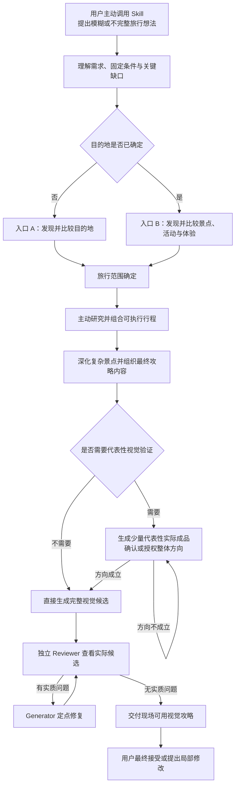

# Travel Guide Skill v0.1：未来目标工作流

> 文件名：`10-travel-guide-target-workflow-v0.1.md`  
> 文档类型：目标工作流设计  
> 版本：v0.1  
> 设计依据：以 `09-cross-source-as-executed-workflow-map.md` 为主，结合 `06`—`08` 的执行证据，并用 `01`—`05` 校准历史要求、失败原因、成功结果与最终验收边界。  
> 适用范围：用户主动调用 Skill 后，在一个全新、连续的旅行规划任务中，从模糊想法推进到可在旅行现场直接使用的视觉旅行攻略。

## 0. 历史能力的最小处置

- **保留：** 模糊需求理解、目的地与体验发现、事实研究、行程组合、复杂景点深化、视觉攻略生成和独立 Review。
- **重构：** 事实整理不再默认产出独立事实包；视觉方向验证改为条件性启用；最终 Review 默认只使用一个未参与生成的独立 Reviewer Agent。
- **删除：** 未确认方向就批量扩散、在已被否定的方向上持续打补丁、把局部 PASS 写成整体通过、固定多 Reviewer／多轮门禁和提示词下沉到微观设计实现。
- **新增：** 支持“目的地未知”和“目的地已知”两个入口；用户可把高影响选择授权给模型；流程按旅行复杂度合并或展开。

---

## 1. v0.1 产品目标和范围

Travel Guide Skill v0.1 的目标是：

> 从用户一个模糊或不完整的旅行想法出发，帮助用户确定旅行范围，完成必要研究和可执行行程设计，深化复杂景点，并最终生成一套在手机现场可以直接使用、尽量做到“看图就能玩”的视觉旅行攻略。

v0.1 的范围边界如下：

1. 用户会主动调用 Skill，不设计自动触发准确率。
2. 从一个全新的、连续的任务开始，不处理中途接手半成品、跨会话恢复或跨会话状态同步。
3. 既支持目的地尚未确定，也支持目的地已经确定但不知道玩什么。
4. 用户已经明确提供的日期、酒店、票务、固定活动、必去／不去和人工确认事实，均作为规划输入；模型可以指出现实冲突，但不能静默覆盖。
5. 对本用户，默认最终产品面向手机现场使用，竖版优先，重要执行信息直接进入图片。
6. 图片数量、拆分方式、视觉风格、地图形式和具体构图由模型根据任务自主决定。
7. 中间结果可以只存在于对话中；只有资料复杂或确有复用价值时，模型才建立中间文档。
8. 本工作流不设计跨会话体系、重型版本管理、权限／审计／安全机制，也不规定具体实现工具和源码结构。

---

## 2. 设计原则

### 2.1 模型主导推进

模型默认自主完成需求理解、候选发现、外部研究、方案比较、行程组合、景点深化、内容拆分和视觉实现。Skill 只限定目标、边界、关键转场和少量高影响决定。

### 2.2 少量高影响决策

只有会明显改变目的地、预算、旅行时间、核心体验或大规模返工成本的决定，才暂停等待用户。普通研究、景点排序、交通组合、页面拆分和视觉实现由模型自主完成。

### 2.3 研究解决客观问题，提问解决个人取舍

开放时间、预约规则、交通方式、临时关闭等客观且可查的信息，由模型主动研究；兴趣优先级、预算承受、旅行节奏和重大取舍才交给用户决定。

### 2.4 结果优先于流程产物

阶段结果要清楚，但不默认创建事实包、状态表、追踪矩阵、版本清单或审批记录。流程服务最终攻略，不把流程本身做成产品。

### 2.5 判断优先于规则数量

模型和 Reviewer 使用整体专业判断发现真实影响旅行使用的问题，不通过固定检查项数量、固定 PASS 层级或机械评分器制造流程。

### 2.6 流程随复杂度伸缩

简单旅行可以合并多个阶段并直接生成完整候选；复杂旅行可以增加研究深度、专项内容和代表性视觉验证，但仍采用最小充分方案。

### 2.7 最终输出优先于生成者说明

视觉攻略的判断对象是用户实际看到的成品，而不是 Generator 的解释、源码意图、坐标说明或“已经通过”报告。

---

## 3. 工作流总览

### 默认用户决策点

正常情况下只保留两个常规决策点和一个条件性决策点：

1. **旅行范围决定：** 选择目的地，或在目的地已知时选择核心体验范围。
2. **总体行程方向决定：** 确认推荐的日程组合和主要取舍。
3. **视觉方向决定：** 仅在启用代表性视觉验证时出现。

用户说“你决定”“按你推荐的来”或要求一次性完成时，上述决定可由模型代为作出。模型只需说明主要假设和取舍，不在后续每个阶段重新索要确认。

---

## 4. 共同起点：理解旅行想法并建立规划框架

### 阶段目标

把用户的模糊想法转换成足以开始推荐和研究的旅行框架，同时保留用户已确认的固定条件。

### 输入

- 用户的自然语言旅行想法；
- 已知的出发地、日期、时长、预算、兴趣、节奏、同行人和限制；
- 已订酒店、车票／机票、演唱会、赛事、预约活动；
- 必去、明确不去及用户人工确认的事实；
- 参考成品和最终使用设备，如用户已经提供。

### 模型实际做什么

1. 判断目的地是否已确定。
2. 提取会约束后续工作的固定输入，不把用户已确认事实重新当成待优化候选。
3. 识别真正会改变目的地、预算、时间或核心体验的缺口。
4. 如有必要，把少量高影响问题一次性集中询问；不采用逐项盘问。
5. 对不影响大方向的缺失信息作合理假设，并明确最重要的假设。
6. 判断任务大致属于简单、一般还是复杂，以决定后续阶段是否合并。

### 得到什么结果

一份可继续工作的旅行框架，至少明确：

- 已知目的地或“目的地待发现”；
- 出发地、日期／时长和预算边界；
- 兴趣、节奏、同行人和重要限制；
- 已固定的预订、活动、必去与不去；
- 模型准备采用的关键假设。

该结果通常直接在对话中表达，不要求建立文件。

### 是否需要用户决定

只有缺失信息会显著改变旅行方向时才需要。例如：出发城市、可用日期、预算数量级、是否带幼儿／老人、明确的体力限制或不可移动的固定活动。

### 如何进入下一阶段

- 目的地未知：进入入口 A。
- 目的地已知：进入入口 B。
- 用户已经给出非常明确的目的地和必玩范围：可跳过候选发现，直接进入研究与行程组合。
- 简单旅行可把本阶段与入口阶段合并在同一轮完成。

---

## 5. 入口 A：目的地尚未确定

### 阶段目标

根据用户的真实条件发现少量有区分度的目的地，并给出明确推荐结论，而不是热门城市名单。

### 输入

共同起点形成的旅行框架，尤其是出发地、时间、预算、兴趣、节奏、同行人、固定活动和限制。

### 模型实际做什么

1. 主动研究与用户条件匹配的目的地，不把可查询的信息继续抛给用户。
2. 只保留少量体验差异明显、现实可行的候选。
3. 对每个候选解释：
   - 为什么适合；
   - 主要体验；
   - 与兴趣和同行人是否匹配；
   - 大致需要多少时间；
   - 从出发地抵达和当地通勤的代价；
   - 预算、体力、人流、天气或预约代价；
   - 与其他候选相比最重要的取舍。
4. 明确给出首选、备选和不建议继续考虑的方向，并说明推荐理由。

### 得到什么结果

- 一个明确的首选目的地或旅行范围；
- 少量备选及其主要取舍；
- 首选成立所依赖的关键假设。

### 是否需要用户决定

目的地通常是第一个高影响决定点。用户可以：

- 直接选择；
- 调整候选范围；
- 说“你决定”或“按首选继续”。

用户已经授权模型决定时，模型选择首选并继续，不再为了形式要求用户确认。

### 如何进入下一阶段

目的地和旅行范围确定后，与入口 B 汇合，进入研究与可执行行程组合。

---

## 6. 入口 B：目的地已经确定

### 阶段目标

在已知目的地内发现并比较适合用户的景点、活动、城市体验和必要的住宿／交通范围，形成有重点的旅行范围。

### 输入

- 已确定的目的地；
- 共同起点形成的旅行框架；
- 用户已经确认的景点、活动、酒店、车票、演出或预约。

### 模型实际做什么

1. 发现与用户兴趣、节奏、同行人和可用时间匹配的景点、活动和城市体验。
2. 在会影响整体行程时，同时比较必要的住宿区域和交通选择；不把住宿和交通变成脱离行程的独立推荐清单。
3. 解释候选的体验、时间、地理位置、通勤代价、预算、体力、人流和预约成本。
4. 将候选组织为：
   - 推荐进入核心行程；
   - 适合作为备选或天气替代；
   - 不适合本次旅行，建议排除。
5. 给出模型推荐的总体旅行方向，例如“博物馆与城市历史优先”“亲子乐园主导”“演出锚定的轻量城市游”，而不是要求用户自己拼接名单。

### 得到什么结果

一份已经收敛的旅行范围，包括核心体验、可选体验、排除项和总体方向。

### 是否需要用户决定

只有候选之间会形成明显不同的旅行体验、预算或时间分配时，才需要用户选择。若用户已经授权模型决定，模型采用推荐方向并继续。

### 如何进入下一阶段

- 核心范围明确后进入研究与行程组合。
- 用户已经指定全部必去地点时，可跳过候选比较，只检查现实可行性并继续。

---

## 7. 汇合后的端到端主流程

### 阶段 1｜主动研究并组合可执行行程

#### 阶段目标

把已确定的旅行范围转成现实可执行的日程，不只是景点清单。

#### 输入

- 已确定的目的地和旅行范围；
- 用户固定条件与模型已声明假设；
- 已有订单、票务、酒店、活动和参考资料。

#### 模型实际做什么

模型在同一阶段中迭代完成“必要研究”和“行程组合”：

1. 主动核实会影响执行的当前事实，包括交通、住宿相关执行信息、开放时间、预约／购票、活动规则、临时关闭或调整。
2. 以用户固定条件为锚点；发现冲突时明确说明，不静默覆盖。
3. 根据地理位置、开放时间、通勤、用户节奏和同行人组合每日路线。
4. 把固定活动、车次和预约先放入时间轴，再安排可调整内容。
5. 加入合理的用餐、休息、排队和交通缓冲。
6. 只在真实风险存在时设计必要 Plan B，不为了显得完整而堆叠备选。
7. 区分当前可采用的信息与出发前需要更新的事项；未公布信息不得伪造。
8. 给出推荐方案和主要取舍，而不是把多个半成品行程交给用户自行拼装。

#### 得到什么结果

一套可执行的总体行程，通常包括：

- 每日主线和关键时间；
- 交通与空间衔接；
- 用餐、缓冲和必要备选；
- 与固定条件的兼容关系；
- 需要临近出发更新的事项；
- 模型推荐该组合的原因及放弃其他组合的主要取舍。

#### 是否需要用户决定

这是第二个常规高影响决定点。只有总体路线存在明显不同方向，或某个取舍会显著改变预算、体力、核心体验或固定活动时，才需要用户确认。

用户已经授权模型决定时，模型简要声明选定的行程方向和关键假设后继续，不在普通排序和交通细节上继续提问。

#### 如何进入下一阶段

- 行程现实可行且主要方向稳定：进入重点深化与内容组织。
- 发现固定条件之间存在无法自行消解的冲突：把冲突和可选取舍交给用户决定，然后继续。
- 简单周末游可以把本阶段与前一入口阶段合并完成。

---

### 阶段 2｜深化重点景点并组织最终攻略内容

#### 阶段目标

把行程中的主要和复杂地点深化到现场可直接使用的程度，并决定最终攻略应如何拆分。

#### 输入

- 已形成的可执行总体行程；
- 景点、活动和场馆的研究结果；
- 用户的手机现场使用目标和参考成品。

#### 模型实际做什么

1. 判断哪些地点只需要简短执行信息，哪些属于主要或复杂景点，需要进一步深化。
2. 对需要深化的地点，根据实际复杂度补充：
   - 从哪里进入；
   - 建议怎么逛和按什么顺序；
   - 大致需要多久；
   - 重点看什么、为什么值得看；
   - 博物馆重点展品与观察点；
   - 公园、主题乐园或大型场馆内部路线；
   - 必要预约、购票和现场容易出错的地方。
3. 将交通、用餐、固定活动、Plan B 和行前更新事项放到最适合用户现场查看的位置。
4. 决定最终视觉攻略的内容单元和图片拆分。图片数量由旅行复杂度和手机可读性决定，不按天数、景点数或历史项目固定。
5. 用户提供参考成品时，提取其被认可的体验和完成度，不机械复制城市风格、页数、构图或结构。

#### 得到什么结果

一套可以直接进入视觉生成的攻略内容组织，明确：

- 总览、每日、专项和复杂景点深层内容中哪些确有必要；
- 每个内容单元要解决的现场问题；
- 关键执行信息、理解信息和待更新信息应放在哪里；
- 预计生成的完整视觉攻略范围。

该结果可以只存在于模型内部规划或对话说明中，不要求建立固定内容文件。

#### 是否需要用户决定

通常不需要。页面拆分、信息层级、图片数量和具体表达由模型自主决定。

只有深化后发现必须在两个高影响体验之间重新取舍，或新信息会明显改变已确认行程时，才返回用户决定。

#### 如何进入下一阶段

内容已经足以支持现场使用后，进入视觉方向判断与生成。简单旅行可把本阶段并入行程组合，并直接生成完整候选。

---

### 阶段 3｜条件性验证视觉方向并生成完整候选

#### 阶段目标

把已研究和组织好的内容转成实际视觉攻略，同时只在高返工风险时增加一次真实有效的方向验证。

#### 输入

- 已完成的攻略内容组织；
- 用户的目标设备和使用场景；
- 用户提供的参考成品；
- 已确认的事实与边界。

#### 模型实际做什么

1. 自主决定图片数量、拆分方式、视觉风格、地图形式、构图和实现方法。
2. 先判断是否满足代表性视觉验证的启用条件。
3. **不启用时：** 直接生成完整视觉候选。
4. **启用时：**
   - 先生成少量能够代表整套风险的实际成品，而不是只给风格说明或设计系统；
   - 代表页应覆盖本次最关键或最不同的内容类型，数量不固定；
   - 用户确认整体方向，或明确授权模型按推荐方向继续；
   - 方向尚未成立时，只调整代表性成品，不批量扩散；
   - 方向成立后再生成完整候选。
5. 生成过程中保持事实含义，不因压缩、地图、路线、图像或短文案改变时间、顺序、空间关系和动作状态。

#### 得到什么结果

一套完整、实际可查看的视觉攻略候选，已经具备：

- 面向手机的自然阅读顺序；
- 旅行当天需要的关键执行信息；
- 与任务复杂度匹配的内容拆分；
- 主要景点的必要深度；
- 清楚标识的待更新信息；
- 用户参考成品所代表的体验目标，但不机械复刻。

#### 是否需要用户决定

仅在代表性视觉验证被启用且用户未授权模型决定时，需要用户确认方向。简单旅行、页面较少或视觉方向明确时，不增加这一确认点。

#### 如何进入下一阶段

完整视觉候选形成后，必须进入独立 Review。Generator 的自检可以先做，但不能代替最终独立 Review。

---

### 阶段 4｜独立 Review、必要修复与最终交付

#### 阶段目标

由未参与该候选生成的独立 Reviewer Agent 检查实际最终输出，修复真正影响用户使用的问题，并交付现场可用成品。

#### 输入

独立 Reviewer 获得：

- 用户目标和真实使用场景；
- 用户已确认的事实、固定条件和边界；
- 必要的参考成品；
- Generator 实际生成的完整候选图片或交付物。

Generator 的自我解释、内部坐标、源码说明或“已通过”报告不能成为 Reviewer 的主要判断依据。

#### 模型实际做什么

1. 默认启用一个独立 Reviewer Agent，由其直接查看实际候选。
2. Reviewer 使用整体专业判断，重点识别真正影响旅行使用的问题，例如：
   - 是否满足用户旅行需求；
   - 行程和重要事实是否有明显矛盾；
   - 手机现场是否容易看懂和行动；
   - 是否有明显错字、歧义、遮挡、错锚或视觉问题；
   - 是否遗漏会实质影响执行的重要内容。
3. Reviewer 只报告具体问题、出现位置和实际影响，不发明新需求、不扩大旅行范围、不重做产品，也不规定具体构图或修图技术。
4. Generator 根据具体问题修复实际候选。
5. 修复后，由独立 Reviewer 查看修改后的实际成品，确认原问题是否解决、是否引入明显新问题。
6. 每一轮都必须由真实问题触发；没有实质问题时立即停止，不为完成流程而继续 Review。
7. 若 Reviewer 判断整套视觉方向根本不成立，将判断交给用户决定是否重开方向；Reviewer 不自行重新设计。
8. Review 通过后，交付按现场使用顺序组织的实际视觉攻略，并简要说明仍需出发前更新的事项。

#### 得到什么结果

- 经独立 Review 和必要修复后的实际视觉攻略；
- 清楚的图片顺序和现场使用入口；
- 必要的出发前更新提醒；
- 用户可以直接查看并作最终接受决定的交付物。

#### 是否需要用户决定

常规 Review 和修复不需要用户逐轮确认。只有两种情况需要用户参与：

1. Reviewer 认为整个视觉方向需要重开；
2. 最终交付后，由用户决定是否接受成品，或只重新打开明确的局部范围。

#### 如何结束

用户接受后任务结束。用户只指出局部问题时，仅重开受影响范围，修复后重新查看相关实际成品，不重新启动整套流程。

---

## 8. 少量关键用户决策点

| 决策点 | 何时出现 | 为什么需要用户 | 可否授权模型决定 |
|---|---|---|---|
| 目的地／旅行范围 | 入口 A，或入口 B 存在明显不同旅行方向时 | 会改变整个旅行体验、预算和后续研究范围 | 可以 |
| 总体行程方向 | 可执行行程形成后，存在重大取舍时 | 会改变时间分配、体力、固定活动兼容和核心体验 | 可以 |
| 代表性视觉方向 | 仅在批量共享视觉方向且返工成本高时 | 错误方向会造成大规模返工 | 可以 |
| 是否重开整个视觉方向 | 独立 Reviewer 判断方向根本不成立时 | 属于产品级重新选择，不应由 Reviewer擅自决定 | 原则上由用户决定 |
| 最终接受 | 实际成品交付后 | 用户是最终体验和使用价值的决定者 | 不由模型代替 |

普通的景点排序、交通组合、用餐位置、缓冲时间、页面数量、地图形式和构图不成为固定确认点。

---

## 9. 用户授权模型自主决定时的推进方式

当用户说“你决定”“按你推荐的来”“直接做完整方案”或表达等价授权时，模型应：

1. 明确给出自己选择的目的地、旅行范围或行程方向，而不是隐含决定。
2. 简要说明最重要的假设和取舍，例如预算层级、节奏、公共交通优先或固定活动不可移动。
3. 在当前连续任务中，把该授权延续到普通后续决定，不在每个阶段重复询问。
4. 主动完成研究、行程、深化、内容拆分和视觉生成。
5. 只有新发现会推翻主要假设、明显增加预算、破坏固定活动或需要重开视觉方向时，才再次请用户决定。
6. 不把用户沉默自动解释为授权；只有用户明确要求继续、要求一次性完成或给出等价委托时，才代为作出高影响选择。

推荐的表达方式是：

> 我将按首选方向继续，主要假设是……；接下来普通安排由我完成，只有出现会改变目的地、预算、固定活动或整体视觉方向的冲突时再请你决定。

这是一种推进说明，不是固定话术。

---

## 10. 提问与自动推进原则

### 10.1 值得询问用户的问题

只有答案会明显改变目的地、预算、旅行范围或体验的问题才值得询问，例如：

- 出发地、可用日期和旅行时长；
- 预算数量级或明显不能接受的成本；
- 同行人、行动能力、亲子／老人等重要限制；
- 固定演出、赛事、酒店、票务和不可移动预约；
- 明确必去、绝对不去和核心兴趣；
- 旅行节奏的重大偏好，如高密度打卡或轻松体验。

问题应尽量一次性集中提出，不把一个模糊请求拆成连续十几轮问答。

### 10.2 可以合理假设后继续的信息

通常可以由模型自主判断：

- 相邻景点的具体先后；
- 普通用餐选择和小范围调整；
- 合理交通缓冲；
- 非关键景点的停留时间；
- 页面数量、拆分、视觉风格和地图表达；
- 普通 Plan B 和现场提示；
- 不影响预算和方向的细节偏好。

模型应只说明对最终结果有影响的主要假设，不需要展示全部内部判断。

### 10.3 应主动研究而不是询问用户的信息

以下信息属于客观执行事实，原则上由模型主动研究：

- 当前开放时间和临时关闭；
- 预约、购票和入场规则；
- 交通方式、换乘和通勤代价；
- 活动规则、场馆执行信息和已公布调整；
- 住宿区域与整体行程的现实关系；
- 景点内部路线和重点内容；
- 出发前必须再次更新的事项。

用户已经明确确认的事实是规划基线。研究发现冲突时应提示用户，而不是静默改写。

### 10.4 用户没有明确选择时如何继续

- 候选比较必须给出首选结论，不能只列选项。
- 用户未点名候选，但继续要求下一步、要求完整方案或表达授权时，模型按首选继续，并说明假设。
- 用户尚未授权且目的地等高影响决定确实无法代替时，停在该关键决定点；不通过继续追问普通细节制造额外轮次。

---

## 11. 简单、一般和复杂旅行的流程裁剪

| 旅行类型 | 流程裁剪 | 通常保留的重点 | 通常不需要的内容 |
|---|---|---|---|
| 简单周末游 | 可合并需求理解、范围收敛、研究和行程组合；内容深化只处理一两个关键地点；页面少时直接生成完整候选 | 清楚的推荐结论、现实通勤、每日主线、手机可用成品、一次独立 Review | 独立事实包、专题研究文件、代表页门禁、多 Reviewer、多轮审批 |
| 一般多日城市游 | 采用完整主流程，但中间结果通常仍留在对话中 | 范围收敛、必要事实核实、每日可执行组合、主要景点深化、完整视觉攻略 | 固定页数、每阶段文件、复杂审计和多层 PASS |
| 含演唱会／赛事／固定活动 | 先锚定不可移动活动，再倒推交通、用餐、入场、散场和缓冲；只有冲突会改变核心体验时请用户决定 | 固定时间保护、场馆执行信息、交通风险、必要 Plan B、与其他行程的兼容 | 把固定活动当成可随意优化项，或为所有细节建立专项文件 |
| 博物馆／主题乐园／大型场馆主导 | 增加场馆专项研究和内部路线；根据批量视觉风险决定是否做代表性成品 | 入口、内部顺序、重点内容、时间分配、预约规则、现场易错点 | 自动增加多个 Reviewer、固定设计系统或庞大事实矩阵 |

复杂旅行允许模型建立临时事实整理或专题笔记，但这些是按需工具，不是默认交付物。

---

## 12. 视觉方向验证的启用条件

只有同时存在明显返工风险时，才启用代表性视觉验证。典型条件包括：

- 最终需要批量生成多张共享视觉方向的图片；
- 错误方向会造成明显大规模返工；
- 用户提供了重要参考成品；
- 当前视觉方向仍存在明显不确定性。

启用后应遵循：

1. 先生成少量有代表性的**实际成品**，而不是只写风格说明。
2. 不固定必须三种方向、五张样稿或完整设计系统。
3. 方向未成立前，不批量扩散。
4. 用户授权模型决定时，模型可以自行选定方向；仍需先在代表性实际成品上判断该方向是否成立，再批量继续，但无需再次向用户索要确认。
5. 页面数量少、方向清楚或返工成本低时，直接生成完整候选，不增加门禁。

代表性验证的作用是避免高成本错误扩散，不是所有旅行都必须经过的仪式。

---

## 13. 独立 Reviewer Agent 的工作方式

### 13.1 默认组织

- 默认一个独立 Reviewer Agent。
- Reviewer 未参与当前候选的生成。
- 只有存在明确且不同的专业风险时，模型才判断是否增加额外独立视角；不固定角色名称和数量。

### 13.2 Reviewer 的判断依据

Reviewer 直接查看：

- 用户目标；
- 用户已确认事实和边界；
- 必要参考成品；
- 实际最终候选图片或交付物。

Reviewer 不以 Generator 的自评、内部坐标、源码说明或 PASS 报告为主要证据。

### 13.3 Reviewer 可以做什么

- 指出具体问题；
- 说明问题出现在哪里；
- 说明为什么会影响旅行使用；
- 判断修改后原问题是否解决，是否出现明显新问题。

### 13.4 Reviewer 不应做什么

- 发明用户没有要求的新内容；
- 扩大旅行范围；
- 重新设计整个产品；
- 规定具体构图或修图技术；
- 为了显得严格而提出没有实际价值的问题。

### 13.5 Review 循环的停止条件

- 有实质问题：Generator 修复，Reviewer 查看修改后的实际成品。
- 无实质问题：停止 Review，进入交付。
- 整体方向根本不成立：交给用户决定是否重开方向。
- 不预设固定 Review 轮数，也不为了流程继续制造缺陷。

---

## 14. 明确不采用的历史失败做法

v0.1 不把以下做法设为默认流程：

1. 在高影响视觉方向尚未成立时直接批量生成整套成品。
2. 用户已经明确否定整体方向后，继续通过局部补丁和更多规则把原方向“修到通过”。
3. 把事实研究、内容压缩、视觉表达和最终 Review 混成同一职责。
4. 把 Generator 的坐标、源码意图、自检报告或局部 QA PASS 当作最终成品通过。
5. 固定页面数量、代表页数量、视觉风格、地图形式、组件、网格或修图方法。
6. 固定 Mechanical／Semantic／Visual 等多个 Reviewer、固定缺陷等级、固定 Review 轮数或多层 PASS。
7. 为每个阶段建立文件、事实 ID、追踪矩阵、审批记录或复杂资产系统。
8. 让参考成品自动决定本次旅行的城市风格、页面结构和数量。
9. 为一次异常建立防篡改、签名、哈希、权限或重型审计体系。
10. 在每个阶段都要求用户确认，或把普通模型判断持续抛回用户。

---

## 15. 后续编写 Skill Spec 仍需决定的问题

以下问题不属于本轮目标工作流，但在转写 Skill Spec 前仍需明确：

1. 用户主动调用 Skill 的具体入口形式，以及首轮输入的最小格式。
2. 对本用户默认生成视觉攻略时，是否允许显式切换为纯文字或混合交付。
3. 外部研究可使用哪些工具、如何优先选择当前官方信息，以及临近出发时如何重新更新事实。
4. 在实际运行环境中，如何创建并保证“未参与当前候选生成”的独立 Reviewer Agent。
5. 最终图片以单张、相册顺序、压缩包或其他方式交付时，采用什么最小且清楚的组织方式。
6. 当图像生成中文文字质量不稳定时，允许采用哪些重试、编辑或替代表达策略。
7. “你决定”授权在当前连续任务中具体持续到何时，哪些新冲突必须重新征求用户决定。
8. 最终攻略中的“出发前更新事项”如何呈现，以及用户重新调用 Skill 更新这些事项时的最小交互方式。

---

## 结论

Travel Guide Skill v0.1 的目标流程不是一套规则大全，而是一条可自然推进的主线：

> 理解旅行想法与固定条件  
> → 在两个入口中完成目的地或体验范围收敛  
> → 主动研究并组合可执行行程  
> → 深化复杂景点并组织最终内容  
> → 按返工风险决定是否验证代表性视觉方向  
> → 生成完整视觉候选  
> → 由独立 Reviewer 查看实际成品并触发必要修复  
> → 交付用户可在旅行现场直接使用的视觉攻略。

模型默认自主推进；用户只参与少量真正会改变旅行结果的决定。流程可以为简单旅行压缩，也可以为复杂场馆或固定活动增加必要深度，但不因复杂而自动演变成多 Agent、多门禁和重型治理系统。
